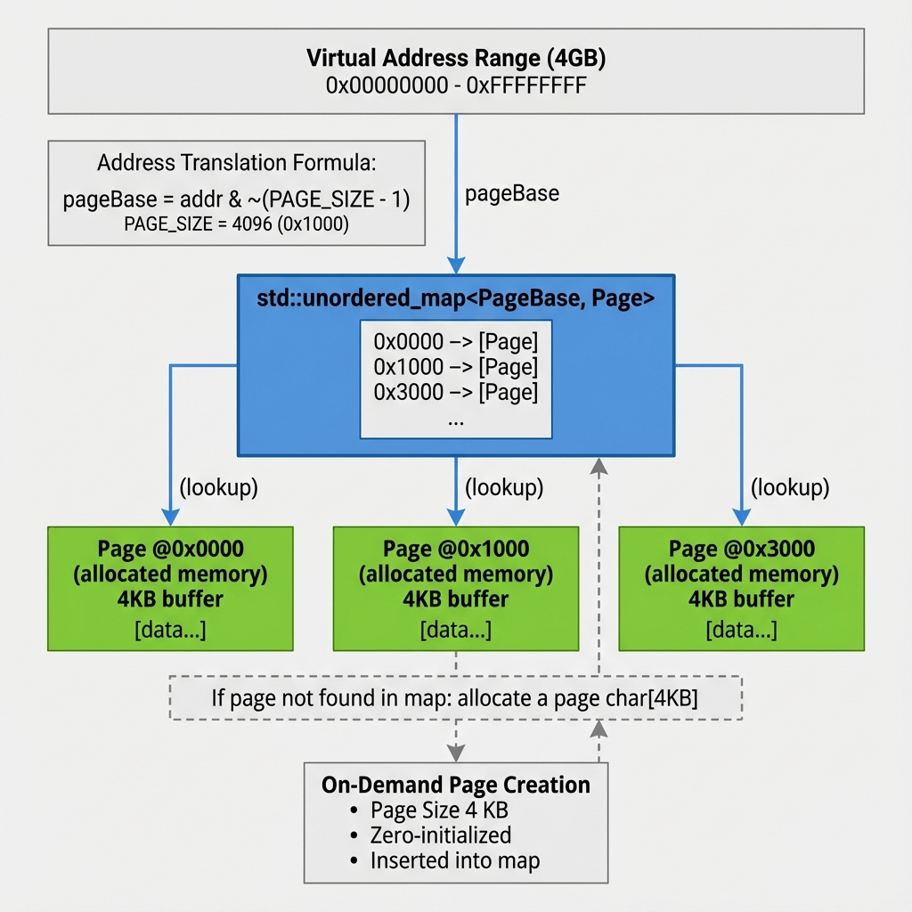

# Paged Memory Technical Specification

## Block Diagram



The block diagram above illustrates the core paged memory architecture with on-demand page allocation, hash-based lookup, and virtual address translation.

# Overview

This document specifies the PagedMemory utility class, a core component used by both SRAM and ROM modules to provide efficient sparse memory allocation. The PagedMemory class implements a page-based memory management system with on-demand allocation.

## Features

- **4KB Page Granularity**: Memory organized into fixed 4KB pages
- **Sparse Allocation**: Pages allocated only when first written
- **Zero-Default Reads**: Unallocated pages return zero without allocation
- **Hash-Based Lookup**: O(1) average-case page lookup using unordered_map
- **Byte-Level Access**: Read and write operations at byte granularity
- **Vector-Based Operations**: Efficient multi-byte read/write with std::vector
- **Memory Efficiency**: Dramatically reduces host memory for sparse address spaces

## Description

PagedMemory is a C++ utility class that provides a sparse memory abstraction layer. Instead of allocating a contiguous block of memory for the entire address space, it maintains a hash map of pages that are allocated on-demand.

## Key Concepts

### Page-Based Organization

```
Address Space View:
┌──────────────┐
│ Page 0       │  0x0000 - 0x0FFF
├──────────────┤
│ Page 1       │  0x1000 - 0x1FFF  
├──────────────┤
│ Page 2       │  0x2000 - 0x2FFF
├──────────────┤
│ ...          │
└──────────────┘

Physical Storage:
page_map = {
    0x0000 → vector<uint8_t>[4096],
    0x2000 → vector<uint8_t>[4096]
}
// Page 1 not allocated (sparse)
```

### On-Demand Allocation

- **Read from Unallocated Page**: Returns 0, no page created
- **Write to Unallocated Page**: Allocates 4KB page (zero-initialized), then writes
- **Subsequent Access**: Direct access to allocated page

## API Reference

### Core Operations

```cpp
uint8_t read(size_t address);
```
Read single byte from address. Returns 0 for unallocated pages.

```cpp
void write(size_t address, uint8_t value);
```
Write single byte to address. Allocates page if needed.

```cpp
std::vector<uint8_t> readBytes(size_t address, size_t length);
```
Read multiple bytes into vector. Handles page boundaries automatically.

```cpp
void writeBytes(size_t address, const uint8_t* data, size_t length);
void writeBytes(size_t address, const std::vector<uint8_t>& data);
```
Write multiple bytes from buffer or vector. Allocates pages as needed.

### Utility Operations

```cpp
uint8_t* getPtr(size_t address);
```
Get direct pointer to byte at address. Returns nullptr if page not allocated.

```cpp
size_t getAllocatedPageCount() const;
```
Get number of currently allocated pages (for memory profiling).

```cpp
void clear();
```
Deallocate all pages, reset to empty state.

## Implementation Details

### Address Translation

```cpp
inline size_t getPageBase(size_t address) {
    return address & ~(PAGE_SIZE - 1);
}

size_t offset = address % PAGE_SIZE;
```

Example:
- Address: `0x3ABC`
- Page Base: `0x3ABC & ~0xFFF = 0x3000`
- Offset: `0x3ABC % 0x1000 = 0xABC` (2748)

### Data Structure

```cpp
class PagedMemory {
private:
    std::unordered_map<size_t, Page> memory_map;
    // Page = std::vector<uint8_t> with PAGE_SIZE elements
};
```

**Hash Map Benefits**:
- O(1) average-case lookup
- Only stores allocated pages
- Automatic memory management via std::vector

## Performance Characteristics

### Time Complexity

| Operation | Best Case | Average Case | Worst Case |
|-----------|-----------|--------------|------------|
| Single read (allocated) | O(1) | O(1) | O(1) |
| Single read (unallocated) | O(1) | O(1) | O(1) |
| Single write (allocated) | O(1) | O(1) | O(1) |
| Single write (unallocated) | O(PAGE_SIZE) | O(PAGE_SIZE) | O(PAGE_SIZE) |
| Multi-byte read/write | O(n) | O(n) | O(n) |

Where n = number of bytes accessed.

### Space Complexity

| Scenario | Address Space | Actual Usage | Pages Allocated | Host Memory |
|----------|---------------|--------------|-----------------|-------------|
| Empty | 1 MB | 0 bytes | 0 | ~80 bytes (empty map) |
| Sparse (1%) | 1 MB | 10 KB | 3 pages | ~12 KB |
| Medium (25%) | 1 MB | 256 KB | 64 pages | ~256 KB |
| Dense (100%) | 1 MB | 1 MB | 256 pages | ~1 MB |

**Memory Overhead**: ~80 bytes for unordered_map + 32 bytes per page entry.

## Usage Examples

### Example 1: SRAM Usage

```cpp
PagedMemory sram_memory;

// Load program code (allocates pages)
sram_memory.writeBytes(0x10000000, program_code, code_size);

// CPU reads instruction (from allocated page)
uint32_t instruction = 
    sram_memory.read(0x10000000) |
    (sram_memory.read(0x10000001) << 8) |
    (sram_memory.read(0x10000002) << 16) |
    (sram_memory.read(0x10000003) << 24);

// CPU writes data (allocates new page if needed)
sram_memory.write(0x10100000, 0x42);
```

### Example 2: ROM Usage

```cpp
PagedMemory rom_memory;

// Load boot code during initialization
rom_memory.writeBytes(0x00000000, boot_code, boot_size);

// CPU reads from ROM
uint8_t byte = rom_memory.read(0x00000100);

// Reading from empty region returns 0
uint8_t unused = rom_memory.read(0x00010000); // Returns 0, no allocation
```

### Example 3: Checking Allocation

```cpp
PagedMemory memory;

std::cout << "Initial pages: " << memory.getAllocatedPageCount() << std::endl;
// Output: 0

memory.write(0x1000, 0xFF);
memory.write(0x5000, 0xAA);

std::cout << "After writes: " << memory.getAllocatedPageCount() << std::endl;
// Output: 2

uint8_t* ptr = memory.getPtr(0x1000);
if (ptr != nullptr) {
    // Page is allocated, can use pointer
}
```

## Design Rationale

### Why Paged Memory?

1. **Virtual Platform Requirements**:
   - Large address spaces (MB to GB)
   - Sparse actual usage (KB to MB)
   - Need to minimize host memory footprint

2. **Alternative Approaches**:
   - **Contiguous Allocation**: Wastes memory for large sparse spaces
   - **Byte-Level Map**: Too much overhead (per-byte hash map entries)
   - **Larger Pages**: Less granular, potential waste within pages

3. **4KB Page Size**:
   - Matches common OS page size
   - Good balance between granularity and overhead
   - Typical cache line alignment benefits

### Trade-offs

**Advantages**:
- ✅ Excellent memory efficiency for sparse workloads
- ✅ Simple API, transparent to callers
- ✅ Fast lookup (hash map)
- ✅ No external dependencies

**Disadvantages**:
- ❌ Cannot provide contiguous DMI pointer
- ❌ Allocation overhead on first write to page
- ❌ Hash map overhead (~32 bytes per allocated page)
- ❌ Not suitable for very dense memory usage

## Thread Safety

**Not Thread-Safe**: PagedMemory assumes single-threaded access. For SystemC TLM models, this is acceptable as:
- SystemC scheduler is cooperative (no preemption)
- TLM transactions are atomic from model perspective
- No concurrent access within same simulation time

## Future Enhancements

Potential improvements:
- **Configurable Page Size**: Support 1KB, 2KB, 4KB, 8KB pages
- **Memory Access Profiling**: Track read/write heat maps
- **Page Compression**: Compress pages with redundant data
- **Backing Store**: Write-through to disk for persistence
- **Read-Only Pages**: Mark pages as immutable after loading
- **Copy-on-Write**: Share pages between multiple instances

## Related Components

- **SRAM Module**: Primary consumer, uses for read-write memory
- **ROM Module**: Secondary consumer, uses for read-only memory
- **Memory Profiling Tools**: Can query getAllocatedPageCount() for statistics
