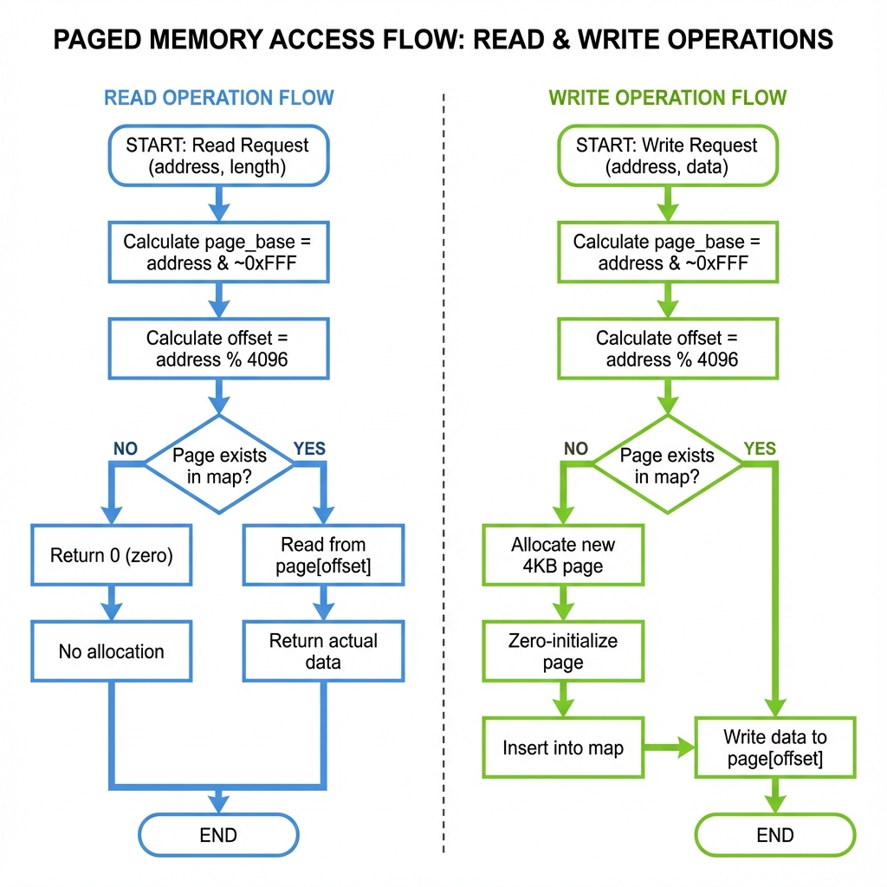
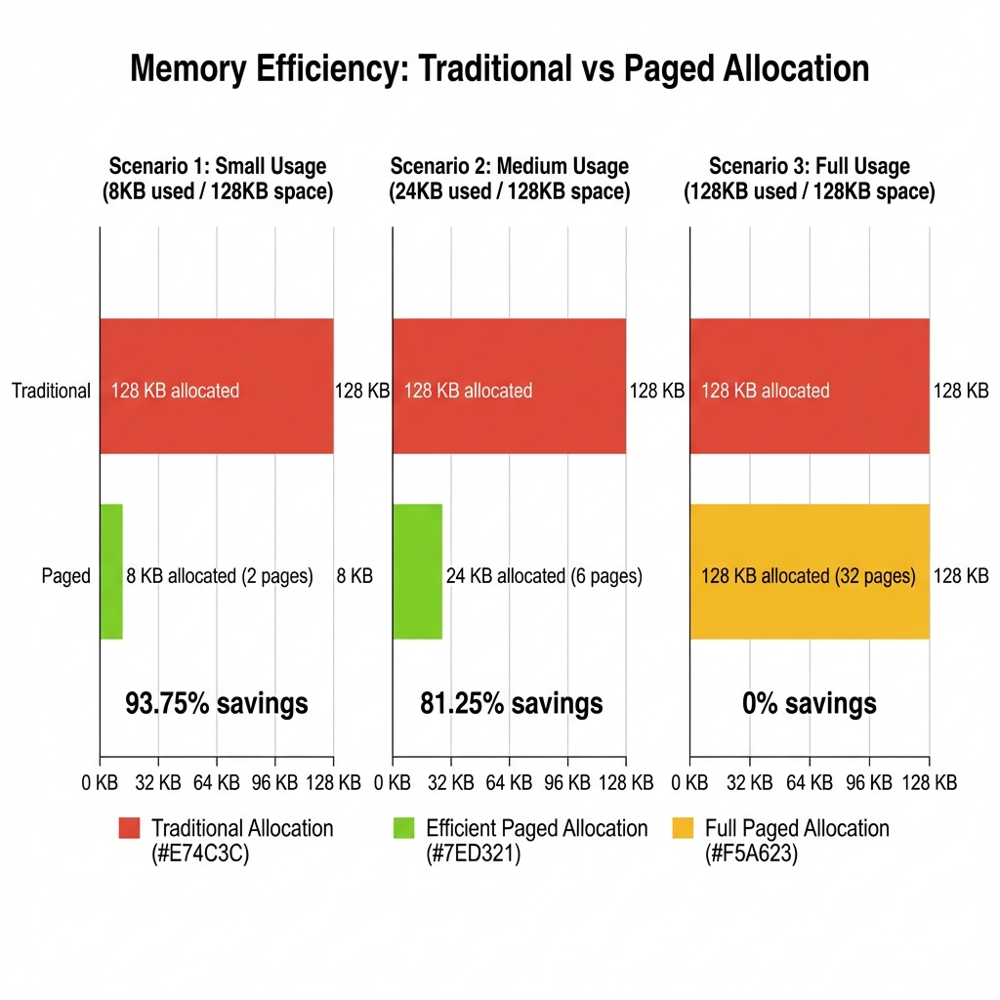

# Paged Memory Theory of Operation

## Block Diagram


The paged memory block diagram above shows the core architecture of the sparse memory allocation system. The system maintains a hash map (`std::unordered_map`) that maps page base addresses to individual 4KB memory pages. This allows efficient O(1) lookup while only allocating memory for pages that are actually accessed.

## Design Principles

### Sparse Allocation Strategy

The paged memory implementation is fundamentally different from traditional contiguous memory allocation:

**Traditional Approach**:
- Allocates entire address space upfront (e.g., 128KB)
- Wastes host memory for unused regions
- Simple pointer arithmetic for access

**Paged Approach**:
- Allocates memory on-demand in 4KB chunks  
- Only pays for what is used
- Hash-based lookup for page access

### Address Translation

Every memory access goes through a two-step translation:

```
Virtual Address: 0x00103ABC
                 ↓
Step 1: Extract Page Base
page_base = 0x00103ABC & ~(0xFFF)
          = 0x00103000

Step 2: Calculate Page Offset  
offset = 0x00103ABC % 0x1000
       = 0xABC (2748 decimal)
```

The `page_base` is used as the key for hash map lookup, and `offset` identifies the byte within the 4KB page.

## Access Patterns

### Read Operation Flow



**Read Algorithm**:
1. Calculate `page_base = address & ~(PAGE_SIZE - 1)`
2. Calculate `offset = address % PAGE_SIZE`
3. Lookup `memory_map[page_base]`
4. **If page exists**: Return `page[offset]` (actual data)
5. **If page doesn't exist**: Return `0` (no allocation)

**Key Feature**: Reading from an unallocated page returns zero **without allocating memory**. This maintains the sparse representation and prevents memory bloat from speculative reads.

### Write Operation Flow

**Write Algorithm**:
1. Calculate `page_base = address & ~(PAGE_SIZE - 1)`
2. Calculate `offset = address % PAGE_SIZE`
3. Lookup `memory_map[page_base]`
4. **If page doesn't exist**:
   - Allocate new `std::vector<uint8_t>(4096, 0)` (zero-initialized)
   - Insert into `memory_map` with key `page_base`
5. Write `value` to `page[offset]`

**Key Feature**: Pages are allocated **lazily** only when first written, not when first read.

## Multi-Byte Operations

### Burst Transfers

Multi-byte read/write operations are decomposed into byte-level operations:

```cpp
std::vector<uint8_t> readBytes(size_t address, size_t length) {
    std::vector<uint8_t> buffer(length);
    for (size_t i = 0; i < length; ++i) {
        buffer[i] = read(address + i);  // Byte-by-byte
    }
    return buffer;
}
```

**Page Boundary Handling**:
```
Address: 0x00000FFE, Length: 4 bytes

Byte 0: 0x00000FFE → Page 0x00000000, offset 0xFFE
Byte 1: 0x00000FFF → Page 0x00000000, offset 0xFFF
Byte 2: 0x00001000 → Page 0x00001000, offset 0x000 (new page!)
Byte 3: 0x00001001 → Page 0x00001000, offset 0x001
```

The byte-level loop automatically handles page boundaries without special logic.

## Memory Efficiency Analysis



### Example Scenarios

**Scenario 1: Embedded Boot Code (8KB usage in 128KB space)**
- Traditional: 128 KB allocated
- Paged: 8 KB allocated (2 pages)
- **Savings: 93.75%**

**Scenario 2: Small Application (24KB usage in 128KB space)**
- Traditional: 128 KB allocated
- Paged: 24 KB allocated (6 pages)
- **Savings: 81.25%**

**Scenario 3: Full Utilization (128KB usage in 128KB space)**
- Traditional: 128 KB allocated
- Paged: 128 KB allocated (32 pages)
- **Savings: 0%** (no benefit when fully populated)

###Real-World Impact

For a RISC-V virtual platform with:
- 128KB SRAM + 64KB ROM = 192KB total address space
- Typical embedded application: 28KB actual usage

**Memory Footprint**:
- Traditional: 192 KB host memory
- Paged: 28 KB host memory
- **Overall Savings: 85.4%**

## Hash Map Performance

### Time Complexity

The `std::unordered_map` provides:

| Operation | Average Case | Worst Case |
|-----------|--------------|------------|
| Page lookup | O(1) | O(n) |
| Page insertion | O(1) | O(n) |
| Memory clear | O(n) | O(n) |

Where `n` = number of allocated pages (not total address space).

### Space Overhead

Each hash map entry incurs overhead:
- **Key storage**: 8 bytes (size_t page base address)
- **Value storage**: 24 bytes (std::vector overhead) + 4096 bytes (page data)
- **Hash table overhead**: ~32 bytes per entry on average

**Total per page**: ~4160 bytes (1.5% overhead compared to 4096 byte payload)

## Zero-Initialization Rationale

All allocated pages are zero-initialized for several reasons:

1. **Deterministic Behavior**: Prevents undefined behavior from reading uninitialized memory
2. **BSS Semantics**: Matches ELF loader expectations for `.bss` sections
3. **Security**: Prevents information leakage from previous allocations
4. **Consistency**: Reads from unallocated pages return zero; allocated pages should start at zero

## Integration with Memory Models

### SRAM Usage

```cpp
class SRAM {
    PagedMemory m_sram_data;  // Read-write paged storage
    
    void load_data(const char *src, uint64_t dst_addr, size_t n) {
        m_sram_data.writeBytes(dst_addr, (const uint8_t*)src, n);
        // Allocates pages as needed during loading
    }
};
```

### ROM Usage

```cpp
class ROM {
    PagedMemory m_rom_data;  // Read-only paged storage
    
    unsigned transport_dbg(tlm::tlm_generic_payload &trans) {
        if (cmd == TLM_READ_COMMAND) {
            auto data = m_rom_data.readBytes(addr, len);  // OK
        } else if (cmd == TLM_WRITE_COMMAND) {
            sc_assert(false);  // Write protection enforced at TLM level
        }
    }
};
```

**Note**: ROM uses the same `PagedMemory` class but rejects TLM writes at a higher level. The `PagedMemory` class itself doesn't enforce read-only semantics.

## Performance Considerations

### Cache Friendliness

- **Pages are contiguous**: Each 4KB page is a `std::vector` with contiguous storage
- **Sequential access**: Within a page, sequential reads/writes benefit from CPU cache
- **Cross-page access**: May incur cache misses and hash lookups

### Allocation Overhead

First write to a new page incurs:
1. `std::vector<uint8_t>(4096, 0)` construction (~4KB zero-fill)
2. Hash map insertion (O(1) average)
3. Potential hash map resize (amortized O(1))

**Typical cost**: 1-2 microseconds on modern hardware

### Optimization Opportunities

1. **Memory Pooling**: Pre-allocate page pool to reduce `std::vector` constructions
2. **Lazy Zero-Fill**: Use copy-on-write to share zero page until first write
3. **Page Size Tuning**: Smaller pages (1KB, 2KB) for finer granularity vs. larger pages (8KB) for fewer hash entries
4. **Compression**: Compress pages with repeated patterns (e.g., all zeros)

## Comparison with Alternatives

### vs. Contiguous Allocation

| Aspect | Contiguous | Paged |
|--------|-----------|-------|
| Memory efficiency | Poor (100% allocated) | Excellent (only used pages) |
| Access speed | Fast (pointer+offset) | Slightly slower (hash lookup) |
| DMI support | Native | Limited |
| Implementation | Simple | Moderate complexity |

### vs. Byte-Level Hash Map

| Aspect | Byte-Level Map | Paged Map |
|--------|---------------|-----------|
| Granularity | 1 byte | 4096 bytes |
| Space overhead | High (~32 bytes per entry) | Low (~1.5% per page) |
| Locality | Poor | Good |
| Suitability | Tiny sparse data | Typical memory usage |

### vs. STL `std::map`

Using ordered `std::map` instead of `std::unordered_map`:

| Aspect | unordered_map | map |
|--------|--------------|-----|
| Lookup | O(1) average | O(log n) |
| Memory overhead | Higher | Lower |
| Iteration order | Unordered | Sorted by address |

The `unordered_map` is chosen for **O(1) average lookup performance**, which is critical for memory access paths.

## Future Enhancements

Potential improvements to the paged memory architecture:

1. **Configurable Page Size**: Support 1KB, 2KB, 8KB pages based on workload
2. **Memory Statistics**: Track allocation patterns, hit rates, page utilization
3. **Persistent Backing**: Write-through to disk for non-volatile memory emulation
4. **Read-Only Pages**: Mark pages immutable after loading for ROM optimization
5. **Copy-on-Write**: Share pages between multiple instances until modified
6. **Compression**: Transparent compression for pages with low entropy

## Related Specifications

- [Paged Memory API Reference](paged-memory-specification.md)
- [SRAM High-Level Design](../../sram-generated-docs/sram-high-level-design.md)
- [ROM High-Level Design](../../../rom/rom-generated-docs/rom-high-level-design.md)
