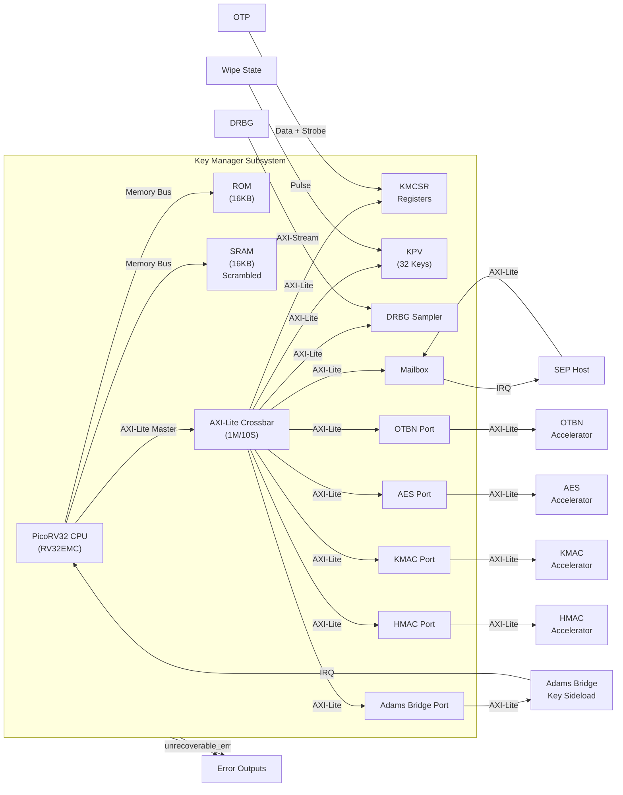

# Key Manager (KM) Component

**Location**: `hw/ip/key_manager`
**Status**: Implemented

## Overview

The Key Manager (KM) is a hardware subsystem that provides foundational infrastructure for secure key management operations in a security processor. The implementation establishes the basic infrastructure including a RISC-V CPU, memory interfaces with SRAM scrambling, interconnect fabric, and mailbox communication mechanism.

### Purpose

The Key Manager serves as a secure, isolated execution environment for key management operations, providing:
- **Secure CPU**: Dedicated RISC-V processor (PicoRV32) for key management firmware
- **Memory Protection**: ROM for immutable boot code, SRAM with address/data scrambling for secure data storage
- **Execute-Permission Whitelist (NX)**: Instruction fetch is restricted to whitelisted regions only
- **Communication**: Mailbox interface for secure message exchange with the Security Processor (SEP)
- **Crypto Integration**: AXI-Lite master ports for external crypto accelerators (OTBN, AES, KMAC, HMAC, ABR)
- **Error Detection**: Byte-wise parity checking for ROM and SRAM

## Architecture

### Core Components



### Key Features

- **CPU**: PicoRV32 (RV32EMC, 16 registers, area-optimized)
- **ROM**: 16KB instruction memory with byte-wise parity checking
- **SRAM**: 16KB data memory with:
  - Address scrambling (PRESENT-based remap)
  - Data scrambling (PRESENT-based encryption)
  - Byte-wise parity checking
- **Interconnect**: AXI4-Lite crossbar (1 master, 10 slaves)
- **KPV**: Key and Policy Vault — 32 key entries (512b each), 32 control registers
- **DRBG Sampler**: Bridges CPU reads at 0x0000_F000 to DRBG AXI-Stream; DATA/CFG/STATUS/PREFETCH_DATA registers; timeout and prefetch
- **Mailbox**: Dual-FIFO message queue for SEP-KM communication
- **PCPI CRC accelerator**: Three PicoRV32 custom instructions for CRC-32C word/byte updates and CRC-8/ROHC byte updates, used internally by firmware without changing public CRC APIs
- **Registers**: KMCSR (Key Manager Control/Status Registers)
- **Reset**: Asynchronous reset input with synchronization and pulse extension
- **Interrupts**: Aggregated interrupt handling via KMCSR; a dedicated PicoRV32 interrupt (bit 5) for the Adams Bridge ML-KEM shared-key event (sticky W1C status); programmable IRQ vector entry via `IRQ_ENTRY_ADDR` / `IRQ_ENTRY_LOCK`

### KPV Firmware Contract

All KPV read/write operations are performed exclusively by KM firmware via the KM port. The KPV is not externally accessible via any SEP-facing write path.

## Directory Structure

```
hw/ip/key_manager/
├── README.md                 # This file
├── doc/                      # Design specifications (architecture, firmware)
├── rtl/                      # RTL source files
│   ├── key_manager.sv       # Top-level module
│   ├── km_crc_engine.sv     # Shared reflected CRC datapath for PCPI instructions
│   ├── picorv32_wrapper.sv  # PicoRV32 CPU wrapper
│   ├── picorv32_pcpi_crc.sv # PicoRV32 CRC custom-instruction front-end
│   ├── km_csr.sv            # Control/Status Registers
│   ├── km_kpv.sv            # Key and Policy Vault (KPV)
│   ├── km_kpv_regfile.sv    # KPV key storage array
│   ├── km_kpv_eraser.sv     # KPV hardware erase sequencer
│   ├── km_mailbox.sv        # Mailbox component
│   ├── km_drbg_sampler.sv   # DRBG Sampler (CPU→DRBG AXI-Stream bridge)
│   ├── km_axi_lite_xbar.sv  # AXI-Lite crossbar
│   ├── km_rom_interface.sv  # ROM memory interface
│   ├── km_sram_interface.sv # SRAM memory interface
│   ├── km_reset_conditioner.sv # Reset synchronization and extension
│   └── km_intf_pkg.sv       # Interface package (types, constants)
├── regs/                     # SystemRDL register definitions
│   ├── key_manager.rdl      # Address map
│   ├── km_csr.rdl           # KMCSR
│   ├── km_kpv.rdl           # KPV
│   ├── km_drbg_sampler.rdl  # DRBG sampler
│   ├── km_mailbox_{km,sep}.rdl        # Mailbox, one per port
│   ├── {hmac,kmac,aes,otbn,abr}_wrapper_key.rdl  # Sideload key interfaces
│   └── gen/                 # Generated collateral (sv, svh, c, py, ral, adoc, html)
└── dv/                       # Verification
    ├── tb/                  # Testbench: tb_key_manager.sv, test_firmware.py, Makefile
    ├── fw/                  # Firmware under test
    │   ├── include/         # Public headers
    │   ├── drivers/         # Driver sources
    │   ├── startup/         # Boot/CRT (crt0.s)
    │   ├── link/            # Linker scripts
    │   ├── scripts/         # Post-processing and analysis tools
    │   ├── tests/           # One directory per firmware test (cocotb regression)
    │   ├── sep_images/      # ROM images built for the SEP UVM testbench
    │   ├── production/      # Production ROM entry point (rom_main)
    │   └── README.md        # Firmware layout and build notes
    ├── cocotb/              # Cocotb support code
    └── testlists/           # Regression test lists
```

## Memory Map

| Region | Address Range | Size | Description |
|--------|---------------|------|-------------|
| ROM | 0x0000_0000 - 0x0000_3FFF | 16KB | Instruction ROM (read-only) |
| SRAM | 0x0000_4000 - 0x0000_7FFF | 16KB | Data SRAM (read/write, scrambled) |
| Reserved | 0x0000_8000 - 0x0000_CFFF | 20KB | Reserved |
| KPV | 0x0000_D000 - 0x0000_DFFF | 4KB | Key and Policy Vault |
| KMCSR | 0x0000_E000 - 0x0000_EFFF | 4KB | Control/Status Registers |
| DRBG Sampler | 0x0000_F000 - 0x0000_FFFF | 4KB | DRBG random data, config, status (DATA/CFG/STATUS/PREFETCH_DATA) |
| Mailbox KM | 0x0001_0000 - 0x0001_0FFF | 4KB | Mailbox KM-side interface (registers in lower 2KB; upper 2KB returns SLVERR) |
| OTP/eFuse | 0x0001_1000 - 0x0001_1FFF | 4KB | AXI-Lite pass-through to SEP eFuse controller (see below) |
| Reserved | 0x0001_2000 - 0x0001_7FFF | 24KB | Reserved |
| OTBN | 0x0001_8000 - 0x0001_8FFF | 4KB | OTBN accelerator port |
| AES | 0x0001_9000 - 0x0001_9FFF | 4KB | AES accelerator port |
| KMAC | 0x0001_A000 - 0x0001_AFFF | 4KB | KMAC accelerator port |
| HMAC | 0x0001_B000 - 0x0001_BFFF | 4KB | HMAC accelerator port |
| Adams Bridge | 0x0001_C000 - 0x0001_CFFF | 4KB | ABR accelerator port |

**Note**: Address map is from the KM CPU perspective. The SEP host accesses the mailbox via a separate AXI-Lite slave port.

### KM → eFuse Access (OTP/eFuse window)

The OTP/eFuse region (`0x0001_1000`–`0x0001_1FFF`) is an AXI-Lite pass-through from the KM crossbar (master port 8) to the system eFuse controller, exposed on the `efuse_req_o` / `efuse_resp_i` ports.

The eFuse controller is typically instantiated at a different absolute address from the KM-local OTP window. `key_manager.sv` performs an address remap before driving `efuse_req_o`: `addr[31:12]` is replaced with `OTP_EFUSE_REMAP_BASE[31:12]` (the `key_manager` module parameter, set by the integrator) while `addr[11:0]` is preserved. KM firmware accesses the three sub-regions at KM-local offsets:

| Offset | Sub-region | Size |
|--------|-----------|------|
| `+0x000` | MAP / OTP shadow registers | 1 KB |
| `+0x400` | eFuse Interface Controller (CTRL) | 28 B |
| `+0x500` | eFuse MMR | 112 B |

C header constants (from `key_manager_addr.h`):
- `KEY_MANAGER_OTP_EFUSE_MAP_BASE_ADDR` = `0x00011000`
- `KEY_MANAGER_OTP_EFUSE_CTRL_BASE_ADDR` = `0x00011400`
- `KEY_MANAGER_OTP_EFUSE_MMR_BASE_ADDR` = `0x00011500`

## Building and Integration

### Prerequisites

- SystemVerilog simulator (VCS, Verilator, etc.)
- Bender for filelist management
- PeakRDL for register generation
- RISC-V toolchain (for firmware compilation)

### Register Generation

Registers are defined in SystemRDL and generated using PeakRDL:

```bash
# Run from the repository root. TARGET scopes to one register block; omit it to
# regenerate every block in the tree.
make -f ocah.mk ocah-regen-regs TARGET=key_manager     # All non-doc collateral
make -f ocah.mk ocah-regen-regs-sv TARGET=key_manager  # SystemVerilog RTL only
make -f ocah.mk ocah-regen-regs-h TARGET=key_manager   # C headers only
```

`TARGET=key_manager` covers the address map top. The sub-blocks (`km_csr`, `km_kpv`,
`km_drbg_sampler`, `km_mailbox_km`, `km_mailbox_sep`, `*_wrapper_key`) are also valid
`TARGET` values when only one of them changed.

### Filelist Generation

The component uses Bender for filelist management. Add to your Bender.yml:

```yaml
targets:
  key_manager:
    files:
      - hw/ip/key_manager/rtl/key_manager.sv
      - hw/ip/key_manager/rtl/km_*.sv
      # ... (see Bender.yml for complete list)
```

### Integration

1. **Instantiate the module**:
   ```systemverilog
   key_manager #(
       .ROM_SIZE_BYTES(16384),
       .SRAM_SIZE_BYTES(16384),
       .MAILBOX_DEPTH(16),
       .LATCHED_MEM_RDATA(1'b0),
       .OTP_EFUSE_REMAP_BASE(32'h1093_0000)  // Integrator-set; see eFuse section
   ) u_key_manager (
       .clk_i(clk),
       .rst_ni(rst_n),
       // Mailbox SEP interface
       .mbox_sep_req_i(sep_mbox_req),
       .mbox_sep_resp_o(sep_mbox_resp),
       .mbox_irq_to_sep_o(mbox_irq),
       // Error condition outputs
       .unrecoverable_err_o(km_unrecoverable_err),
       .recoverable_err_o(km_recoverable_err),
       // Crypto engine ports
       .otbn_req_o(otbn_req),
       .otbn_resp_i(otbn_resp),
       .aes_req_o(aes_req),
       .aes_resp_i(aes_resp),
       .kmac_req_o(kmac_req),
       .kmac_resp_i(kmac_resp),
       .hmac_req_o(hmac_req),
       .hmac_resp_i(hmac_resp),
       .abr_req_o(abr_req),
       .abr_resp_i(abr_resp),
       .abr_mlkem_sharedkey_irq_i(abr_mlkem_sharedkey_irq),
       // DRBG AXI-Stream (KM is slave: TREADY out; TVALID, TDATA, TSTRB in)
       .drbg_axis_req_i(drbg_axis_req),
       .drbg_axis_resp_o(drbg_axis_resp),
       // ROM/SRAM interfaces (to hard macros)
       .rom_mem_req_o(rom_req),
       .rom_mem_rsp_i(rom_rsp),
       .sram_mem_req_o(sram_req),
       .sram_mem_rsp_i(sram_rsp),
       // OTP data interface
       .otp_data_i(otp_data),
       // Wipe state
       .wipe_state_i(wipe_state),
       // Test/scan ports
       .test_en_i(test_en),
       .scan_rst_ni(scan_rst_n),
       .scanmode_i(scanmode)
   );
   ```

2. **Connect ROM/SRAM hard macros**:
   - ROM: Connect `rom_mem_req_o` / `rom_mem_rsp_i` to ROM hard macro
   - SRAM: Connect `sram_mem_req_o` / `sram_mem_rsp_i` to SRAM hard macro

3. **Connect mailbox to SEP host**:
   - **Mailbox AXI-Lite Slave Interface**: Connect `mbox_sep_req_i` / `mbox_sep_resp_o` to SEP host's AXI-Lite master port
   - **Mailbox Interrupt**: Connect `mbox_irq_to_sep_o` to SEP host's interrupt controller
   - The mailbox provides dual-FIFO communication (SEP→KM inbound, KM→SEP outbound)
   - Interrupts are level-sensitive:
     - `mbox_irq_to_sep_o`: asserted when outbound FIFO has data available for SEP (OUTBOUND_READ_DATA_AVAIL) or when inbound write FIFO has space (INBOUND_WRITE_SPACE_AVAIL), when the corresponding enable bits are set
     - `mbox_irq_to_km_o`: asserted when inbound FIFO has data available for KM (INBOUND_READ_DATA_AVAIL) or when outbound write FIFO has space (OUTBOUND_WRITE_SPACE_AVAIL), when the corresponding enable bits are set

4. **Connect DRBG AXI-Stream**:
   - **`drbg_axis_req_i`**: TVALID, TDATA[31:0], TSTRB[3:0] from DRBG source
   - **`drbg_axis_resp_o`**: TREADY to DRBG. In testbenches, drive `tvalid=0` and `tdata=0`, `tstrb=0` when not used

5. **Connect external crypto engines**:
   - OTBN: Connect `otbn_req_o` / `otbn_resp_i` to OTBN accelerator's AXI-Lite slave port
   - AES: Connect `aes_req_o` / `aes_resp_i` to AES accelerator's AXI-Lite slave port
   - KMAC: Connect `kmac_req_o` / `kmac_resp_i` to KMAC accelerator's AXI-Lite slave port
   - HMAC: Connect `hmac_req_o` / `hmac_resp_i` to HMAC accelerator's AXI-Lite slave port
   - Adams Bridge: Connect `abr_req_o` / `abr_resp_i` to ABR accelerator's AXI-Lite slave port, and `abr_mlkem_sharedkey_irq_i` to its ML-KEM shared-key interrupt output

6. **Connect scan ports for DFT**:
   - **`scan_rst_ni`**: Connect to scan reset signal (active-low). This bypasses the reset synchronizer during scan mode.
   - **`scanmode_i`**: Connect to scan mode control signal (type `mubi4_t`). Use `prim_mubi_pkg::MuBi4True` to enable scan mode, `MuBi4False` for normal operation.
   - **`test_en_i`**: Connect to test enable signal. Set to `1'b1` for test mode, `1'b0` for normal operation.
   - During scan mode, `scan_rst_ni` can override the synchronized reset to allow scan chain operation.

## Testing

The component includes comprehensive firmware-driven tests. See `dv/tb/README.md` for detailed testing documentation.

### Quick Start

```bash
cd hw/ip/key_manager/dv/tb

# Run a firmware test
make run_fw FW_TEST=test_rom_crc

# Run with printf output (VUART printing enabled)
make run_fw FW_TEST=test_rom_crc_pcpi_bench VUART_PRINT=1

# Run all tests
make regression

# Run with waveforms
make run_fw FW_TEST=test_rom_crc WAVES=1

# Run with both waveforms and printf output
make run_fw FW_TEST=test_rom_crc WAVES=1 VUART_PRINT=1
```

**Note**: VUART printing is **disabled by default** to save simulation time during regressions. Enable it with `VUART_PRINT=1` to see `printf()` output from firmware.

The CRC benchmark records:

- CRC-32C word: 86% cycle reduction versus the software baseline
- CRC-32C byte: 58% cycle reduction versus the software baseline
- CRC-8/ROHC byte: the benchmark still records the software-versus-PCPI cycle delta, but it is informational rather than a performance signoff criterion

### Test Coverage

The testbench includes 109 firmware-driven tests covering:
- CPU execution and interrupts (EBREAK, bus error)
- ROM interface, parity checking, and write error detection
- SRAM interface, parity checking, scrambling, and write-lock
- Mailbox communication (SEP↔KM), overflow/underflow, flush, and framing
- KMCSR register access, software-triggered interrupts (IRQ_SET)
- KPV: KM port access, store/lock, last_dword enforcement, scrambling
- DRBG Sampler: sanity, prefetch, timeout, counter saturation
- OTP data registers and write count
- Wipe state (KPV zeroing, IRQ)
- Error condition outputs (recoverable/unrecoverable)
- AXI error IRQs (bad R/W SLVERR, DECERR)
- Software-triggered reset
- Virtual UART functionality
- Programmable IRQ entry address and lock

## Key Specifications

### Reset Architecture

- **Input**: Asynchronous active-low reset (`rst_ni`)
- **Synchronization**: Two-stage synchronizer (async assert, sync deassert)
- **Pulse Extension**: Minimum 10-cycle reset hold time
- **Soft Reset**: Software-triggered reset via KMCSR (magic code: `0x53525354`)
- **Scan Support**: Scan reset and scan mode ports for DFT

### Interrupt Architecture

- **Aggregation**: All interrupts aggregated in KMCSR
- **Types**: Level-sensitive (mailbox data-available, write-FIFO space-available) and edge-sensitive (parity errors, AXI errors, overflow/underflow, flush)
- **Mailbox IRQ Sources** (per side):
  - Read data available (level): inbound data for KM (`INBOUND_READ_DATA_AVAIL`), outbound data for SEP (`OUTBOUND_READ_DATA_AVAIL`)
  - Write FIFO space available (level): outbound write space for KM (`OUTBOUND_WRITE_SPACE_AVAIL`), inbound write space for SEP (`INBOUND_WRITE_SPACE_AVAIL`)
  - Overflow/underflow (sticky): `OUTBOUND_OVERFLOW`, `INBOUND_UNDERFLOW`
  - Flushed by peer (sticky): `FLUSHED_BY_SEP` (KM side), `FLUSHED_BY_KM` (SEP side)
- **CPU IRQ**: Single aggregated interrupt to CPU (IRQ bit 3)

### SRAM Scrambling

- **Address Scrambling**: PRESENT-based remap (XOR + S-box + permutation)
- **Data Scrambling**: PRESENT-based encryption
- **Key Source**: 32-bit key in KMCSR, seeded from the DRBG on first boot, then locked (`SCRAMBLER_CTRL.LOCK`) so it cannot be re-read or changed until reset
- **Enable**: Software-controlled via KMCSR, disabled by default

### Execute-Permission Whitelist (NX)

The PicoRV32 instruction-fetch pipeline is gated by a hardware whitelist that prevents the CPU
from executing code outside of explicitly allowed memory regions.

| Mode | Executable regions | Trigger |
|------|--------------------|---------|
| ROM mode (`SRAM_EXEC_MODE.enable == 0`) | ROM (`0x0000–0x3FFF`) and VROM (`0x1000_0000–0x1000_FFFF`, TB-only) | Power-on / warm reset default |
| SRAM mode (`SRAM_EXEC_MODE.enable == 1`) | ROM, VROM, **and write-locked SRAM regions** (`SRAM_LOCK.lock_bits`) | Set by ROM in stack-less handoff asm |

Any instruction fetch outside the whitelisted set pulses `EXEC_VIOLATION` → `IRQ_STATUS[10]` →
`rom_isr_kmcsr()` → `ROM_KM_UFAULT_EXEC` (unrecoverable fault, fault code `-17`).

`SRAM_EXEC_MODE.enable` is write-1-only (`woset`) and warm-reset-cleared. ROM sets it via an
inline triple-write in `rom_handover_jump.S` immediately before the `jalr` to SRAM, minimising
the window between enabling SRAM execution and actually jumping there.

### Parity Protection

- **ROM**: Byte-wise odd parity, read-only
- **SRAM**: Byte-wise odd parity, read/write
- **Error Handling**: Parity errors reported via KMCSR IRQ_STATUS (sticky bits, W1C)

## Documentation

### Component Documentation

- **Testbench**: `hw/ip/key_manager/dv/tb/README.md` - Cocotb/VCS flow, firmware tests, regression
- **Firmware**: `hw/ip/key_manager/dv/fw/README.md` - ROM firmware layout and build
- **Design specs**: `hw/ip/key_manager/doc/` - Architecture and firmware specifications

## Dependencies

- **PicoRV32**: RISC-V CPU core (`vendor/tenstorrent/tt-picorv32/`)
- **PULP AXI**: AXI-Lite crossbar (`vendor/pulp-platform/axi/`)
- **Common Cells**: FIFOs, primitives (`vendor/pulp-platform/common_cells/`)
- **Scrambler IP**: PRESENT-based scrambling (`hw/ip/scrambler/`)
- **PeakRDL**: Register generation tool
