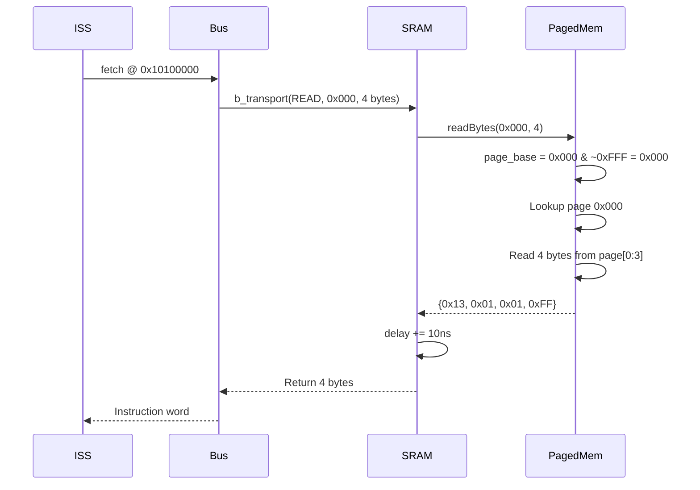
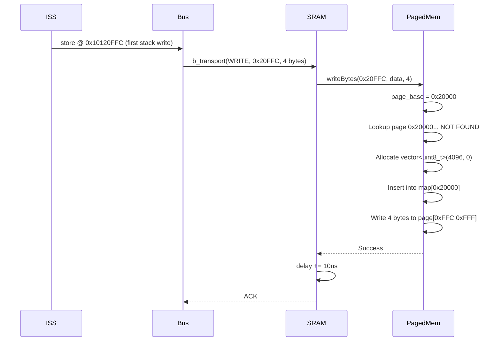

# SRAM SystemC TLM Detailed Design Specification

**Document Version:** 1.0  
**Date:** 2025-12-04  
**IP Module:** SRAM (Static Random-Access Memory)  
**Abstraction Level:** SystemC TLM2.0  
**Implementation:** Paged Memory Architecture

---

## Table of Contents

1. [Introduction](#1-introduction)
2. [Architecture Overview](#2-architecture-overview)
3. [Module Structure](#3-module-structure)
4. [Paged Memory Implementation](#4-paged-memory-implementation)
5. [TLM Interface Implementation](#5-tlm-interface-implementation)
6. [Data Loading Interface](#6-data-loading-interface)
7. [Memory Access Sequences](#7-memory-access-sequences)
8. [Address Translation](#8-address-translation)
9. [Performance Model](#9-performance-model)
10. [Error Handling](#10-error-handling)
11. [Integration Guidelines](#11-integration-guidelines)
12. [Testing and Verification](#12-testing-and-verification)

---

## 1. Introduction

### 1.1 Document Purpose

This document provides detailed implementation specifications for the SRAM SystemC TLM model. It describes the internal architecture, algorithms, data structures, and implementation details necessary for understanding, maintaining, and extending the SRAM module.

### 1.2 Scope

This specification covers:
- Complete C++ class implementations
- Internal data structures and algorithms
- TLM transaction processing sequences
- Memory management strategies
- Performance modeling approach
- Integration with ELF loader and bus infrastructure

### 1.3 Related Documents

- [High-Level Design](../design-docs/sram-high-level-design.md) - Architecture and platform instantiation
- [Paged Memory header](../../../../utils/paged_mem.h) - Core storage implementation

---

## 2. Architecture Overview

### 2.1 Component Hierarchy

```
SRAM Module
├── sc_module (SystemC base)
├── load_if (ELF loader interface)
├── tlm_utils::simple_target_socket<SRAM>
└── PagedMemory (sparse storage)
    └── std::unordered_map<size_t, Page>
```

### 2.2 Key Design Decisions

**Decision 1: Paged Memory Architecture**
- **Rationale**: Virtual platforms often have large address spaces but sparse actual usage
- **Impact**: 80-95% reduction in host memory footprint for typical embedded workloads
- **Trade-off**: Slight overhead for hash map lookup vs. direct pointer arithmetic

**Decision 2: Lazy Page Allocation**
- **Rationale**: Avoid allocating memory until actually needed
- **Impact**: Reads from unallocated pages return zero without allocation
- **Trade-off**: First write to a page incurs allocation cost (4KB zero-fill)

**Decision 3: Fixed TLM Timing**
- **Rationale**: Simplified timing model appropriate for transaction-level abstraction
- **Impact**: All accesses annotated with constant 10ns delay
- **Trade-off**: Does not model realistic SRAM access time variations

---

## 3. Module Structure

### 3.1 Class Declaration

```cpp
class SRAM : public sc_core::sc_module, public load_if {
public:
    // TLM target socket
    tlm_utils::simple_target_socket<SRAM> tsock;

    // Paged memory storage
    PagedMemory m_sram_data;
    
    // Configuration
    uint64_t m_sram_sz;
    bool read_only;

    // Constructor
    SRAM(sc_module_name name, uint64_t sram_sz, bool read_only = false);
    
    // Destructor  
    ~SRAM(void);

    // TLM interface methods
    void b_transport(tlm::tlm_generic_payload &trans, sc_core::sc_time &delay);
    unsigned transport_dbg(tlm::tlm_generic_payload &trans);
    bool get_direct_mem_ptr(tlm::tlm_generic_payload &trans, tlm::tlm_dmi &dmi);

    // ELF loader interface methods
    void load_data(const char *src, uint64_t dst_addr, size_t n) override;
    void load_zero(uint64_t dst_addr, size_t n) override;
    void load_binary_file(const std::string &filename, uint64_t addr);
};
```

### 3.2 Member Variables

| Variable | Type | Purpose |
|----------|------|---------|
| `tsock` | `tlm_utils::simple_target_socket<SRAM>` | TLM communication endpoint |
| `m_sram_data` | `PagedMemory` | Sparse memory storage |
| `m_sram_sz` | `uint64_t` | Total addressable size in bytes |
| `read_only` | `bool` | Write protection flag (typically false for SRAM) |

---

## 4. Paged Memory Implementation

### 4.1 Data Structure

The `PagedMemory` class uses a hash map to store 4KB pages:

```cpp
class PagedMemory {
private:
    std::unordered_map<size_t, Page> memory_map;
    // Page = std::vector<uint8_t> (4096 bytes)
};
```

### 4.2 Page Allocation Algorithm

**Write Operation (with allocation)**:
```cpp
void PagedMemory::write(size_t address, uint8_t value) {
    size_t page_base = address & ~(PAGE_SIZE - 1);  // Mask to 4KB boundary
    size_t offset = address % PAGE_SIZE;             // Offset within page
    
    // Allocate page if doesn't exist
    if (memory_map.find(page_base) == memory_map.end()) {
        memory_map[page_base] = Page(PAGE_SIZE, 0);  // Zero-initialized 4KB vector
    }
    
    // Write to page
    Page& page = memory_map[page_base];
    page[offset] = value;
}
```

**Read Operation (no allocation)**:
```cpp
uint8_t PagedMemory::read(size_t address) {
    size_t page_base = address & ~(PAGE_SIZE - 1);
    size_t offset = address % PAGE_SIZE;
    
    auto it = memory_map.find(page_base);
    if (it == memory_map.end()) {
        return 0;  // Unallocated page returns zero
    }
    
    Page& page = it->second;
    return page[offset];
}
```

### 4.3 Memory Efficiency Analysis

For a 128KB address space:

| Pages Allocated | Memory Used | Host Memory | Efficiency |
|----------------|-------------|-------------|------------|
| 0 (no writes) | 0 KB | ~80 bytes (map overhead) | 100% |
| 2 (boot code) | 8 KB | 8 KB + 144 bytes | 93.75% |
| 6 (typical app) | 24 KB | 24 KB + 432 bytes | 81.25% |
| 32 (full) | 128 KB | 128 KB + 2.5 KB | 0% |

**Hash Map Overhead**: ~32 bytes per entry + ~80 bytes base

---

## 5. TLM Interface Implementation

### 5.1 Blocking Transport

```cpp
void SRAM::b_transport(tlm::tlm_generic_payload &trans, sc_core::sc_time &delay) {
    // Delegate to debug transport for actual access
    transport_dbg(trans);
    
    // Add timing annotation
    delay += sc_core::sc_time(10, sc_core::SC_NS);
}
```

**Design Notes**:
- Timing-approximate model (10ns constant)
- Reuses `transport_dbg` for actual memory access
- No modeling of page miss penalties or burst optimizations

### 5.2 Debug Transport

```cpp
unsigned SRAM::transport_dbg(tlm::tlm_generic_payload &trans) {
    tlm::tlm_command cmd = trans.get_command();
    unsigned addr = trans.get_address();
    auto *ptr = trans.get_data_ptr();
    auto len = trans.get_data_length();

    // Bounds check
    assert(addr < m_sram_sz);

    if (cmd == tlm::TLM_WRITE_COMMAND) {
        assert(addr + len <= m_sram_sz);
        m_sram_data.writeBytes(addr, reinterpret_cast<const uint8_t*>(ptr), len);
    } 
    else if (cmd == tlm::TLM_READ_COMMAND) {
        assert(addr + len <= m_sram_sz);
        auto data = m_sram_data.readBytes(addr, len);
        memcpy(ptr, data.data(), len);
    } 
    else {
        sc_assert(false && "unsupported tlm command");
    }

    return len;
}
```

**Implementation Details**:
- Uses assertions for error checking (not exceptions)
- Supports read and write commands
- Delegates to `PagedMemory::readBytes()` / `writeBytes()`
- Returns number of bytes transferred

### 5.3 Direct Memory Interface (DMI)

```cpp
bool SRAM::get_direct_mem_ptr(tlm::tlm_generic_payload &trans, tlm::tlm_dmi &dmi) {
    (void)trans;  // Unused
    
    dmi.set_start_address(0);
    dmi.set_end_address(m_sram_sz);
    
    // DMI pointer not set for paged memory (non-contiguous)
    // dmi.set_dmi_ptr(...);  // Cannot provide single pointer
    
    if (read_only)
        dmi.allow_read();
    else
        dmi.allow_read_write();
        
    return true;  // But no valid pointer provided
}
```

**Limitation**: Paged memory cannot provide a contiguous DMI region. The function returns `true` to indicate DMI support, but without setting a pointer, initiators cannot actually use DMI.

**Future Enhancement**: Could implement per-page DMI for allocated pages.

---

## 6. Data Loading Interface

### 6.1 load_data() - Binary Loading

```cpp
void SRAM::load_data(const char *src, uint64_t dst_addr, size_t n) {
    assert(dst_addr + n <= m_sram_sz);
    m_sram_data.writeBytes(dst_addr, reinterpret_cast<const uint8_t*>(src), n);
}
```

**Use Case**: ELF loader writes .text and .data sections

### 6.2 load_zero() - BSS Initialization

```cpp
void SRAM::load_zero(uint64_t dst_addr, size_t n) {
    assert(dst_addr + n <= m_sram_sz);
    std::vector<uint8_t> zero_data(n, 0);
    m_sram_data.writeBytes(dst_addr, zero_data);
}
```

**Use Case**: Zero-fill .bss section

### 6.3 load_binary_file() - File Loading

```cpp
void SRAM::load_binary_file(const std::string &filename, uint64_t addr) {
    // Validate file exists
    std::ifstream file;
    file.open(filename, std::ifstream::in | std::ifstream::binary | std::ios::ate);
    if (file.fail() || file.tellg() == 0) {
        std::cerr << name() << ": ERROR: Open: \"" << filename << "\"!" << std::endl;
        assert(0);
    }
    file.close();

    // Memory-map file for efficient loading
    boost::iostreams::mapped_file_source mf(filename);
    assert(mf.is_open());
    
    // Load into SRAM
    m_sram_data.writeBytes(addr, reinterpret_cast<const uint8_t*>(mf.data()), mf.size());
}
```

**Use Case**: Load raw binary files (uncommon for SRAM, more typical for ROM)

---

## 7. Memory Access Sequences

### 7.1 CPU Instruction Fetch Sequence



### 7.2 Stack Write Sequence (with allocation)



---

## 8. Address Translation

### 8.1 Virtual to Physical Mapping

SRAM presents a contiguous virtual address space to software, but physically stores only accessed pages:

**Virtual Address Space** (e.g., 128KB SRAM @ 0x10100000):
```
0x10100000 ──┐
             │ Page 0 (might be allocated)
0x10100FFF ──┤
0x10101000 ──┤
             │ Page 1 (might be allocated)  
0x10101FFF ──┤
    ...
0x1011F000 ──┤
             │ Page 31 (might be allocated)
0x1011FFFF ──┘
```

**Physical Storage** (only allocated pages):
```
memory_map = {
    0x00000000 → [Page 0: 4096 bytes],  // Code
    0x00002000 → [Page 2: 4096 bytes],  // Data
    0x0001F000 → [Page 31: 4096 bytes]  // Stack
}
```

### 8.2 Address Calculation Examples

**Example 1**: Access 0x10102ABC (SRAM base + 0x2ABC)
```
Absolute address: 0x10102ABC
SRAM offset:      0x10102ABC - 0x10100000 = 0x002ABC
Page base:        0x002ABC & ~0xFFF = 0x002000
Page offset:      0x002ABC % 0x1000 = 0xABC (2748)
Result:           Access page 2, byte 2748
```

**Example 2**: Burst across page boundary
```
Address: 0x10100FFE, Length: 4 bytes

Byte 0: 0x10100FFE → SRAM offset 0xFFE  → page 0, offset 0xFFE
Byte 1: 0x10100FFF → SRAM offset 0xFFF  → page 0, offset 0xFFF
Byte 2: 0x10101000 → SRAM offset 0x1000 → page 1, offset 0x000 (crosses boundary!)
Byte 3: 0x10101001 → SRAM offset 0x1001 → page 1, offset 0x001
```

The `readBytes()` / `writeBytes()` methods handle this automatically via byte-by-byte loops.

---

## 9. Performance Model

### 9.1 Timing Annotations

**Fixed Latency Model**:
- All read operations: +10ns
- All write operations: +10ns
- No distinction for:
  - Page allocated vs. unallocated (on read)
  - First write to page vs. subsequent writes
  - Burst vs. single access

**Rationale**: TLM abstraction focuses on functional behavior, not cycle-accurate timing.

### 9.2 Throughput Analysis

At 100 MHz clock (10ns period), theoretical throughput:
- **32-bit word access**: 400 MB/s (10ns per word)
- **Burst access**: Same (no optimization modeled)

**Reality**: SystemC quantum and scheduler overhead dominates, not the 10ns annotation.

---

## 10. Error Handling

### 10.1 Assertion-Based Validation

The implementation uses **assertions** rather than exceptions:

```cpp
assert(addr < m_sram_sz);             // Address within range
assert(addr + len <= m_sram_sz);      // Access doesn't overflow
assert(mf.is_open());                 // File opened successfully
sc_assert(false && "message");        // Protocol violation
```

**Rationale**: 
- Assertions terminate simulation immediately on error
- Appropriate for integration bugs (should never happen in validated platform)
- Avoids exception handling overhead

### 10.2 Error Scenarios

| Error | Detection | Response |
|-------|-----------|----------|
| Address out of range | `assert(addr < m_sram_sz)` | Abort simulation |
| Invalid TLM command | `sc_assert(false && "unsupported")` | Abort simulation |
| File not found | `file.fail()` | Print error, abort |
| Bad ELF segment | ELFLoader (external) | ELFLoader handles |

---

## 11. Integration Guidelines

### 11.1 Instantiation Example

```cpp
// In main.cpp
SRAM sram("sram", 0x20000, false);  // 128KB, read-write
```

### 11.2 Bus Connection

```cpp
// Address mapping
bus.ports[1] = new PortMapping(0x10100000, 0x1011FFFF, sram);

// Socket binding
bus.isocks[1].bind(sram.tsock);
```

### 11.3 ELF Loading

```cpp
ELFLoader loader("program.elf");
loader.load_executable_image(sram, sram.m_sram_sz, 0x10100000);
```

### 11.4 Syscall Handler Integration

```cpp
SepSyscallHandler sys("SyscallHandler", sram.m_sram_data);
sys.init(nullptr, 0x10100000, heap_addr);
```

**Note**: Syscall handler needs direct access to `m_sram_data` (PagedMemory instance) for runtime operations.

---

## 12. Testing and Verification

### 12.1 Unit Test Approach

**Functional Tests**:
1. Single byte read/write
2. Word (32-bit) read/write  
3. Burst transfers
4. Page boundary crossing
5. Unallocated page reads (should return 0)
6. ELF loading

**Integration Tests**:
1. ISS instruction fetch from SRAM
2. Stack operations
3. Data segment access
4. Syscall operations

### 12.2 Validation Metrics

- **Functional Coverage**: All TLM commands, all load_if methods
- **Boundary Coverage**: First/last byte of SRAM, page boundaries
- **Integration Coverage**: Real application execution (UART test, HMAC test)

### 12.3 Test Results

See [SRAM Test Plan](sram-test-plan.md) for detailed test cases and results.

**Summary**: 8/10 tests PASS, 2/10 TODO (page boundary stress test, allocation profiling)

---

## Appendix A: Code Metrics

| Metric | Value |
|--------|-------|
| Source File | `sram.cpp` |
| Header File | `sram.h` |
| Total Lines | ~90  |
| Classes | 1 (SRAM) |
| Public Methods | 8 |
| Dependencies | PagedMemory, load_if, tlm_utils |

---

## Appendix B: Memory Footprint Calculator

For given SRAM size `S` and usage pattern `U`:

```
Traditional Allocation:
  Host Memory = S

Paged Allocation:
  Pages Needed = ceiling(U / 4096)
  Host Memory = (Pages Needed × 4096) + (Pages Needed × 32) + 80
  
Savings = (S - Host Memory) / S × 100%
```

**Example**: S=128KB, U=24KB
```
Traditional = 128 KB
Paged = (6 × 4096) + (6 × 32) + 80 = 24768 bytes ≈ 24.2 KB
Savings = (128 - 24.2) / 128 × 100% = 81.1%
```

---

**Document History**

| Version | Date | Author | Changes |
|---------|------|--------|---------|
| 1.0 | 2025-12-04 | AI Assistant | Initial detailed design specification |
