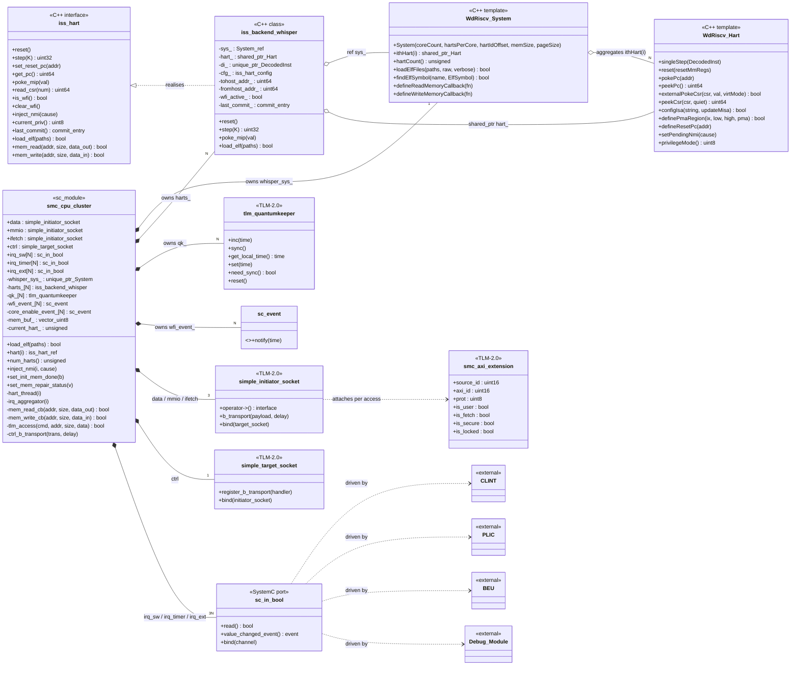
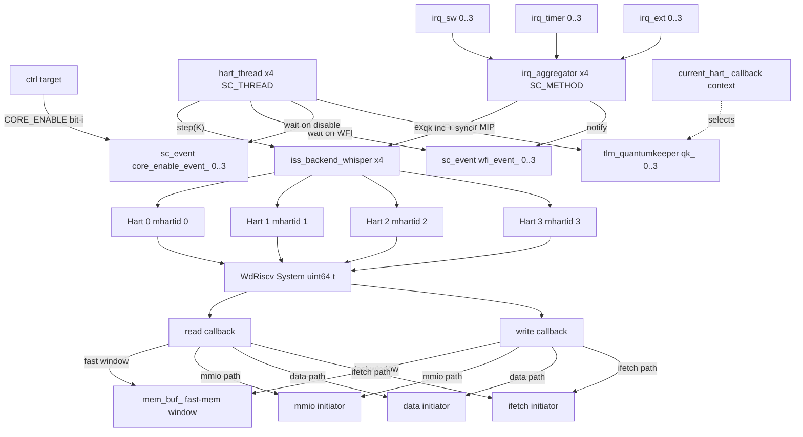
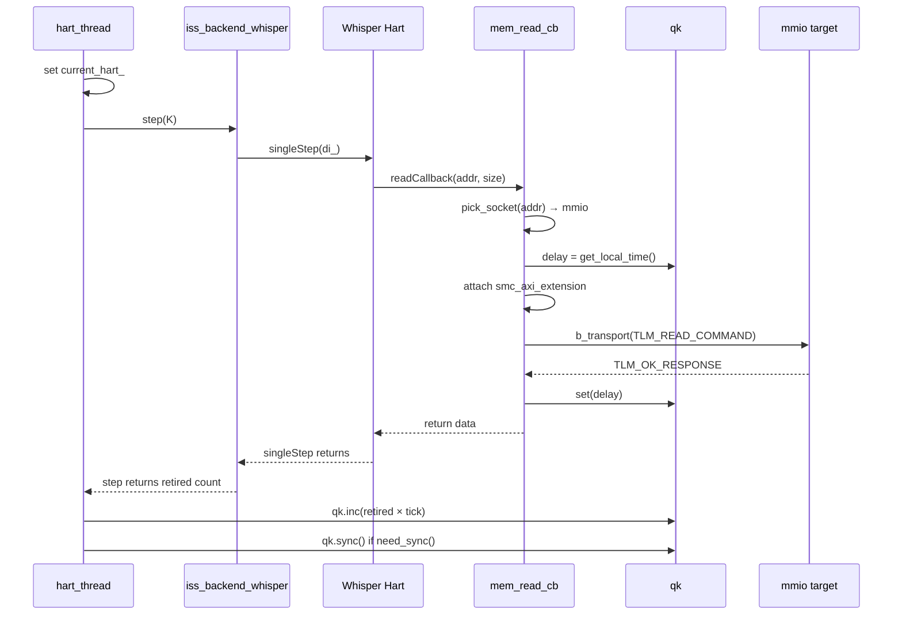
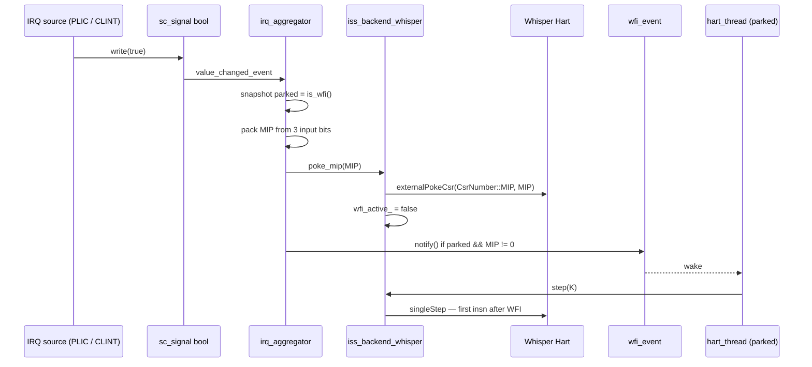
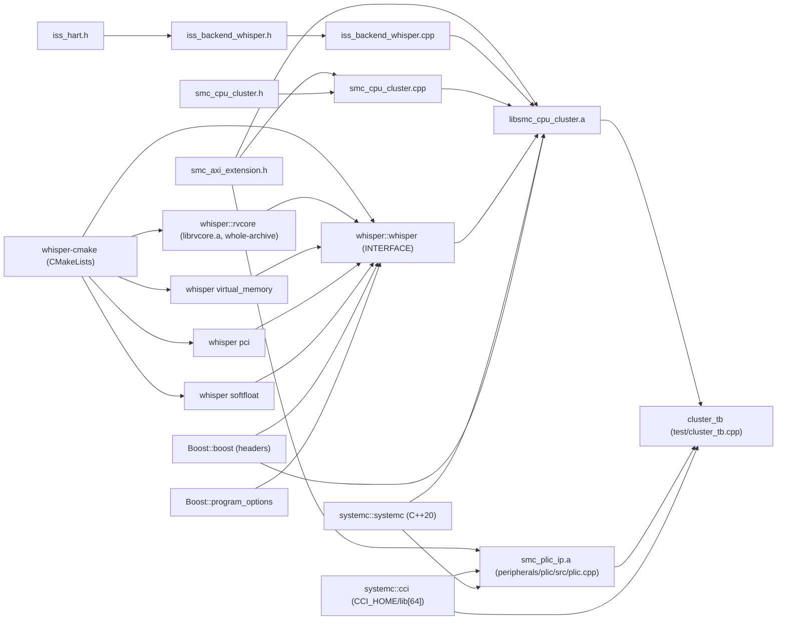

# SMC CPU Cluster — Low-Level Design & Implementation

> Companion document to `01_SMC_Architecture.pdf` (chiplet-level architecture)
> and `02_SMC_IP_LowLevel_Design.pdf §3` (CPU cluster low-level design).
> This document is the markdown reference for the SystemC / TLM-2.0
> implementation that lives under `libsmc/cpu/`.  It is intended to be
> readable on its own — the PDFs are normative for the *what*, this doc
> is normative for the *how*.

## Contents

1. [Purpose & scope](#1-purpose--scope)
2. [SMC top-level architecture (chiplet view)](#2-smc-top-level-architecture-chiplet-view)
   - 2.1 [SMC subsystem role](#21-smc-subsystem-role)
   - 2.2 [Top-level block diagram](#22-top-level-block-diagram)
   - 2.3 [Key parameters](#23-key-parameters)
   - 2.4 [Memory map (high-level)](#24-memory-map-high-level)
   - 2.5 [Clock & reset domains](#25-clock--reset-domains)
   - 2.6 [Fabric behavior (LT abstraction)](#26-fabric-behavior-lt-abstraction)
   - 2.7 [IP catalog (units of modeling)](#27-ip-catalog-units-of-modeling)
   - 2.8 [Modeling priorities](#28-modeling-priorities)
3. [CPU Cluster — role in the SMC](#3-cpu-cluster--role-in-the-smc)
   - 3.1 [Position in the chiplet](#31-position-in-the-chiplet)
   - 3.2 [External interfaces (DUT boundary)](#32-external-interfaces-dut-boundary)
   - 3.3 [Internal block view](#33-internal-block-view)
4. [CPU Cluster — implementation](#4-cpu-cluster--implementation)
   - 4.1 [File layout](#41-file-layout)
   - 4.2 [Component inventory](#42-component-inventory)
   - 4.3 [Spawned processes](#43-spawned-processes)
   - 4.4 [ISS backend (Whisper)](#44-iss-backend-whisper)
   - 4.5 [Memory callback bridge & address decode](#45-memory-callback-bridge--address-decode)
   - 4.6 [IRQ aggregator](#46-irq-aggregator)
   - 4.7 [TLM-2.0 sideband — `smc_axi_extension`](#47-tlm-20-sideband--smc_axi_extension)
   - 4.8 [CPU Control register file (BASE + 0x001_0000)](#48-cpu-control-register-file-base--0x001_0000)
   - 4.9 [Temporal decoupling (`tlm_quantumkeeper`)](#49-temporal-decoupling-tlm_quantumkeeper)
   - 4.10 [ELF loading](#410-elf-loading)
5. [Class & component diagrams](#5-class--component-diagrams)
   - 5.1 [Class diagram (UML)](#51-class-diagram-uml)
   - 5.2 [Component view (num_harts = 4)](#52-component-view-num_harts--4)
   - 5.3 [Runtime sequence — MMIO load](#53-runtime-sequence--mmio-load)
   - 5.4 [Runtime sequence — IRQ wakes a parked hart](#54-runtime-sequence--irq-wakes-a-parked-hart)
6. [Build & dependency view](#6-build--dependency-view)
7. [Conformance with §3 of 02_SMC_IP_LowLevel_Design](#7-conformance-with-3-of-02_smc_ip_lowlevel_design)
8. [Peer-IP integration status](#8-peer-ip-integration-status)
9. [References](#9-references)

---

## 1. Purpose & scope

The **System Management Controller (SMC)** is the per-chiplet subsystem that
owns clock / voltage / reset management, hardware platform bring-up, security
filtering, interrupt aggregation and inter-chiplet communication.  It is built
around a small firmware-driven **RV64GC microcontroller cluster** of 1–4
cores.

This document covers two layers:

1. **Chiplet view (§2)** — the SMC's role in the OCAH SMU, its TLM
   topology, memory map, and the catalogue of peer IPs that the cluster
   interacts with.  This is a summary of `01_SMC_Architecture.pdf` and is
   provided so a reader of the cluster code has the surrounding context in
   one searchable place.
2. **CPU cluster view (§3 – §7)** — the architecture and implementation of
   `smc::smc_cpu_cluster`, the SystemC/TLM-2.0 model under `libsmc/cpu/`.
   This is the deliverable that the markdown documents in this directory
   (`03_CPU_Cluster_Test_Plan.md`, `04_CCI_Integration_Guide.md`) verify.

The implementation uses the Tenstorrent **Whisper** ISS
(`WdRiscv::System<uint64_t>` / `WdRiscv::Hart<uint64_t>`) as the sole
execution engine, behind a backend-agnostic `iss_hart` interface so the
cluster does not call Whisper APIs directly.

### 1.1 Verification scope (what this IP proves)

`03_CPU_Cluster_Test_Plan.md` and `test/cluster_tb` verify the **cluster
model** and **integration hooks** to peer IPs. They do not replace
peripheral-IP or SoC-level plans.

| Aspect | Owner | `cluster_tb` |
|--------|-------|--------------|
| PLIC IP functional matrix | `peripherals/plic` + `plic_tb` | Real `plic.cpp` linked; exhaustive matrix in `plic_tb` |
| Cluster ↔ PLIC (MMIO + `irq_ext` + ISR) | §8.7 of test plan | **In scope** |
| CLINT IP (mtime, MSIP MMIO, …) | `peripherals/clint` (future) | **Out of scope** — `irq_sw` / `irq_timer` stubs only (§8.6) |
| Scratchpad on `data` @ `0xC006_0000` | Fabric router (future) | `INIT_MEM_DONE` handshake via `ScratchpadSramStub` only |
| `riscv_plic0.c` / production IRQ map | Firmware / SoC test plan | Open |

See also `03_SMC_Test_Plan.md` §A.2 for the repo-wide GTest vs `*_tb` patterns.

---

## 2. SMC top-level architecture (chiplet view)

### 2.1 SMC subsystem role

> Source: `01_SMC_Architecture.pdf §1`.

The SMC is a per-chiplet subsystem providing:

- Clock, voltage and reset management (PLLs, reset trees, FLR, AVS).
- Hardware platform configuration and bring-up (boot ROM, eFuse, straps).
- System monitoring & telemetry (PVT, ATB telemetry, log engine).
- Inter-processor / inter-chiplet communication (mailboxes, OCTS time
  sync, I²C/I³C).
- Security-aware fabric (address remap, inbound/outbound filters,
  protection bits).
- Centralised interrupt management (PLIC, CLINT, per-core watchdogs,
  BEUs).

In a multi-chiplet SiP each chiplet contains one SMC; the SMC of the
primary chiplet additionally orchestrates SiP-level tasks for secondary
chiplets via the OCCP protocol.

All control logic lives in **firmware** running on the cluster; HW IPs
are added only when firmware cannot meet performance / determinism /
security requirements.

### 2.2 Top-level block diagram

> Source: `01_SMC_Architecture.pdf §2`, re-drawn for the SystemC/TLM-2.0
> modeling unit boundary.

```
                    sys_axi_in           sep_axi_in           jtag_axi_in
                         │                    │                    │
                         ▼                    ▼                    ▼
                  ┌─────────────────────────────────────────────────────┐
                  │            Inbound  Filters  ×16                    │
                  │       (prot[2:0] / source_id / addr range)          │
                  └─────────────────────────┬───────────────────────────┘
                                            │
                  ┌─────────────────────────▼───────────────────────────┐
                  │              SMC Fabric  (Router)                   │
                  │           AXI4  +  AXI4-Lite  dual network          │
                  │        Alias / M-mode / Xvisor remap shims          │
                  │   LOCAL_BASE = 0xC000_0000  ·  REGION_SIZE = 32 MB  │
                  └──┬───────────┬──────────────┬───────────┬───────────┘
                     │           │              │           │
       ┌─────────────┘           │              │           └────────────┐
       │                         │              │                        │
       ▼                         ▼              ▼                        ▼
 ┌──────────────┐        ┌──────────────┐ ┌──────────────┐       ┌──────────────┐
 │ CPU Cluster  │        │ Boot ROM     │ │  Scratchpad  │       │  Outbound    │
 │ 1-4 × RV64GC │        │   64 KB      │ │     SRAM     │       │ Filters ×16  │
 │ L1 I/D · MMU │        │     DMI      │ │ 1 MiB · 32 b │       │ → output_axi │
 │ M / S / U    │        └──────────────┘ │  DMI · init  │       └──────────────┘
 │ CPU Control  │                         └──────────────┘
 │ (BASE+0x10k) │
 └──────┬───────┘
        │
        │   Per-hart IRQ inputs (sc_signal<bool>):
        │     irq_sw[i]   ← CLINT  (MSIP)
        │     irq_timer[i]← CLINT  (MTIP)
        │     irq_ext[i]  ← PLIC   (MEIP / SEIP)
        │     beu_nmi_in  ← BEU
        │     debug_irq_in← Debug Module
        ▼
 ┌────────────────────────────────────────────────────────────────────────┐
 │  Interrupt / Safety   PLIC (332 src · 8 ctx)  ·  CLINT  ·  WDT ×4      │
 │                       BEU ×4  ·  Debug Module                          │
 └────────────────────────────────────────────────────────────────────────┘

 ┌────────────────────────────────────────────────────────────────────────┐
 │  Internal Masters     DMA (PULP iDMA)  ·  Memory Zeroer  ·             │
 │                       Log Engine ×4    ·  Debug Module jtag2axi         │
 └────────────────────────────────────────────────────────────────────────┘

 ┌────────────────────────────────────────────────────────────────────────┐
 │  Peripheral Crossbar  (AXI4-Lite, clk_periph_i)                        │
 │   Mailbox ×32 · OCTS Timer · eFuse · UART 16550 ×4 · I²C ×3            │
 │   AVSBus · GPIO ×68 · Telemetry ×3 · PVT · PLL Wrapper · Reset Unit    │
 │   MISC Wrapper                                                         │
 └────────────────────────────────────────────────────────────────────────┘

Legend
   solid arrow = TLM data path  (AXI4 / AXI4-Lite via b_transport)
   dashed line = interrupt / control signal  (sc_signal<bool>)
```

Each block in the figure above corresponds to **one SystemC modeling
unit** listed in §2.7.

### 2.3 Key parameters

> Source: `01_SMC_Architecture.pdf §2.1`.

| Parameter                              | Value                       |
|----------------------------------------|-----------------------------|
| CPU cores                              | 1–4 RV64GC                  |
| Aperture size                          | 32 MB at SMC-local base `0xC000_0000` |
| AXI4 data width                        | 64-bit                      |
| AXI4 system address width              | 56-bit                      |
| AXI4 internal address width            | 32-bit                      |
| Maximum interrupt sources at PLIC      | 332 (326 active)            |
| Peripheral clock domain                | ≥ 100 MHz                   |

### 2.4 Memory map (high-level)

> Source: `01_SMC_Architecture.pdf §2.2`.  All offsets are relative to
> `LOCAL_BASE = 0xC000_0000` (read-only) which aliases to a
> firmware-programmable `GLOBAL_BASE` (default `0x4000_0000`).

| Range (BASE+)                  | Size    | Block                                       |
|--------------------------------|---------|---------------------------------------------|
| `0x000_0000`–`0x000_0FFF`      | 4 KB    | Watchdog Timers (4 cores)                   |
| `0x000_1000`–`0x000_1FFF`      | 4 KB    | RISC-V Debug Module                         |
| `0x000_2000`–`0x000_3FFF`      | 8 KB    | Reset Unit, MISC, PLL Wrapper               |
| `0x000_4000`–`0x000_4FFF`      | 4 KB    | GPIO Interface (68) + GPIO Control          |
| `0x000_7000`–`0x000_AFFF`      | 16 KB   | PVT, AVSBus, I²C, UART                      |
| `0x000_B000`–`0x000_FFFF`      | 20 KB   | eFuse, Telemetry, OCTS, DTP/DFT             |
| `0x001_0000`–`0x001_7FFF`      | 32 KB   | **CPU Control**, Alias / M-mode / Xvisor remap, Filters |
| `0x001_8000`–`0x003_7FFF`      | 128 KB  | Mailbox (32 channels)                       |
| `0x003_8000`–`0x003_83FF`      | 1 KB    | DMA + Zeroer                                |
| `0x004_0000`–`0x007_FFFF`      | 256 KB  | ROM + Scratchpad SRAM                       |
| `0x100_0000`–`0x17F_FFFF`      | 8 MB    | M-mode remapped region                      |
| `0x180_0000`–`0x1FF_FFFF`      | 8 MB    | Xvisor remapped region                      |
| `0x400_0000`–`0x43F_FFFF`      | 4 MB    | PLIC                                        |
| `0x800_0000`–`0x800_FFFF`      | 64 KB   | CLINT                                       |
| `0x801_0000 + N×0x1000`        | 4×4 KB  | Bus Error Units                             |

The **CPU Control** sub-window (32 KB at BASE + `0x001_0000`) is owned by
the cluster's `ctrl` target socket (see §4.8).

### 2.5 Clock & reset domains

> Source: `01_SMC_Architecture.pdf §3`.

| Domain            | Drives                                                  |
|-------------------|---------------------------------------------------------|
| `clk_smc_i`       | CPU cluster, AXI4 fabric, alias remap, filters          |
| `clk_ref_i`       | CLINT, OCTS, debug, reset CDC anchor, PLL ref           |
| `clk_periph_i`    | AVSBus, I²C, UART, I³C, peripheral crossbar             |
| `clk_telemetry_i` | Telemetry receiver (sourced by ATB)                     |

Reset hierarchy:

- **Cold Reset** (POR / external) — primary reset.
- **Cool Reset** (BMC / FLR sequence) — primary reset, with isolation.
- **Core Reset** — CPU + private caches, PLIC, CLINT, WDT, BEU.
- **Function Level Reset (FLR)** — PCIe-driven; programmable pre-reset
  delay (`ISOLATE_REQ_FLR_COUNTER_VALUE`) and reset hold
  (`ISOLATE_REQ_FLR_RESET_COUNTER_VALUE`); auto-bypasses memory repair
  via `skip_mem_repair_o`.
- **Watchdog Reset / Debug Reset** — core-local.

LT-modeling implications:

- Clocks are abstract; no waveform is generated.  Each module exposes a
  single `sc_event`-based reset and uses `sc_time` deltas for delay
  annotations.
- Reset signals are modelled as boolean inputs that trigger SC_METHOD
  initialisers.

### 2.6 Fabric behavior (LT abstraction)

> Source: `01_SMC_Architecture.pdf §4`.

The SMC fabric is a **dual-network interconnect**:

- AXI4 high-performance network — CPU cluster, SRAM, DMA, filtering,
  external AXI ports.
- AXI4-Lite low-performance network — peripherals and configuration
  registers.

In LT, the fabric is one **TLM-2.0 router module** that exposes:

- one `tlm_utils::simple_target_socket` per IP;
- one `tlm_utils::simple_initiator_socket` per master (CPU, DMA,
  JTAG2AXI, Log Engine, `sys_axi_in`, `sep_axi_in`).

Every transaction carries a `tlm::tlm_generic_payload` extended with the
sideband fields described in §4.7 (`smc::smc_axi_extension`).  Address
remapping (alias / M-mode / Xvisor) and the inbound / outbound filters
are **purely functional** in LT — latency is annotated only when needed
for performance studies (default 0 ns).

### 2.7 IP catalog (units of modeling)

> Source: `01_SMC_Architecture.pdf §5`.  Each entry is one SystemC
> modeling unit.  Per-IP detail is in `02_SMC_IP_LowLevel_Design.pdf`.

| #  | IP module                                    | TLM role               | Bus                | Approx. reg space    |
|----|----------------------------------------------|------------------------|--------------------|----------------------|
| 1  | `smc_cpu_cluster` (RV64GC wrapper)           | Initiator + Target     | AXI4 / AXI4-Lite   | 8 KB (CPU Ctrl)      |
| 2  | `plic` (332 sources)                         | Target                 | AXI4-Lite          | 4 MB                 |
| 3  | `clint` (4 cores)                            | Target                 | AXI4-Lite          | 64 KB                |
| 4  | `wdt` (per-core watchdog ×4)                 | Target                 | APB4               | 1 KB each            |
| 5  | `bus_error_unit` (per-core BEU ×4)           | Target                 | AXI4-Lite          | 4 KB each            |
| 6  | `boot_rom`                                   | Target                 | AXI4-Lite          | up to 64 KB          |
| 7  | `scratchpad_sram` (32 banks, 1 MiB)          | Target                 | AXI4               | 128 KB × 2 windows   |
| 8  | `smc_fabric` (router + remap)                | Router                 | AXI4 + AXI4-Lite   | —                    |
| 9  | `axi_filter` (inbound ×16 + outbound ×16)    | Filter                 | AXI4 / AXI4-Lite   | 32 B per filter      |
| 10 | `dma_engine` (PULP iDMA)                     | Initiator + Target     | AXI4 + AXI4-Lite   | 512 B                |
| 11 | `memory_zeroer`                              | Initiator + Target     | AXI4 + AXI4-Lite   | 512 B                |
| 12 | `mailbox_unit` (up to 32 pairs)              | Target                 | AXI4-Lite          | 2 KB × 64            |
| 13 | `system_timer_octs`                          | Target + pulse I/F     | AXI4-Lite / APB4   | 36 B                 |
| 14 | `efuse` (ctrl + shadow + bank + SHIM)        | Target                 | APB4 + AXI4-Lite   | 4 KB total           |
| 15 | `uart_16550` (×4)                            | Target                 | AXI4-Lite          | 64 B                 |
| 16 | `log_engine` (×4)                            | Initiator + Target     | AXI4-Lite          | 128 B                |
| 17 | `i2c_controller` (×3, OpenTitan-style)       | Target + initiator-on-bus | AXI4-Lite       | 4 KB                 |
| 18 | `avsbus_controller`                          | Target                 | AXI4-Lite / APB4   | 256 B                |
| 19 | `gpio` (68 + ctrl)                           | Target                 | AXI4-Lite          | 16 B/inst + 32 B ctrl |
| 20 | `telemetry_receiver` (×3, ATB)               | Target + ATB sink      | AXI4-Lite          | 128 B                |
| 21 | `reset_unit`                                 | Target                 | AXI4-Lite          | 2 KB                 |
| 22 | `pll_wrapper`                                | Target                 | AXI4-Lite          | 4 KB                 |
| 23 | `misc_wrapper`                               | Target                 | AXI4-Lite          | 2 KB                 |
| 24 | `debug_module` (RISC-V DM)                   | Target + initiator (jtag2axi) | AXI4-Lite + APB | 4 KB              |
| 25 | `pvt_wrapper`                                | Target                 | AXI4-Lite          | 4 KB                 |

I³C controllers (§6.10) are listed in the spec as RESERVED / NOT YET
IMPLEMENTED and are therefore excluded from the initial modeling scope.

### 2.8 Modeling priorities

> Source: `01_SMC_Architecture.pdf §5.2`.

| Priority | Modules                                                                                                                                                       | Rationale                                                |
|----------|---------------------------------------------------------------------------------------------------------------------------------------------------------------|----------------------------------------------------------|
| P0       | `smc_fabric`, `axi_filter`, `smc_cpu_cluster` (stub), `plic`, `clint`, `boot_rom`, `scratchpad_sram`, `reset_unit`, `misc_wrapper`, `mailbox_unit`, `system_timer_octs`, `uart_16550`, `gpio`, `efuse` | Required to boot SMC firmware up to OCCP loop.            |
| P1       | `dma_engine`, `memory_zeroer`, `log_engine`, `i2c_controller`, `avsbus_controller`, `pvt_wrapper`, `telemetry_receiver`, `pll_wrapper`, `wdt`, `bus_error_unit` | Required for full functional system management workloads. |
| P2       | `debug_module`                                                                                                                                                | Needed only when modelling JTAG / debug flows.            |

---

## 3. CPU Cluster — role in the SMC

### 3.1 Position in the chiplet

The cluster is **the only firmware-executing IP in the SMC**.  Every
management decision (boot, FLR, telemetry, OCCP, AVS, security) is taken
by software running on 1–4 RV64GC harts inside it; every other SMC IP
exists to give that firmware deterministic, low-latency hooks into the
hardware.

The cluster is wired to the SMC fabric as both an **AXI initiator** (for
hart loads/stores and instruction fetches into the fabric) and an
**AXI-Lite target** (for the 8 KB CPU Control register block at BASE +
`0x001_0000`).

### 3.2 External interfaces (DUT boundary)

The cluster's only contact points with the rest of the chiplet are:

| Direction      | Object                                | Type                                | Purpose                                                                                       |
|----------------|---------------------------------------|-------------------------------------|-----------------------------------------------------------------------------------------------|
| out → fabric   | `data`                                | `simple_initiator_socket<...,64>`   | High-perf data accesses (SRAM, DMA target, internal SRAM)                                     |
| out → fabric   | `mmio`                                | `simple_initiator_socket<...,64>`   | Peripheral / register-window accesses (PLIC, CLINT, peripherals)                              |
| out → fabric   | `ifetch`                              | `simple_initiator_socket<...,64>`   | Instruction fetch path (currently routed identically; reserved for an ICache decode hook)     |
| in  ← fabric   | `ctrl`                                | `simple_target_socket<...,64>`      | CPU Control register file (RESET_VECTOR_N, CORE_ENABLE, LOCAL/GLOBAL_BASE, REGION_SIZE, …)    |
| in  ← CLINT    | `irq_sw[i]`                           | `sc_in<bool>`                       | Per-hart software interrupt (MSIP / MIP[3])                                                   |
| in  ← CLINT    | `irq_timer[i]`                        | `sc_in<bool>`                       | Per-hart timer interrupt (MTIP / MIP[7])                                                      |
| in  ← PLIC     | `irq_ext[i]`                          | `sc_in<bool>`                       | Per-hart external interrupt (MEIP / MIP[11])                                                  |

Future / not-yet-wired (gated on peer IPs):

| Direction    | Object         | Source        |
|--------------|----------------|---------------|
| in ← BEU     | `beu_nmi_in`   | Bus Error Unit |
| in ← Debug   | `debug_irq_in` | Debug Module  |
| in ← PLIC    | `irq_ext_s[i]` | PLIC (S-mode context) — see `03_CPU_Cluster_Test_Plan.md §13.1` |

### 3.3 Internal block view

Plain-ASCII "read this first" sketch — renders in any editor, with the
DUT / TB split made explicit:

```
 ╔══════════════════════════════════════════════════════════════════════╗
 ║                     TESTBENCH  (test/*.cpp, sc_main)                 ║
 ║                                                                      ║
 ║    ┌───────────────────────┐         ┌──────────────────────────┐    ║
 ║    │  TlmRamStub           │         │  sc_signal<bool>          │   ║
 ║    │  simple_target_socket │         │   irq_sw_sig[0..N-1]      │   ║
 ║    │  b_transport → OK     │         │   irq_timer_sig[0..N-1]   │   ║
 ║    │  (flat ROM / RAM      │         │   irq_ext_sig[0..N-1]     │   ║
 ║    │   on the bus)         │         │  (driven by CLINT / PLIC  │   ║
 ║    │                       │         │   stubs in the TB)        │   ║
 ║    └──────────┬────────────┘         └─────────────┬─────────────┘   ║
 ║               │ socket-to-socket bind() at         │ port-to-channel ║
 ║               │ sc_main elaboration                │ bind() at       ║
 ║               │                                    │ sc_main         ║
 ╚═══════════════╪════════════════════════════════════╪═════════════════╝
                 │                                    │
                 │     ┌── DUT boundary ──┐           │
                 │     │                  │           │
                 ▼                                    ▼
 ╔══════════════════════════════════════════════════════════════════════╗
 ║                    DUT  (libsmc/cpu/, smc_cpu_cluster)               ║
 ║                                                                      ║
 ║    ┌───────────────────────┐         ┌──────────────────────────┐    ║
 ║    │  data / mmio / ifetch │         │  irq_sw / irq_timer /    │    ║
 ║    │  simple_initiator_    │         │  irq_ext                 │    ║
 ║    │   socket  (3 ports)   │         │  sc_in<bool> × 3 × N     │    ║
 ║    └──────────┬────────────┘         └─────────────┬────────────┘    ║
 ║               │ b_transport(payload, delay)        │ value_changed_  ║
 ║               │                                    │  event          ║
 ║               ▼                                    ▼                 ║
 ║    ┌───────────────────────┐         ┌──────────────────────────┐    ║
 ║    │  mem_read_cb /        │         │  irq_aggregator(i) × N   │    ║
 ║    │  mem_write_cb         │         │   SC_METHOD              │    ║
 ║    │                       │         │                          │    ║
 ║    │  ┌────────────────┐   │         │   pack MIP from 3 bits:  │    ║
 ║    │  │   mem_buf_     │   │         │     bit  3 = MSIP        │    ║
 ║    │  │ fast-mem flat  │   │         │     bit  7 = MTIP        │    ║
 ║    │  │  byte buffer   │   │         │     bit 11 = MEIP        │    ║
 ║    │  │ [lo, hi)       │   │         │   call poke_mip(MIP)     │    ║
 ║    │  └────────────────┘   │         │   notify wfi_event_[i]   │    ║
 ║    │                       │         │     if hart was parked   │    ║
 ║    │  if addr in fast win  │         └─────────────┬────────────┘    ║
 ║    │     read/write buf    │                       │                 ║
 ║    │  else                 │                       │                 ║
 ║    │     pick_socket(addr) │                       │                 ║
 ║    │     → b_transport     │                       │                 ║
 ║    └──────────┬────────────┘                       │                 ║
 ║               │ readCallback_ / writeCallback_     │                 ║
 ║               │ (registered on Whisper System)     │ external        ║
 ║               │                                    │ PokeCsr(MIP)    ║
 ║               ▼                                    ▼                 ║
 ║    ┌──────────────────────────────────────────────────────────────┐  ║
 ║    │       iss_backend_whisper × N  (per-hart adapter)            │  ║
 ║    │  reset / step / poke_mip / read_csr / load_elf / mem_rw      │  ║
 ║    └─────────────────────────────┬────────────────────────────────┘  ║
 ║                                  │                                   ║
 ║                                  ▼                                   ║
 ║    ┌──────────────────────────────────────────────────────────────┐  ║
 ║    │      Whisper engine     WdRiscv::System<uint64_t>            │  ║
 ║    │      (one shared engine for all harts in the cluster)        │  ║
 ║    │                                                              │  ║
 ║    │   ┌────────┐   ┌────────┐   ┌────────┐   ┌────────┐          │  ║
 ║    │   │ Hart 0 │   │ Hart 1 │   │ Hart 2 │   │ Hart 3 │  ...     │  ║
 ║    │   │ single │   │ single │   │ single │   │ single │          │  ║
 ║    │   │  Step  │   │  Step  │   │  Step  │   │  Step  │          │  ║
 ║    │   │  CSR   │   │  CSR   │   │  CSR   │   │  CSR   │          │  ║
 ║    │   │  IRQ   │   │  IRQ   │   │  IRQ   │   │  IRQ   │          │  ║
 ║    │   │  PMA   │   │  PMA   │   │  PMA   │   │  PMA   │          │  ║
 ║    │   └────┬───┘   └────┬───┘   └────┬───┘   └────┬───┘          │  ║
 ║    └────────┼────────────┼────────────┼────────────┼──────────────┘  ║
 ║             │            │            │            │                 ║
 ║             ▼            ▼            ▼            ▼                 ║
 ║    ┌──────────────────────────────────────────────────────────────┐  ║
 ║    │   hart_thread(i) × N    SC_THREAD                            │  ║
 ║    │      reset()                                                 │  ║
 ║    │      while true:                                             │  ║
 ║    │          if is_wfi(): qk.sync(); wait(wfi_event_[i])         │  ║
 ║    │          current_hart_ = i                                   │  ║
 ║    │          step(K)                                             │  ║
 ║    │          qk.inc(retired × tick); if need_sync(): qk.sync()   │  ║
 ║    └──────────────────────────────────────────────────────────────┘  ║
 ║                                                                      ║
 ╚══════════════════════════════════════════════════════════════════════╝
```

The right-hand side shows how a `sc_signal<bool>` rising edge becomes a
`MIP` poke and a WFI wake-up; the left-hand side shows how a hart load
becomes a `b_transport` on one of three initiator sockets after the
fast-mem fast path is consulted.  All four sockets and the IRQ inputs
are the cluster's only external interfaces — every other peer IP plugs
into one of them.

---

## 4. CPU Cluster — implementation

### 4.1 File layout

```
external/
  whisper/                      ← git submodule (tenstorrent/whisper, pinned SHA)
  whisper-cmake/
    CMakeLists.txt              ← build shim (ExternalProject wrapping GNUmakefile)

libsmc/cpu/
  iss_hart.h                    ← pure abstract C++ interface (backend-agnostic)
  iss_bus_bridge.h              ← TLM bridge helpers (pick_socket, ext setup)
  iss_backend_whisper.h         ← Whisper-specific concrete adapter
  iss_backend_whisper.cpp       ← sole ISS backend
  smc_cpu_cluster.h             ← sc_module declaration
  smc_cpu_cluster.cpp           ← processes, IRQ aggregator, CPU Control regs
  smc_axi_extension.h           ← canonical sideband tlm_extension
  CMakeLists.txt                ← libsmc_cpu_cluster.a target

CMakeLists.txt (cluster top-level)
                                ← finds SystemC / Whisper / Boost / CCI;
                                  optionally builds the PLIC integration
                                  via SMC_BUILD_PLIC_INTEGRATION (default ON).

test/                           ← see 03_CPU_Cluster_Test_Plan.md
```

### 4.2 Component inventory

| Owned object    | Type                                    | Count | Purpose                                        |
|-----------------|-----------------------------------------|-------|------------------------------------------------|
| `whisper_sys_`  | `unique_ptr<WdRiscv::System<uint64_t>>` | 1     | Multi-hart Whisper engine                      |
| `harts_[i]`     | `unique_ptr<iss_backend_whisper>`       | N     | Per-hart adapter to abstract `iss_hart`        |
| `qk_[i]`        | `tlm_quantumkeeper`                     | N     | Local time per hart (temporal decoupling)      |
| `wfi_event_[i]` | `sc_event`                              | N     | WFI park / wake-up signal                      |
| `core_enable_event_[i]` | `sc_event`                      | N     | `CORE_ENABLE`-driven park / re-enable          |
| `mem_buf_`      | `vector<uint8_t>`                       | 1     | Fast-memory window for non-MMIO addresses      |
| `current_hart_` | `unsigned`                              | 1     | Hart index visible to the read/write callbacks |
| `data`, `mmio`, `ifetch` | `simple_initiator_socket<...,64>` | 3 | TLM masters to the SMC fabric                  |
| `ctrl`          | `simple_target_socket<...,64>`          | 1     | CPU Control register file target               |
| `irq_*[i]`      | `sc_vector<sc_in<bool>>`                | 3 × N | M-mode software / timer / external IRQ inputs  |

### 4.3 Spawned processes

| Process             | Kind        | Sensitivity                                    | Body                                                                          |
|---------------------|-------------|------------------------------------------------|-------------------------------------------------------------------------------|
| `hart_thread(i)`    | `SC_THREAD` | none (runs at `sc_start`)                      | reset → `step(K)` loop with qk + WFI / CORE_ENABLE park                       |
| `irq_aggregator(i)` | `SC_METHOD` | `irq_sw[i]`, `irq_timer[i]`, `irq_ext[i]`      | pack MIP → `poke_mip()` → notify `wfi_event_[i]` if hart was parked           |
| `ctrl_b_transport`  | callback    | invoked by `ctrl` target socket               | 32 / 64-bit decode against the CPU Control register file (§4.8)               |

### 4.4 ISS backend (Whisper)

The cluster never calls Whisper APIs directly.  All execution goes
through the pure abstract `iss_hart` interface:

| Method                  | Purpose                                                          |
|-------------------------|------------------------------------------------------------------|
| `reset()`               | Reset hart; PC goes to address set by `set_reset_pc()`          |
| `step(K)`               | Execute up to *K* instructions (default loops one at a time)    |
| `set_reset_pc(addr)`    | Set boot vector (takes effect on the next `reset()`)            |
| `get_pc()`              | Read current program counter                                    |
| `poke_mip(val)`         | Inject machine interrupt-pending bits                           |
| `read_csr(num)`         | Read any CSR by number                                          |
| `is_wfi()`              | True if the hart is stalled in WFI                              |
| `clear_wfi()`           | Clear the WFI stall flag (called after poking MIP)              |
| `inject_nmi(cause)`     | Schedule an NMI (`Hart::setPendingNmi`); wakes a parked hart    |
| `last_commit()`         | `{pc, opcode, trapped, trap_cause, was_wfi, priv}` snapshot     |
| `current_priv()`        | Live `Hart::privilegeMode()` (0 = U, 1 = S, 3 = M)              |
| `load_elf(paths)`       | `System::loadElfFiles({elf}, raw=false, verbose=false)`         |
| `mem_read / mem_write`  | Side-effect-free debug accesses (for testbench / Debug Module)  |

The Whisper-specific concrete class `iss_backend_whisper` maps each of
these to the underlying engine:

| `iss_hart` method | Whisper API used                                          |
|-------------------|-----------------------------------------------------------|
| `reset()`         | `Hart::reset()`                                           |
| `step(K)`         | `for (i<K) hart_->singleStep(di_)` (loop)                 |
| `set_reset_pc(v)` | `Hart::defineResetPc(v)`                                  |
| `poke_mip(v)`     | `Hart::externalPokeCsr(CsrNumber::MIP, v, false)`         |
| `read_csr(n)`     | `Hart::peekCsr(CsrNumber(n))`                             |
| `is_wfi()`        | internal `wfi_active_` flag, set when `di_.instId() == InstId::wfi` |
| `clear_wfi()`     | implicit — `poke_mip(v != 0)` clears `wfi_active_`         |
| Memory read       | `System::defineReadMemoryCallback(fn)`                    |
| Memory write      | `System::defineWriteMemoryCallback(fn)`                   |
| Load ELF          | `System::loadElfFiles({elf}, false, false)`               |

**WFI detection.**  After each `singleStep(di_)`, the backend checks
`di_.instId() == InstId::wfi`.  If true and `(MIP & MIE) == 0`, it sets
`wfi_active_ = true` and breaks the inner step loop.  Whisper's default
`wfiTimeout_ = 1` advances the PC past the WFI immediately, which is
why the decoded-instruction check is used in preference to a PC-stall
heuristic.

**WFI-wake quirk.**  After an external `MIP` poke wakes a parked hart,
Whisper may dispatch to `MTVEC` on the next step even with `MSTATUS.MIE
= 0` and `MIE = 0`.  The tests install a `j .` self-loop at `MTVEC = 0`
in fast-mem so Whisper lands on a valid instruction; the wrapper itself
is unaffected (the wake event is delivered correctly).

### 4.5 Memory callback bridge & address decode

Whisper's `MEM_CALLBACKS=1` build mode lets the cluster intercept every
load and store through two C++ callbacks registered on the
`WdRiscv::System` at construction time:

```cpp
sys_.defineReadMemoryCallback ([this](uint64_t a, unsigned s, uint64_t& d) {
    return mem_read_cb(a, s, d);
});
sys_.defineWriteMemoryCallback([this](uint64_t a, unsigned s, uint64_t  d) {
    return mem_write_cb(a, s, d);
});
```

The bridge logic in each callback is:

1. **Fast path** — if `addr ∈ [fast_mem_lo, fast_mem_hi)`, copy from /
   to `mem_buf_`.  No TLM activity.
2. **Slow path** — `pick_socket(addr)` selects one of `data`, `mmio`,
   `ifetch`:
   - `mmio` for addresses inside the `[cfg.mmio_lo, cfg.mmio_hi)` window
     (peripherals, CPU Control, PLIC, CLINT, …);
   - `ifetch` for instruction-fetch accesses (currently routed
     identically to `data`; reserved for an ICache decode hook);
   - `data` for everything else (SRAM, DMA targets, etc.).
3. Build a `tlm_generic_payload`, attach an `smc_axi_extension`
   (§4.7), call `b_transport(trans, delay)` on the picked socket, and
   sync the per-hart `tlm_quantumkeeper` with the returned `delay`.
4. **Data packing.**  Whisper passes data as a packed `uint64_t`, not a
   byte buffer.  The bridge memcpy-packs / -unpacks via a stack-local
   `uint8_t buf[8]`.

```cpp
bool mem_rd(uint64_t addr, unsigned size, uint64_t& data) {
  uint8_t buf[8] = {};
  tlm::tlm_generic_payload trans;
  trans.set_read();
  trans.set_address(addr);
  trans.set_data_ptr(buf);
  trans.set_data_length(size);
  set_axi_ext(trans, /*source_id*/cfg_.source_id,
                     /*priv*/priv_from_hart(),
                     /*axi_id*/current_hart_);
  sc_time delay = qk_->get_local_time();
  pick_socket(addr)->b_transport(trans, delay);
  qk_->set(delay);
  std::memcpy(&data, buf, size);                     // little-endian
  return trans.is_response_ok();
}
```

### 4.6 IRQ aggregator

One `SC_METHOD` per hart, sensitive to the three IRQ input ports:

```
irq_aggregator(i):
    mip = 0
    mip |= (irq_sw   [i].read() << 3)   // MSIP
    mip |= (irq_timer[i].read() << 7)   // MTIP
    mip |= (irq_ext  [i].read() << 11)  // MEIP
    parked_before = harts_[i]->is_wfi()  // snapshot BEFORE the poke
    harts_[i]->poke_mip(mip)             // externalPokeCsr(MIP, mip)
    if mip != 0 and parked_before:
        wfi_event_[i].notify()
```

**Ordering invariant.**  `poke_mip(non-zero)` clears `wfi_active_` as a
side effect, so the `is_wfi()` snapshot must be taken **before** the
poke.  If snapped after, every wake-from-WFI path silently drops the
`notify()` and the parked hart never resumes.  This is the single most
common regression in this area; the test
`cluster_irq_test` (TC-CPU-007/008/009) pins it.

### 4.7 TLM-2.0 sideband — `smc_axi_extension`

> Canonical definition: `smc/common/include/smc_axi_extension.h`.

Every outgoing transaction carries a `tlm::tlm_extension` describing the
master and access type.  The class (and the `smc::source_id_t` enum) is
defined under the `smc` namespace in the single shared header
`smc/common/include/smc_axi_extension.h`, which every SMC IP — cpu_cluster,
smc_fabric, and every peripheral — includes directly via its CMake include
path.  There are no per-peripheral copies, so a single binary that links any
combination of SMC modules sees one and only one `smc::smc_axi_extension`
type — the ODR contract is held by construction.

| Field        | Type      | Default              | Meaning                                                       |
|--------------|-----------|----------------------|---------------------------------------------------------------|
| `source_id`  | uint16_t  | `SMC_CPU_SOURCE_ID`  | Originating master ID (cluster default = `0x10`)              |
| `axi_id`     | uint16_t  | `0`                  | AXI transaction ID; cluster sets to the hart index            |
| `prot`       | uint8_t   | `0b0111`             | AXI4 PROT[3:0] (bit assignments below)                        |
| `is_locked`  | bool      | `false`              | Mirror of `prot[3]`; set for AMO / LR-SC                      |
| `is_fetch`   | bool      | `false`              | Mirror of `!prot[0]`; set for instruction-fetch transactions  |
| `is_secure`  | bool      | `false`              | Mirror of `!prot[1]`; secure mode (not modelled yet)          |
| `is_user`    | bool      | `false`              | Mirror of `!prot[2]`; tracks U-mode vs M/S-mode               |

`prot` bit assignments:

```
bit [0] : data (1) vs instruction (0)
bit [1] : non-secure (1) vs secure (0)
bit [2] : privileged (M/S = 1) vs user (U = 0)
bit [3] : locked (atomic AMO / LR-SC) — 1 when in a locked sequence
```

Population rules in `tlm_access()` (cluster source):

- `source_id = cfg_.source_id` (default `0x10`).
- `axi_id    = current_hart_`.
- `is_user` ← `iss_hart::current_priv() == 0`.
- `is_locked` ← `cfg_.amo_lock_detect && last_commit().opcode[6:0] == 0x2F`
  (catches both AMO and LR/SC).

### 4.8 CPU Control register file (BASE + 0x001_0000)

> Mapped per `01_SMC_Architecture.pdf §2.2` and
> `02_SMC_IP_LowLevel_Design.pdf §3.8`.

The cluster owns a TLM-2.0 target socket `ctrl` that decodes a small
register window.  Offsets and widths:

| Offset      | Width | Reg                       | Notes                                                                   |
|-------------|-------|---------------------------|-------------------------------------------------------------------------|
| `0x000`     | 64    | `RESET_VECTOR_0`          | Write also calls `harts_[0]->set_reset_pc(value)` so the next reset uses it |
| `0x008`     | 64    | `RESET_VECTOR_1`          | same for hart 1                                                         |
| `0x010`     | 64    | `RESET_VECTOR_2`          | same for hart 2                                                         |
| `0x018`     | 64    | `RESET_VECTOR_3`          | same for hart 3                                                         |
| `0x040`     | 32    | `CORE_ENABLE`             | bit-*i* clear parks hart *i* on `core_enable_event_[i]`                  |
| `0x100`     | 32    | `LOCAL_BASE`              | RO, value = `cfg.local_base_default`                                     |
| `0x104`     | 32    | `GLOBAL_BASE`             | RW, firmware-programmable                                                |
| `0x108`     | 32    | `REGION_SIZE`             | RW                                                                       |
| `0x200`     | 32    | `INIT_MEM_DONE`           | RO; driven by peer Scratchpad SRAM via `set_init_mem_done(bool)` — **tested** in `cluster_tb` (`ScratchpadSramStub`, TC-CPU-004/005) |
| `0x204`     | 32    | `DISABLE_SRAM_AUTO_INIT`  | RW strap; sampled by scratchpad peer on reset — **tested** in `cluster_tb` |
| `0x208`     | 32    | `MEM_REPAIR_STATUS`       | RO; flipped by `cluster.set_mem_repair_status(uint32_t)`                 |

The decode tree is `ctrl_b_transport()` and only accepts 32- and 64-bit
aligned accesses; everything else returns `TLM_GENERIC_ERROR_RESPONSE`.
The `cluster_ctrl_test` GoogleTest binary covers every offset, RO/RW
boundary, and the hart-reset-vector / core-enable side effects.

### 4.9 Temporal decoupling (`tlm_quantumkeeper`)

One `tlm_quantumkeeper` per hart (`qk_[i]`).  Conventions:

- Default `quantum_insts_ = 1000` instructions per `qk.sync()` boundary;
  the per-instruction tick is `1 ns` (override at construction).
- `hart_thread(i)` calls `qk_[i].inc(retired × tick); if
  qk_[i].need_sync() qk_[i].sync();` after each `step(K)` call.
- On WFI park, the thread calls `qk_[i].sync()` immediately, **then**
  `wait(wfi_event_[i] | core_enable_event_[i])`, so the hart's local
  time is published before it goes to sleep.
- The memory-bridge callbacks read `qk.get_local_time()` for the
  `delay` argument of `b_transport(...)`, and store the returned delay
  back into the quantum keeper (`qk.set(delay)`).

This is the Bucket-A initiator pattern from `02_SMC_IP_LowLevel_Design.pdf
§3.5`.

### 4.10 ELF loading

The cluster's constructor (or a deferred `load_elf(paths)` call) invokes
`whisper_sys_->loadElfFiles(paths, /*raw*/false, /*verbose*/false)`.
Because the read / write memory callbacks are registered **before**
`loadElfFiles()` runs, the ELF segments populate `mem_buf_` through the
same fast-mem / slow-mem decision tree as run-time loads — i.e. ELF
load exercises the very same address-decode and TLM extension path as
a hart-issued store, so any change to that path is automatically
covered by image-load tests.

`tohost` / `fromhost` symbols are resolved with `System::findElfSymbol`
and stashed in `tohost_addr_` / `fromhost_addr_` for testbench polling.

---

## 5. Class & component diagrams

### 5.1 Class diagram (UML)

Stereotype key:

| Stereotype          | Meaning                                                           |
|---------------------|-------------------------------------------------------------------|
| `<<sc_module>>`     | SystemC module (registered with the kernel; can have processes)   |
| `<<C++ interface>>` | Pure abstract class — only virtual methods                        |
| `<<C++ class>>`     | Plain C++ class with state and behaviour                          |
| `<<C++ template>>`  | Templated class instantiated as `<uint64_t>`                      |
| `<<SystemC>>`       | A SystemC primitive (e.g. `sc_event`)                             |
| `<<SystemC port>>`  | A directional port that binds to a channel (`sc_in`)              |
| `<<TLM-2.0>>`       | TLM-2.0 utility (sockets, payload, quantum keeper)                |
| `<<external>>`      | Lives in another SMC IP (CLINT, PLIC, BEU, Debug Module)          |

Relationship key:

- `<|..`  realises (interface implementation)
- `*--`   composition (owns; lifetime tied)
- `o--`   aggregation (references; independent lifetime)
- `..>`   dependency / uses (call, no ownership)



### 5.2 Component view (num_harts = 4)



### 5.3 Runtime sequence — MMIO load



### 5.4 Runtime sequence — IRQ wakes a parked hart



---

## 6. Build & dependency view

> The cluster builds against:
>
> - Accellera **SystemC 2.3.4** (built with C++20) — `SYSTEMC_HOME`
> - Tenstorrent **Whisper** ≥ pinned SHA — `WHISPER_HOME` (built with `MEM_CALLBACKS=1`)
> - **Boost** ≥ 1.74 — `BOOST_DIR`
> - Optional: Accellera **SystemC CCI 1.0** — `CCI_HOME` (required when `SMC_BUILD_PLIC_INTEGRATION=ON`, the default; links real PLIC into `cluster_tb`)



Key CMake hooks (top-level `CMakeLists.txt`):

```cmake
# Required
SYSTEMC_HOME  : SystemC install (include/systemc.h + lib64/libsystemc.so)
WHISPER_HOME  : Whisper source tree (build-Linux/librvcore.a)
BOOST_DIR     : Boost install (include/boost/version.hpp)

# Optional (default ON)
SMC_BUILD_PLIC_INTEGRATION : compile peripherals/plic/src/plic.cpp into
                              smc_plic_ip.a and link it into cluster_tb
CCI_HOME      : Accellera SystemC CCI 1.0 install (required when the
                option above is ON)
```

---

## 7. Conformance with §3 of 02_SMC_IP_LowLevel_Design

The audit-closed share of `02_SMC_IP_LowLevel_Design.pdf §3` is summarised
below.  Items left blocked on peer IPs are tabulated in §8.

| §    | Design point                                               | Status | Implementation                                                                                                                                                                                                |
|------|------------------------------------------------------------|--------|---------------------------------------------------------------------------------------------------------------------------------------------------------------------------------------------------------------|
| 3.3  | TLM-2.0 sockets `data` / `mmio` / `ifetch`                 | done   | Three `simple_initiator_socket<…,64>`; `pick_socket()` routes by address (`mmio_lo`/`mmio_hi` vs everywhere else).  `ifetch` is currently routed identically to `data` (reserved for a future ICache hook).    |
| 3.3  | TLM-2.0 target socket `ctrl` (8 KiB CPU-Control regs)      | done   | `simple_target_socket<…,64> ctrl`; `ctrl_b_transport()` decodes 32 / 64-bit accesses against `regs_` (see §4.8).                                                                                              |
| 3.4  | Per-hart `iss_hart` + Whisper backend, `sc_vector` wiring  | done   | `sc_vector<sc_in<bool>>` for the IRQ legs; `unique_ptr<iss_backend_whisper>` array for `harts_`.                                                                                                              |
| 3.5  | Per-hart execution loop (`SC_THREAD`), temporal decoupling | done   | `hart_thread()` uses `step(K)` with `K = quantum_insts` (default 16); quantum keeper advances by `retired × tick` (≥ 1 ns).                                                                                  |
| 3.5  | Per-hart `CORE_ENABLE` gating                              | done   | `hart_thread()` parks on `core_enable_event_[i]` whenever bit *i* of `regs_.core_enable` is clear.  Re-enable triggers `core_enable_event_[i].notify()`.  WFI park waits on `wfi_event_[i]` or `core_enable_event_[i]`. |
| 3.6  | Fast-mem fast path + TLM slow path                         | done   | `mem_buf_` covers `[fast_mem_lo, fast_mem_hi)`; slow path picks one of three sockets via `pick_socket()`.                                                                                                     |
| 3.7  | Per-hart IRQ inputs (`msip` / `mtip` / `meip`)             | done   | `irq_aggregator()` packs them into MIP, calls `poke_mip()`, and notifies `wfi_event_[i]` when a parked hart needs to wake.                                                                                    |
| 3.8  | CPU-Control register file at BASE + `0x001_0000`           | done   | See §4.8 for the full register map.                                                                                                                                                                            |
| 3.8  | `RESET_VECTOR_N[i]` write → `hart(i).set_reset_pc()`       | done   | Inside `ctrl_b_transport()`.                                                                                                                                                                                  |
| 3.8  | `INIT_MEM_DONE` / `MEM_REPAIR_STATUS` testbench hooks      | done   | `set_init_mem_done()` exercised by `ScratchpadSramStub` in `cluster_tb` (TC-CPU-004/005). Production scratchpad TLM on `data` still open. |
| 3.9  | Debug API: `step(K)`, `inject_nmi`, `last_commit()`        | done   | `iss_hart::step(unsigned n)`, `iss_hart::inject_nmi(cause)` (`Hart::setPendingNmi`), `iss_hart::last_commit()` populated each `step()`.  `cluster.inject_nmi(i, cause)` wakes a parked hart.                  |
| 3.9  | `iss_hart::current_priv()`                                 | done   | Live `Hart::privilegeMode()` (0 = U, 1 = S, 3 = M); drives `prot[2]`.                                                                                                                                         |
| 3.10 | `smc_axi_extension` on every outgoing transaction          | done   | `smc/common/include/smc_axi_extension.h` (§4.7); `tlm_access()` allocates and attaches one extension per GP; ownership transferred to the GP.                                                                         |
| 3.10 | `prot[3]` (lock) for AMO / LR-SC                           | done   | `cfg.amo_lock_detect == true`: `tlm_access()` inspects `iss_hart::last_commit().opcode` (AMO opcode = `0x2F`).                                                                                                |
| 3.10 | `prot[2]` (privilege) for U vs M/S                         | done   | `tlm_access()` reads `iss_hart::current_priv()`.                                                                                                                                                              |
| 3.10 | Unified `smc_axi_extension` shared with peer IPs (ODR-safe) | done   | Single canonical header `smc/common/include/smc_axi_extension.h` included by every SMC IP (no per-peripheral copies).  Exercised when `cluster_tb` links `smc_plic_ip`.         |

---

## 8. Peer-IP integration status

> Detail by individual IP is in `03_CPU_Cluster_Test_Plan.md §13`.  This
> table is the chiplet-level summary.

**PLIC vs CLINT in verification:** the full **PLIC IP** matrix lives in
`peripherals/plic/test/plic_tb`. **`cluster_tb`** proves **cluster ↔ PLIC**
(CPU programs PLIC over `mmio`, `irq_ext` from `ctx_out`, ISR claim/complete).
The **CLINT IP** is not modeled here; `cluster_tb` only toggles
`irq_sw` / `irq_timer` as wire-level stubs (§8.6 of the test plan).

| Peer IP / line               | Cluster-side hook                              | Status                                                                                              |
|-------------------------------|------------------------------------------------|-----------------------------------------------------------------------------------------------------|
| `CLINT.msip_out[i]`           | `irq_sw[i]` (`sc_in<bool>`)                    | Cluster side ready; CLINT IP + MMIO out of scope for `cluster_tb` (wire stubs §8.6)                |
| `CLINT.mtip_out[i]`            | `irq_timer[i]` (`sc_in<bool>`)                 | Cluster side ready; CLINT IP + MMIO out of scope for `cluster_tb` (wire stubs §8.6)                |
| `PLIC.ctx_out[2*h + 0]`        | `irq_ext[i]` (`sc_in<bool>`)                   | **Integration green** (`cluster_tb` §8.7): CPU MMIO configures PLIC; TB drives `src_in`; firmware ISR claim/complete. Full PLIC matrix: `plic_tb`. S-mode context open. |
| `PLIC.ctx_out[2*h + 1]`        | `irq_ext_s[i]` (planned port)                  | Open — see `03_CPU_Cluster_Test_Plan.md §13.1`                                                     |
| `PLIC.seip / claim-complete`   | shared with `irq_ext` + `mmio`                 | Open — folded into the S-mode leg above                                                            |
| `BEU.nmi_out[i]`               | `beu_nmi_in[i]` (planned port; trivial to add) | Cluster has `iss_hart::inject_nmi(cause)` ready; awaiting BEU IP and the port                      |
| `Debug Module → cluster`       | `debug_irq_in` (planned)                       | Awaiting Debug Module IP                                                                            |
| `Reset Unit → cluster`         | reset network (Cold / Cool / Core / FLR / WDT) | Awaiting Reset Unit IP; cluster currently consumes a single boolean `rst_n_i`                       |
| `Boot ROM` + `Scratchpad SRAM` | `data` / `ifetch` initiator sockets            | Init handshake via `ScratchpadSramStub` in `cluster_tb`; full scratchpad map + Boot ROM still open |

The cluster's interfaces are **strictly additive** from this list — any
future peer IP plugs into either an existing socket or a held-low IRQ
input, with no changes to the cluster's own source.

---

## 9. References

- `01_SMC_Architecture.pdf` — chiplet-level architecture
  (§1 purpose, §2 top-level, §3 clock/reset, §4 fabric, §5 IP catalogue,
  §6 modelling conventions, §7 SMU integration).
- `02_SMC_IP_LowLevel_Design.pdf §3` — CPU cluster low-level design
  (3.3 sockets, 3.5 quantum keeper, 3.7 IRQ aggregator, 3.8 CPU Control,
  3.9 debug API, 3.10 sideband extension).
- `03_SMC_Test_Plan.pdf §A.1 – A.6` and §B.3 — verification methodology
  and TC-CPU-001 .. 010 catalogue.
- `03_CPU_Cluster_Test_Plan.md` — markdown test plan for this IP,
  including the §13.1 PLIC-integration status table.
- `04_CCI_Integration_Guide.md` — adopting SystemC CCI for the cluster's
  `config` parameters and how peer IPs (e.g. PLIC) expose `cci_param`s.
- `peripherals/plic/README.md` — sibling IP (`plic_tb` = full PLIC matrix;
  `cluster_tb` = cluster ↔ PLIC integration only).

---

*End of document.*
