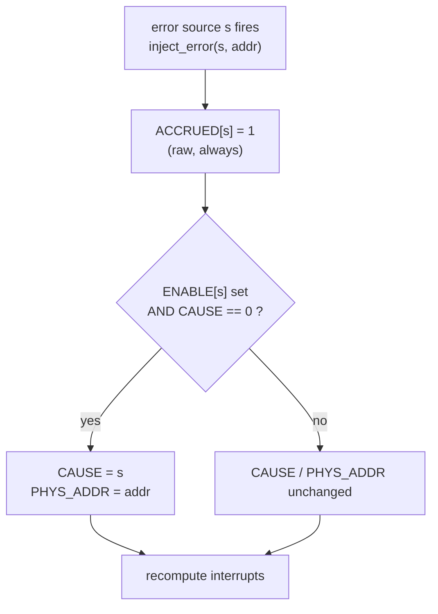
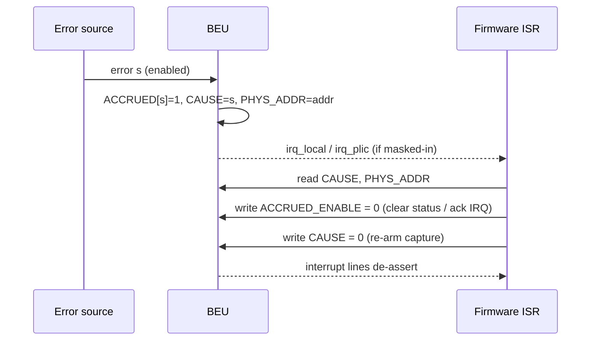
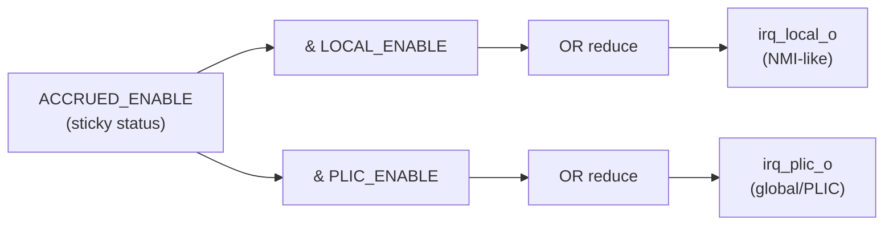

# SMC Bus Error Unit — Functional Specification

> Externally-observable behaviour of the SystemC/TLM-2.0 LT model in
> `smc/peripherals/beu`. The authoritative hardware source is
> `hw/smc/smc_cpu/data/registers/rdl/bus_error_unit.rdl` with behaviour from
> the Rocket `OCAH4CORECluster_BusErrorUnit.sv`.

## Table of contents

1. [Overview](#1-overview)
2. [Address map and integration](#2-address-map-and-integration)
3. [Register map](#3-register-map)
4. [Error sources and CAUSE encoding](#4-error-sources-and-cause-encoding)
5. [Behaviour and flow diagrams](#5-behaviour-and-flow-diagrams)
6. [Interrupt model](#6-interrupt-model)
7. [Reset](#7-reset)
8. [Modeling scope and abstractions](#8-modeling-scope-and-abstractions)

---

## 1. Overview

The Bus Error Unit (BEU) is a small, per-core register block that **records the
first bus / cache-ECC error** observed on a core and **raises interrupts** when
enabled error sources fire. There is one BEU per CPU core. It is passive: it
never initiates bus traffic; it only observes error-report inputs from the
core's caches/bus and exposes status + interrupts to software.

The model reproduces:

- the 6-register, 64-bit register file (bit-compatible with the RDL);
- **first-error latching**: `CAUSE`/`PHYS_ADDR` capture the highest-priority
  enabled error and hold until software clears `CAUSE`;
- **accrued status**: a sticky, per-source record of every error seen
  (independent of the recording-enable mask);
- **dual interrupt delivery**: a local (NMI-like) line and a PLIC (global)
  line, each with an independent per-source mask.

---

## 2. Address map and integration

Per `hw/smc/doc/memmap.adoc` and `interrupts.adoc`:

- Each BEU occupies a **4 KiB** window at `0xC801_0000 + N × 0x1000` (N = core).
- The six registers occupy the low `0x30`; the rest of the window is unmapped.
- Access is AXI4-Lite-style, **64-bit** (`regwidth = accesswidth = 64`).
- The **local** interrupt is delivered NMI-like, **bypassing the PLIC**, for
  immediate notification of bus errors; the **PLIC** line is a conventional
  global interrupt source.

In the SMC SystemC model the register window is a TLM-2.0 target socket; the two
interrupt lines are boolean outputs wired to the core's local-interrupt input
and to the PLIC, respectively.

---

## 3. Register map

All registers 64-bit; accessed with 8-byte, 8-byte-aligned transactions.

| Offset | Name | SW access | Reset | Description |
|--------|------|-----------|-------|-------------|
| `0x00` | `CAUSE`          | rw | `0x0`  | `[2:0]` cause of the latched error (see §4). HW latches the first enabled error while `CAUSE==0`; SW writes 0 to acknowledge and re-arm. |
| `0x08` | `PHYS_ADDR`      | ro | `0x0`  | `[55:0]` physical address of the latched error (HW-written). Writes ignored. |
| `0x10` | `ENABLE`         | rw | `0xE6` | `[7:0]` per-source **recording** enable. When a source is enabled, its errors may latch `CAUSE`/`PHYS_ADDR`. Reset = all five sources enabled. |
| `0x18` | `PLIC_ENABLE`    | rw | `0x0`  | `[7:0]` per-source PLIC (global) interrupt mask. |
| `0x20` | `ACCRUED_ENABLE` | rw | `0x0`  | `[7:0]` per-source sticky **accrued** error status. HW sets a bit on any raw error for that source; SW writes 0 to clear (acknowledge). |
| `0x28` | `LOCAL_ENABLE`   | rw | `0x0`  | `[7:0]` per-source local (NMI-like) interrupt mask. |

Field bit positions (all 8-bit fields): only bits `{1,2,5,6,7}` are defined; bits
`{0,3,4}` are reserved and read as zero. The `VALID_MASK` is therefore `0xE6`.

> **Naming note.** The RDL names offset `0x20` `ACCRUED_ENABLE` and calls it a
> "coarse-grain interrupt enable"; in the Rocket RTL this register is the sticky
> per-source *accrued error status* that is AND-ed with both interrupt masks.
> The model follows the RTL behaviour: `0x18`/`0x28` are the PLIC/local **masks**
> and `0x20` is the accrued **status**.

### 3.1 Register bit fields

All registers are 64-bit; only the low bits shown carry meaning — every bit
above the marked field is reserved and reads 0.

**Shared "source-bit" layout** — used identically by `ENABLE`, `PLIC_ENABLE`,
`ACCRUED_ENABLE`, and `LOCAL_ENABLE`:

```
 bit:  7        6        5        4     3     2        1        0
     +--------+--------+--------+-----+-----+--------+--------+-----+
     | dcache | dcache | dcache |rsvd4|rsvd3| icache | icache |rsvd0|
     | UNcorr |  corr  | tlbus  |     |     |  corr  | tlbus  |     |
     +--------+--------+--------+-----+-----+--------+--------+-----+
        deu=7    dec=6    dtl=5             iec=2    itl=1
     [63:8] = reserved (read 0)

 VALID_MASK = 0b1110_0110 = 0xE6   (bits 1, 2, 5, 6, 7)
```

**`0x00` CAUSE** (sw = rw), reset `0x0`:

```
 bit:  63 ................................ 3    2     1     0
     +------------------------------------+ +-----------------+
     |            reserved (0)            | |   cause_enum    |
     +------------------------------------+ +-----------------+
                                                  [2:0]
 [2:0] = 0 no_error | 1 itl | 2 iec | (3 ieu*) | (4 rsvd*) | 5 dtl | 6 dec | 7 deu
 (* 3 and 4 unused by the SMC configuration)
```

**`0x08` PHYS_ADDR** (sw = r, HW-written), reset `0x0`:

```
 bit:  63 ....... 56 55 ........................................ 0
     +--------------+ +----------------------------------------+
     | reserved (0) | |     physical address of error [55:0]   |
     +--------------+ +----------------------------------------+
```

**`0x10` ENABLE** (sw = rw) — recording gate, reset `0xE6` (all sources on):

```
 bit:  7    6    5    4  3   2    1    0
     +----+----+----+--+--+----+----+--+
     | 1  | 1  | 1  |0 |0 | 1  | 1  |0 |   reset = 0xE6
     +----+----+----+--+--+----+----+--+
      deu  dec  dtl        iec  itl
```

**`0x18` PLIC_ENABLE** (sw = rw) — global/PLIC interrupt mask, reset `0x0`:

```
 bit:  7    6    5    4  3   2    1    0
     +----+----+----+--+--+----+----+--+
     | 0  | 0  | 0  |0 |0 | 0  | 0  |0 |   reset = 0x00
     +----+----+----+--+--+----+----+--+
      deu  dec  dtl        iec  itl
```

**`0x20` ACCRUED_ENABLE** (sw = rw) — sticky per-source status, reset `0x0`:

```
 bit:  7    6    5    4  3   2    1    0
     +----+----+----+--+--+----+----+--+
     | S  | S  | S  |0 |0 | S  | S  |0 |   S = HW-set on any error, SW W-clear
     +----+----+----+--+--+----+----+--+
      deu  dec  dtl        iec  itl
```

**`0x28` LOCAL_ENABLE** (sw = rw) — local (NMI-like) interrupt mask, reset `0x0`:

```
 bit:  7    6    5    4  3   2    1    0
     +----+----+----+--+--+----+----+--+
     | 0  | 0  | 0  |0 |0 | 0  | 0  |0 |   reset = 0x00
     +----+----+----+--+--+----+----+--+
      deu  dec  dtl        iec  itl
```

Interrupt equations (bits `b` in `{1,2,5,6,7}`):

```
irq_plic_o  = OR( ACCRUED_ENABLE[b] & PLIC_ENABLE[b]  )
irq_local_o = OR( ACCRUED_ENABLE[b] & LOCAL_ENABLE[b] )
```

---

## 4. Error sources and CAUSE encoding

The source's bit position equals its `CAUSE` value (`cause_enum` in the RDL):

| `beu_src` | Bit / `CAUSE` | `cause_enum` |
|-----------|---------------|--------------|
| `ICACHE_TLBUS`         | 1 | `itl_error` |
| `ICACHE_CORRECTABLE`   | 2 | `iec_error` |
| `DCACHE_TLBUS`         | 5 | `dtl_error` |
| `DCACHE_CORRECTABLE`   | 6 | `dec_error` |
| `DCACHE_UNCORRECTABLE` | 7 | `deu_error` |

Values 0 (`no_error`), 3 (`ieu_error`) and 4 are reserved / unused by the SMC
configuration.

When more than one enabled source fires while `CAUSE==0`, the recorded cause
follows the RTL priority (highest first): `deu (7) > dec (6) > dtl (5) >
iec (2) > itl (1)`.

---

## 5. Behaviour and flow diagrams

Each figure below is a rendered **SVG** (`doc/figures/`) so it displays in any
Markdown viewer, including Cursor's built-in preview; the SVGs are generated
from the Graphviz sources next to them (`dot -Tsvg NN_name.dot -o NN_name.svg`).
The equivalent Mermaid source — which some viewers (GitHub/GitLab/VS Code)
render inline — is kept as a collapsible text fallback under each figure.

### 5.1 Error event

![BEU error-event flow: when source s fires via inject_error(s, addr), ACCRUED[s] is set unconditionally; if ENABLE[s] is set and CAUSE is 0 the error is latched into CAUSE and PHYS_ADDR, otherwise CAUSE/PHYS_ADDR are unchanged; either way the interrupts are recomputed.](figures/01_error_event.svg)

<details>
<summary>Text fallback (Mermaid source)</summary>



</details>

Key points:
- `ACCRUED[s]` is set for **every** raw error, regardless of `ENABLE` — so
  software can always see that a source fired.
- `CAUSE`/`PHYS_ADDR` capture only the **first enabled** error and hold until
  software clears `CAUSE` (write 0). Subsequent errors accrue but do not
  overwrite the captured cause/address.

### 5.2 Software service routine

![BEU software service routine: HW reports an enabled error s; the BEU sets ACCRUED[s], CAUSE=s, PHYS_ADDR=addr and raises irq_local/irq_plic if masked in; firmware reads CAUSE and PHYS_ADDR, writes ACCRUED_ENABLE=0 to clear status and acknowledge the IRQ, then writes CAUSE=0 to re-arm capture, after which the interrupt lines de-assert.](figures/02_sw_service.svg)

<details>
<summary>Text fallback (Mermaid source)</summary>



</details>

### 5.3 Interrupt aggregation


<details>
<summary>Text fallback (Mermaid source)</summary>



</details>

---

## 6. Interrupt model

Two independent, level-sensitive outputs, both driven by a single recompute
method (single-driver discipline):

```
irq_local_o = ( ACCRUED_ENABLE & LOCAL_ENABLE & VALID_MASK ) != 0
irq_plic_o  = ( ACCRUED_ENABLE & PLIC_ENABLE  & VALID_MASK ) != 0
```

- Because both lines derive from the sticky `ACCRUED_ENABLE`, they stay asserted
  until software clears the corresponding accrued bits.
- `ENABLE` does **not** affect interrupts directly — it only gates whether an
  error is *recorded* in `CAUSE`/`PHYS_ADDR`. A source can therefore raise an
  interrupt (via accrued status + mask) even if its cause is not captured.

---

## 7. Reset

On active-low `rst_n_i` assertion:

- `ENABLE   = 0xE6` (all five sources enabled for recording),
- `PLIC_ENABLE = LOCAL_ENABLE = 0` (no interrupts masked in),
- `CAUSE = PHYS_ADDR = ACCRUED_ENABLE = 0`,
- both interrupt outputs de-assert.

---

## 8. Modeling scope and abstractions

**Modeled faithfully**

- Register map, field masks, reset values (bit-compatible with the RDL).
- First-error latching + priority; sticky accrued status.
- Local vs. PLIC interrupt aggregation and per-source masking.
- 64-bit access discipline, in-window decode-miss and out-of-window errors.

**Abstracted away**

- The TileLink / AXI error-report wiring: error sources are injected through the
  test-bench back door `inject_error()` rather than modeled as ports.
- Cache ECC syndromes and the exact physical-address derivation.
- Cycle-level timing (a single mutable `access_delay_ns` annotates each access).
