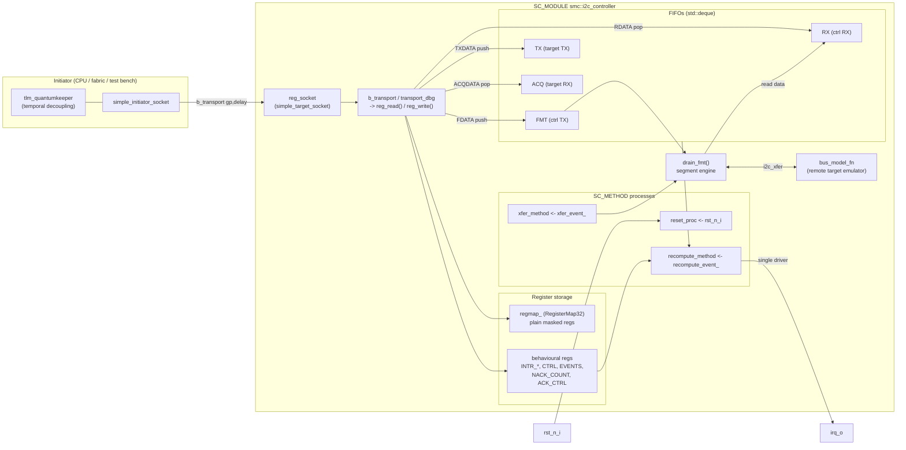
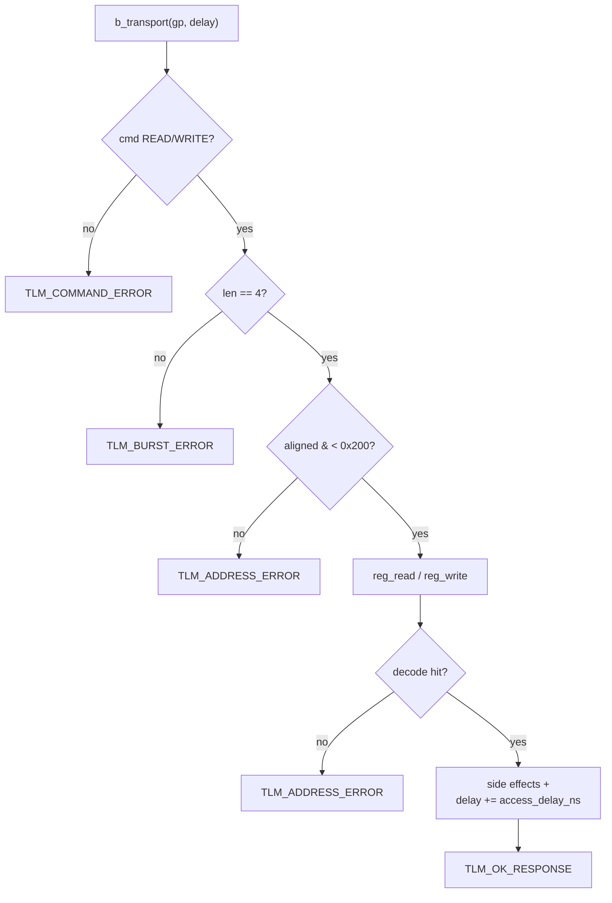
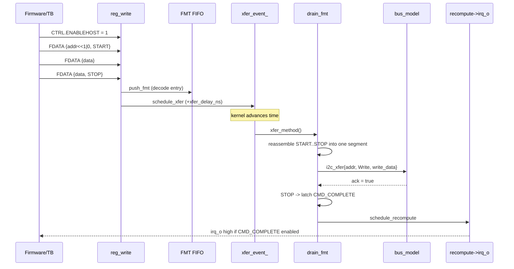
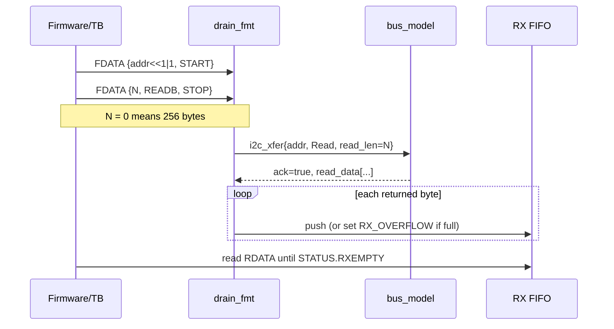
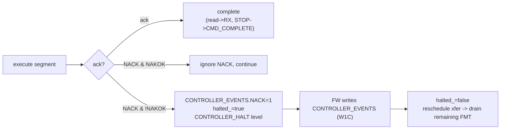
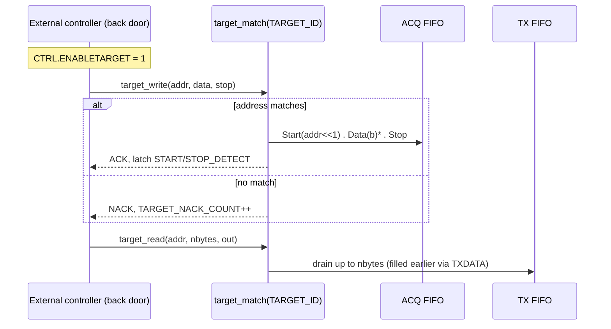
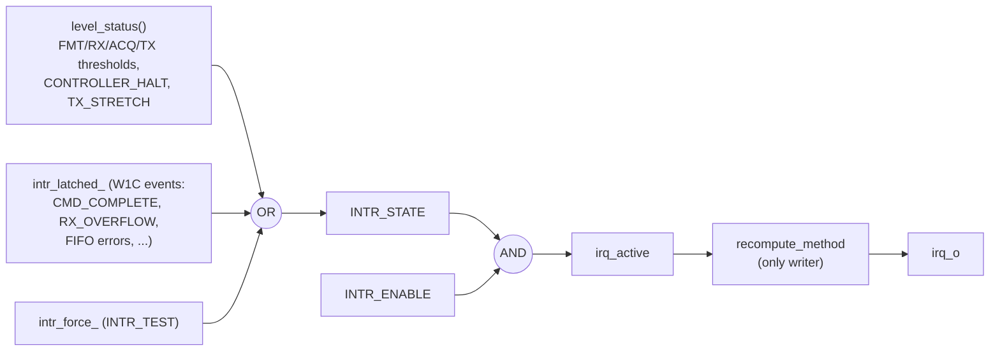

# SMC I2C Controller — Functional Specification

**Document**: `01_I2C_CONTROLLER_Specification.md`
**Module**: `smc::i2c_controller` (SystemC/TLM-2.0 Loosely-Timed model)
**Spec base**: OpenTitan-derived OCA `i2c` core (Controller / Target / Hybrid / Monitor)
**RTL reference**: `hw/comp/i2c/rtl/` (register map `hw/comp/i2c/data/registers/rdl/i2c.rdl`)
**Status**: Design phase — document governs the `peripherals/i2c_controller/` model
**Companion docs**:
  - `02_I2C_CONTROLLER_LowLevel_Design.md` — internal SystemC implementation
  - `03_I2C_CONTROLLER_Test_Plan.md` — verification strategy and test list

---

## Contents

1. [Purpose and scope](#1-purpose-and-scope)
2. [Conformance and references](#2-conformance-and-references)
3. [Feature summary](#3-feature-summary)
4. [Configuration parameters](#4-configuration-parameters)
5. [Block diagram, port list, and flow diagrams](#5-block-diagram-port-list-and-flow-diagrams)
6. [Theory of operation](#6-theory-of-operation)
7. [Register map](#7-register-map)
8. [Functional behaviour](#8-functional-behaviour)
9. [Interrupts](#9-interrupts)
10. [Reset behaviour](#10-reset-behaviour)
11. [Bus interface (TLM-2.0 / AXI4-Lite)](#11-bus-interface-tlm-20--axi4-lite)
12. [Programming model](#12-programming-model)
13. [Compliance matrix](#13-compliance-matrix)
14. [Revision history](#14-revision-history)
15. [Glossary](#15-glossary)

---

## 1. Purpose and scope

The SMC I2C Controller is an OpenTitan-derived **I2C controller/target** peripheral for the
SMC chiplet. The `i2c_wrap` platform wrapper packs `NUM_I2CS` (default 3) identical `i2c`
cores plus a small wrapper-enable register behind one AXI slave; each core occupies a
`0x200`-byte register window (`i2c[NUM_I2CS] @0x0 += 0x200`, `i2c_ctrl @0xe00`).

This specification defines the **externally-observable behaviour of one `i2c` core** as
implemented by the SystemC/TLM-2.0 loosely-timed functional model: configuration
parameters, register map, the Controller-Mode and Target-Mode datapaths, the four FIFOs,
the 20-source interrupt block, reset, and the TLM-2.0 bus contract. It is the contract that:

- Firmware (register-mapped driver code) programs against,
- The RTL (`hw/comp/i2c`) implements at gate level, and
- The SystemC model (`peripherals/i2c_controller/`) implements at transaction level.

The model is a **functional** model: register semantics and byte-level data flow are
reproduced faithfully and are bit-compatible with the RDL register layout, while bit-level
SCL/SDA signalling, clock stretching, arbitration timing, and the analog timing/timeout
parameters are firmware-visible storage with no modelled waveform (see §13). Modelling one
core (rather than the `i2c_wrap` bundle) mirrors how `smc::uart` models a single UART
instance; the platform integrator instantiates as many as the wrapper requires.

Internal implementation choices (process topology, FIFO modelling, the FMT-drain engine,
quantum-keeper usage) are documented in
[`02_I2C_CONTROLLER_LowLevel_Design.md`](02_I2C_CONTROLLER_LowLevel_Design.md).

---

## 2. Conformance and references

| Source | Authority |
|--------|-----------|
| `hw/comp/i2c/data/registers/rdl/i2c.rdl` | **Ground-truth** register map (this model) |
| `hw/comp/i2c/doc/architecture.adoc` | Block diagram, FSMs, FIFOs |
| `hw/comp/i2c/doc/programming.adoc` | Controller/Target programming sequences |
| `hw/comp/i2c/doc/memmap.adoc` | Register offsets |
| `hw/periph/i2c_wrap/data/registers/rdl/i2c_wrap.rdl` | Multi-instance packing |
| `hw/periph/i2c_wrap/data/registers/rdl/i2c_ctrl.rdl` | Wrapper enable register (out of scope here) |
| I2C-bus specification (NXP UM10204) / SMBus 3.x | Industry-standard protocol baseline |

The model is **bit-compatible** with the RDL register layout and protocol-compatible with
the OpenTitan I2C programming model. All deliberate deviations (abstracted timing) are
listed in §13.

---

## 3. Feature summary

| Feature | Value / behaviour |
|---------|-------------------|
| Roles | Controller, Target, Hybrid (both), Monitor — via `CTRL.ENABLEHOST` / `CTRL.ENABLETARGET` |
| Controller TX (FMT) FIFO | Configurable depth (default 64 entries); `fmt_fifo_depth` CCI param |
| Controller RX FIFO | Configurable depth (default 64 bytes); `rx_fifo_depth` CCI param |
| Target TX FIFO | Configurable depth (default 64 bytes); `tx_fifo_depth` CCI param |
| Target RX (ACQ) FIFO | Configurable depth (default 64 entries); `acq_fifo_depth` CCI param |
| Addressing | 7-bit; two programmable target addresses + masks (`TARGET_ID`) |
| Format flags | START / STOP / READB / RCONT / NAKOK per FMT entry (`FDATA`) |
| ACQ signalling | Start / Stop / Restart / Data / NackData / NackStart / Error (`ACQDATA.SIGNAL`) |
| SMBus features | SMBus enable / suspend / alert (`SMBUS_CTRL`, `SMBUS_STATUS`) — abstracted |
| Interrupt sources | 20 (mix of hardware-computed level bits and latched write-1-to-clear events) |
| Timing / timeouts | `TIMING0..4`, `TIMEOUT_CTRL`, host/target/NACK-handler timeouts — storage only |
| Bus interface | TLM-2.0 LT target socket (AXI4-Lite, 32-bit data, 32-bit address) |
| Register window | 512 bytes (`0x000 .. 0x1FF`); registers occupy `0x00 .. 0x80` |
| Reset polarity | Active-low asynchronous (`rst_n_i`) |

---

## 4. Configuration parameters

### 4.1 CCI parameters (primary interface)

The model exposes the following OSCI CCI (`cci_configuration`) parameters. These are the
**primary** configuration interface; test benches and platform integrators use the CCI
broker to set them.

| CCI parameter | Type | Mutability | Default | Notes |
|---------------|------|------------|---------|-------|
| `fmt_fifo_depth` | `cci_param<unsigned>` (`CCI_IMMUTABLE_PARAM`) | Immutable | 64 | Controller TX (FMT) FIFO depth in entries. Maps to RTL `FMTFIFO_DEPTH`. Must be ≥ 1. |
| `rx_fifo_depth` | `cci_param<unsigned>` (`CCI_IMMUTABLE_PARAM`) | Immutable | 64 | Controller RX FIFO depth in bytes. Maps to RTL `RXFIFO_DEPTH`. Must be ≥ 1. |
| `tx_fifo_depth` | `cci_param<unsigned>` (`CCI_IMMUTABLE_PARAM`) | Immutable | 64 | Target TX FIFO depth in bytes. Maps to RTL `TXFIFO_DEPTH`. Must be ≥ 1. |
| `acq_fifo_depth` | `cci_param<unsigned>` (`CCI_IMMUTABLE_PARAM`) | Immutable | 64 | Target RX (ACQ) FIFO depth in entries. Maps to RTL `ACQFIFO_DEPTH`. Must be ≥ 1. |
| `access_delay_ns` | `cci_param<double>` | Mutable | 2.0 | Delay added to `sc_time& delay` in `b_transport`. Approximates AXI4-Lite latency. |
| `xfer_delay_ns` | `cci_param<double>` | Mutable | 100.0 | Modelled latency between an FMT push (or host-enable) and the transaction executing. |

Hierarchical param names follow the standard CCI convention
`<broker_prefix>.<sc_module_name>.<param_name>`, e.g.:

```cpp
broker.set_preset_cci_value("top.i2c0.rx_fifo_depth", cci::cci_value(128u));
auto h = broker.get_param_handle("top.i2c0.xfer_delay_ns");
h.set_cci_value(cci::cci_value(20.0));  // mutable
```

Each FIFO-depth of 0 is rejected at construction with `SC_REPORT_FATAL`.

### 4.2 `i2c_controller_cfg` struct (defaults + fixed constants)

The constructor accepts an optional `i2c_controller_cfg cfg` whose fields supply the
**default values** for the CCI params (a broker preset set before construction wins). The
struct also holds the fixed address-map constants (never CCI params because they must not
vary at run-time):

| Constant | Value | Description |
|----------|-------|-------------|
| `WINDOW_SIZE` | `0x200` | 512-byte decoded window (per-core stride from `i2c_wrap.rdl`) |
| `REG_WIDTH` | `4` | Register stride (bytes) |

---

## 5. Block diagram, port list, and flow diagrams

### 5.1 Block diagram (ASCII)

```
   Initiator (CPU / fabric / test bench)
   ┌───────────────────────────┐
   │ simple_initiator_socket    │   b_transport(gp, delay)
   │ tlm_quantumkeeper          │◄────────────────────────────┐
   └───────────────────────────┘                              │
                                                               ▼
   ┌──────────────────── SC_MODULE(smc::i2c_controller) ────────────────────┐
   │ reg_socket (target) ─► b_transport/transport_dbg ─► reg_read/reg_write │
   │                                          │                             │
   │   FDATA ─► FMT FIFO ─► [xfer_event @ xfer_delay] ─► drain_fmt() ──┐     │
   │                                    (segments → bus_model_fn)      │     │
   │   RDATA ◄─ RX FIFO ◄───────────────── read data                  │     │
   │                                                                   │     │
   │   target_write()/target_read() ─► ACQ FIFO / TX FIFO (Target Mode)│     │
   │                                                                   ▼     │
   │   reset_proc(rst_n_i)     recompute_method ─► irq_o (single driver)     │
   └─────────────────────────────────────────────────────────────────────────┘
```

*The SCL/SDA lines are not simulated at bit level. In Controller Mode the remote target(s)
are emulated by a test-bench `bus_model_fn`; in Target Mode an external controller is
emulated by the `target_write` / `target_read` back doors.*

### 5.2 Ports

| Port | Direction | Type | Description |
|------|-----------|------|-------------|
| `reg_socket` | target | `tlm_utils::simple_target_socket<i2c_controller>` | TLM-2.0 LT register-access socket (AXI4-Lite-style) |
| `rst_n_i` | input | `sc_in<bool>` | Active-low asynchronous reset |
| `irq_o` | output | `sc_out<bool>` | Interrupt output (active-high; OR of enabled `INTR_STATE` bits) |

The bit-level SDA/SCL pads of the RTL core are intentionally **not** exposed; their function
is abstracted into the bus-model / back-door API (see §6 and `02_*` §12).

### 5.3 Flow diagrams

The following diagrams show the structural architecture and the main dynamic flows. They
complement the ASCII block diagram in §5.1 and the datapath pseudocode in §6.3–§6.4. Each
figure is a rendered **SVG** (`doc/figures/`) so it displays in any Markdown viewer, including
Cursor's built-in preview; the SVGs are generated from the Graphviz sources next to them
(`dot -Tsvg NN_name.dot -o NN_name.svg`). The equivalent Mermaid source — which some viewers
(GitHub/GitLab/VS Code) render inline — is kept as a collapsible text fallback under each
figure.

#### 5.3.1 Structural architecture


<details>
<summary>Text fallback (Mermaid source)</summary>



</details>

#### 5.3.2 Register-access flow (every transaction, §11)


<details>
<summary>Text fallback (Mermaid source)</summary>



</details>

#### 5.3.3 Controller-Mode WRITE (§6.3, §8.1)


<details>
<summary>Text fallback (Mermaid source)</summary>



</details>

#### 5.3.4 Controller-Mode READ (§6.3, §8.2)


<details>
<summary>Text fallback (Mermaid source)</summary>



</details>

#### 5.3.5 NACK -> halt -> resume (§6.2, §8.1)


<details>
<summary>Text fallback (Mermaid source)</summary>



</details>

#### 5.3.6 Target Mode (§6.4, §8.4)


<details>
<summary>Text fallback (Mermaid source)</summary>



</details>

#### 5.3.7 Interrupt aggregation (§9)


<details>
<summary>Text fallback (Mermaid source)</summary>



</details>

**Mental model**: the register path (`b_transport`) is decoupled and effectively
instantaneous — it only touches registers/FIFOs and annotates `access_delay_ns`. The protocol
work (the actual I2C transaction) happens *later, on `xfer_event_`*, in `drain_fmt`, against
the abstracted bus. That annotate-now / execute-on-event split is what makes this a
loosely-timed model and is why the quantum keeper lives in the initiator, not the peripheral.

---

## 6. Theory of operation

### 6.1 Operating principle

The I2C core moves bytes between firmware-visible FIFOs and the (abstracted) I2C bus in one
of two roles, selected by `CTRL`:

- **Controller Mode** (`CTRL.ENABLEHOST = 1`): firmware pushes *format entries* into the
  Controller TX FIFO ("FMT") through `FDATA`. Each entry is a byte plus START/STOP/READB/
  RCONT/NAKOK flags. The engine reassembles the entries into per-address **segments** and
  presents each to the bus; read data is pushed into the Controller RX FIFO (`RDATA`).
- **Target Mode** (`CTRL.ENABLETARGET = 1`): an external controller addresses this device.
  A matching address (per `TARGET_ID`) fills the Target RX FIFO ("ACQ", read via `ACQDATA`)
  with signalled entries; read requests drain the Target TX FIFO (filled via `TXDATA`).

### 6.2 Architectural concepts

| Concept | Definition |
|---------|------------|
| **FMT FIFO** | Controller TX format queue. Each entry = `{byte, start, stop, readb, rcont, nakok}` written through `FDATA`. |
| **RX FIFO** | Controller receive queue (bytes). Popped by reading `RDATA`. |
| **TX FIFO** | Target transmit queue (bytes). Filled by writing `TXDATA`; drained on a Target-Mode read. |
| **ACQ FIFO** | Target receive/acquisition queue. Each entry = `{byte, signal}` read through `ACQDATA`. |
| **Segment** | One addressed phase: START/repeated-START + address byte, then the write bytes or requested read length, up to the next START or STOP. |
| **Bus model** | Test-bench callback (`i2c_bus_model_fn`) that, given a segment (`i2c_xfer`), sets the ACK and, for reads, supplies the read bytes. |
| **Controller halt** | An address/data NACK (without NAKOK) sets a `CONTROLLER_EVENTS` bit, halts the FMT engine, and raises `CONTROLLER_HALT`. Clearing the events (W1C) resumes it. |

### 6.3 Controller-Mode datapath

```
FDATA write ─► FMT FIFO ─► [xfer_event @ xfer_delay_ns] ─► drain_fmt()
   reassemble entries into segments:
     START(addr|R/W) → open segment
     data byte       → append to write payload (write) or add to read length (read)
     STOP            → execute segment, raise CMD_COMPLETE
   execute(segment): bus_model_fn(xfer)
     ack == false && !nakok → CONTROLLER_EVENTS.NACK, halt
     dir == Read            → push returned bytes into RX FIFO (RX_OVERFLOW if full)
```

### 6.4 Target-Mode datapath

```
external write:  target_write(addr, data, stop)
   addr matches TARGET_ID?  no → NACK, TARGET_NACK_COUNT++
                            yes → ACQ: Start(addr<<1) · Data(b)* · [Stop]
                                  TARGET_EVENTS.START_DETECT / STOP_DETECT

external read:   target_read(addr, nbytes, out, stop)
   addr matches?            no → NACK, TARGET_NACK_COUNT++
                            yes → ACQ: Start(addr<<1|1); drain up to nbytes from TX FIFO
```

### 6.5 Loosely-timed timing

`b_transport` never calls `wait()`; it only adds `access_delay_ns` to the annotated `delay`
(temporal decoupling is the initiator's responsibility — the test-bench driver owns the
`tlm_quantumkeeper`). The modelled transaction latency `xfer_delay_ns` is realised by
scheduling an internal `sc_event`, so a Controller-Mode transfer completes a bounded time
after the FMT push rather than instantaneously.

---

## 7. Register map

All registers are 32-bit and word-aligned within the 512-byte window. Offsets `0x00..0x80`
are decoded; any other aligned offset inside the window returns `TLM_ADDRESS_ERROR_RESPONSE`
(same policy as the UART model).

| Offset | Register | Access | Description |
|--------|----------|--------|-------------|
| 0x00 | INTR_STATE | RW | Interrupt state (level bits read-only; latched event bits are W1C) |
| 0x04 | INTR_ENABLE | RW | Per-source interrupt enable |
| 0x08 | INTR_TEST | WO | Force interrupts (level bits held while set; event bits latched) |
| 0x0C | SMBUS_CTRL | RW | SMBus suspend / alert drive (abstracted) |
| 0x10 | CTRL | RW | Mode/enable select (see §7.1) |
| 0x14 | STATUS | RO | FIFO full/empty + idle flags (computed) |
| 0x18 | RDATA | RO | Pop Controller RX FIFO (returns 0 when empty) |
| 0x1C | FDATA | WO | Push a Controller TX (FMT) format entry (see §7.2) |
| 0x20 | FIFO_CTRL | WO | Self-clearing FIFO resets (see §7.3) |
| 0x24 | HOST_FIFO_CONFIG | RW | `RX_THRESH[11:0]` / `FMT_THRESH[27:16]` |
| 0x28 | TARGET_FIFO_CONFIG | RW | `TX_THRESH[11:0]` / `ACQ_THRESH[27:16]` |
| 0x2C | HOST_FIFO_STATUS | RO | `FMTLVL[11:0]` / `RXLVL[27:16]` (computed) |
| 0x30 | TARGET_FIFO_STATUS | RO | `TXLVL[11:0]` / `ACQLVL[27:16]` (computed) |
| 0x34 | OVRD | RW | SDA/SCL override (abstracted storage) |
| 0x38 | VAL | RO | Oversampled SCL/SDA (abstracted → 0) |
| 0x3C | TIMING0 | RW | THIGH / TLOW (storage) |
| 0x40 | TIMING1 | RW | T_R / T_F (storage) |
| 0x44 | TIMING2 | RW | TSU_STA / THD_STA (storage) |
| 0x48 | TIMING3 | RW | TSU_DAT / THD_DAT (storage) |
| 0x4C | TIMING4 | RW | TSU_STO / T_BUF (storage) |
| 0x50 | TIMEOUT_CTRL | RW | VAL / MODE / EN (storage) |
| 0x54 | TARGET_ID | RW | ADDRESS0/MASK0/ADDRESS1/MASK1 (7-bit each) |
| 0x58 | ACQDATA | RO | Pop Target RX (ACQ) FIFO: `ABYTE[7:0]` + `SIGNAL[10:8]` |
| 0x5C | TXDATA | WO | Push Target TX FIFO |
| 0x60 | HOST_TIMEOUT_CTRL | RW | VAL (storage) |
| 0x64 | TARGET_TIMEOUT_CTRL | RW | VAL / EN (storage) |
| 0x68 | TARGET_NACK_COUNT | RW | Saturating 8-bit NACK counter; **read-clear** |
| 0x6C | TARGET_ACK_CTRL | RW | `NBYTES[8:0]`; writing bit 31 pulses a target NACK |
| 0x70 | ACQ_FIFO_NEXT_DATA | RO | Next ACQ byte without popping (computed) |
| 0x74 | HOST_NACK_HANDLER_TIMEOUT | RW | VAL / EN (storage) |
| 0x78 | CONTROLLER_EVENTS | RW | NACK / … / ARBITRATION_LOST (W1C; gate `CONTROLLER_HALT`) |
| 0x7C | TARGET_EVENTS | RW | TX_PENDING / … / START_DETECT / STOP_DETECT (W1C) |
| 0x80 | SMBUS_STATUS | RO | SMBus suspend / alert status (abstracted → 0) |

### 7.1 CTRL (0x10)

| Bit | Field | Description |
|-----|-------|-------------|
| 0 | ENABLEHOST | Enable Controller Mode (drains the FMT FIFO) |
| 1 | ENABLETARGET | Enable Target Mode (accepts back-door transactions) |
| 2 | LLPBK | Line-loopback (abstracted storage) |
| 3 | NACK_ADDR_AFTER_TIMEOUT | (storage) |
| 4 | ACK_CTRL_EN | Enable software ACK control (storage) |
| 5 | MULTI_CONTROLLER_MONITOR_EN | (storage) |
| 6 | TX_STRETCH_CTRL_EN | (storage) |
| 7 | ACQ_START_STOP_EN | (storage) |

### 7.2 FDATA format entry (0x1C, WO)

| Bit | Field | Description |
|-----|-------|-------------|
| 7:0 | FBYTE | Data byte, or (for the address phase) `{addr[6:0], R/W}`, or read length when `READB` set (0 ⇒ 256) |
| 8 | START | Issue START/repeated-START before this byte (byte is the address) |
| 9 | STOP | Issue STOP after this byte (closes the segment; raises CMD_COMPLETE) |
| 10 | READB | This entry requests a read of `FBYTE` bytes |
| 11 | RCONT | Read continues (no NACK on last byte) — accepted; not separately modelled |
| 12 | NAKOK | A NACK on this segment is expected and does not halt the controller |

### 7.3 FIFO_CTRL (0x20, WO, self-clearing)

| Bit | Field | Effect |
|-----|-------|--------|
| 0 | RXRST | Clear the Controller RX FIFO |
| 1 | FMTRST | Clear the Controller TX (FMT) FIFO |
| 7 | ACQRST | Clear the Target RX (ACQ) FIFO |
| 8 | TXRST | Clear the Target TX FIFO |

### 7.4 STATUS (0x14, RO, computed)

| Bit | Field | Meaning |
|-----|-------|---------|
| 0 | FMTFULL | FMT FIFO full |
| 1 | RXFULL | RX FIFO full |
| 2 | FMTEMPTY | FMT FIFO empty |
| 3 | HOSTIDLE | FMT empty and controller not halted |
| 4 | TARGETIDLE | Target idle (functionally always 1 in this LT model) |
| 5 | RXEMPTY | RX FIFO empty |
| 6 | TXFULL | TX FIFO full |
| 7 | ACQFULL | ACQ FIFO full |
| 8 | TXEMPTY | TX FIFO empty |
| 9 | ACQEMPTY | ACQ FIFO empty |
| 10 | ACK_CTRL_STRETCH | Software ACK-control stretch (not modelled → 0) |

### 7.5 ACQDATA (0x58, RO) — `SIGNAL[10:8]` codes

| Code | Signal | Meaning |
|------|--------|---------|
| 0x0 | Data | Ordinary ACKed data byte |
| 0x1 | Start | Address byte preceded by a START |
| 0x2 | Stop | STOP after ACKed data |
| 0x3 | Restart | Address byte preceded by a repeated START |
| 0x4 | NackData | NACKed data byte |
| 0x5 | NackStart | Address byte whose following data were NACKed |
| 0x6 | Error | Abnormal transaction termination |

---

## 8. Functional behaviour

### 8.1 Controller write sequence

1. `CTRL.ENABLEHOST = 1`.
2. Write `FDATA = {addr<<1 | 0, START}` (address, write).
3. Write one `FDATA` per data byte; set `STOP` on the last.
4. `xfer_delay_ns` later the engine executes the segment against the bus model. On ACK the
   write completes; `STOP` raises `CMD_COMPLETE`.
5. An address/data NACK without `NAKOK` sets `CONTROLLER_EVENTS.NACK`, raises
   `CONTROLLER_HALT`, and halts further draining until the event is cleared (W1C).

### 8.2 Controller read sequence

1. `CTRL.ENABLEHOST = 1`.
2. Write `FDATA = {addr<<1 | 1, START}` (address, read).
3. Write `FDATA = {N, READB, STOP}` to request `N` bytes (N = 0 ⇒ 256).
4. On ACK the bus model supplies up to `N` bytes, which are pushed into the RX FIFO; each
   byte dropped because the RX FIFO is full sets `RX_OVERFLOW`.
5. Firmware reads bytes from `RDATA` until `STATUS.RXEMPTY`.

### 8.3 Repeated START

If a new `FDATA` with `START` arrives while a segment is still open (no intervening `STOP`),
the open segment is executed first (repeated-START semantics) and a new segment is opened.

### 8.4 Target write / read (back door)

An external controller is emulated with `target_write()` / `target_read()`. A match against
either `{ADDRESS0, MASK0}` or `{ADDRESS1, MASK1}` (`addr & mask == address & mask`, mask ≠ 0)
ACKs the transaction; otherwise it NACKs and increments the saturating `TARGET_NACK_COUNT`.
A matched write pushes `Start`, one `Data` entry per byte, and (if requested) `Stop` into the
ACQ FIFO and latches `TARGET_EVENTS.START_DETECT` / `STOP_DETECT`. A matched read pushes a
`Start` entry and drains up to `nbytes` from the Target TX FIFO.

### 8.5 FIFO thresholds and levels

`HOST_FIFO_CONFIG` / `TARGET_FIFO_CONFIG` program the FMT/RX and TX/ACQ thresholds that
drive the threshold interrupts (§9). `HOST_FIFO_STATUS` / `TARGET_FIFO_STATUS` report the
live occupancy of each FIFO.

---

## 9. Interrupts

`INTR_STATE` aggregates 20 sources. The software-visible value is
`level_bits | latched_bits | forced_bits`, where:

- **Level bits** are recomputed continuously from state and read-only in `INTR_STATE`.
- **Latched (event) bits** are set by hardware conditions and cleared by writing 1 (W1C).
- **Forced bits** come from `INTR_TEST` (level sources are held while the test bit is set;
  event sources are latched once).

`irq_o = (INTR_STATE & INTR_ENABLE) != 0`.

| Bit | Source | Kind |
|-----|--------|------|
| 0 | FMT_THRESHOLD | level (FMT level < FMT_THRESH) |
| 1 | RX_THRESHOLD | level (RX level > RX_THRESH) |
| 2 | ACQ_THRESHOLD | level (ACQ level > ACQ_THRESH) |
| 3 | RX_OVERFLOW | latched |
| 4 | CONTROLLER_HALT | level (any `CONTROLLER_EVENTS` bit set) |
| 5 | SCL_INTERFERENCE | latched (not driven by the model) |
| 6 | SDA_INTERFERENCE | latched (not driven) |
| 7 | STRETCH_TIMEOUT | latched (not driven) |
| 8 | SDA_UNSTABLE | latched (not driven) |
| 9 | CMD_COMPLETE | latched |
| 10 | TX_STRETCH | level (`TARGET_EVENTS` stretch bits) |
| 11 | TX_THRESHOLD | level (TX level < TX_THRESH) |
| 12 | ACQ_STRETCH | level (not modelled → 0) |
| 13 | UNEXP_STOP | latched (not driven) |
| 14 | HOST_TIMEOUT | latched (not driven) |
| 15 | SMBALERT | latched (not driven; reachable via INTR_TEST) |
| 16 | CONTROLLER_TX_FIFO_ERROR | latched (FMT overflow) |
| 17 | CONTROLLER_RX_FIFO_ERROR | latched |
| 18 | TARGET_TX_FIFO_ERROR | latched (TX overflow) |
| 19 | TARGET_RX_FIFO_ERROR | latched (ACQ overflow) |

---

## 10. Reset behaviour

On assertion of `rst_n_i = 0`:

- All RW/RO storage registers return to their reset value (0).
- Latched interrupts, forced interrupts, `CONTROLLER_EVENTS`, `TARGET_EVENTS`,
  `TARGET_ACK_CTRL`, and `TARGET_NACK_COUNT` are cleared.
- The controller `halted_` flag is cleared.
- All four FIFOs (FMT, RX, TX, ACQ) are emptied.
- Any pending FMT-drain event is cancelled.
- `irq_o` is driven to 0.

---

## 11. Bus interface (TLM-2.0 / AXI4-Lite)

### 11.1 Transport function

The model exports a single `tlm_utils::simple_target_socket<i2c_controller>` named
`reg_socket`. `b_transport`:

1. Validates the payload: command `TLM_READ_COMMAND` / `TLM_WRITE_COMMAND`; data length
   exactly 4; address 4-byte aligned and within the window.
2. Adds `access_delay_ns` to the `sc_time& delay`.
3. Dispatches to `reg_read()` / `reg_write()`, performing all register side effects.
4. Returns `TLM_OK_RESPONSE` on success.

### 11.2 Error responses

| Condition | Response code |
|-----------|---------------|
| Unsupported command (not READ/WRITE) | `TLM_COMMAND_ERROR_RESPONSE` |
| Data length ≠ 4 | `TLM_BURST_ERROR_RESPONSE` |
| Unaligned address, or address ≥ `WINDOW_SIZE` | `TLM_ADDRESS_ERROR_RESPONSE` |
| Aligned in-window offset with no register decode | `TLM_ADDRESS_ERROR_RESPONSE` |

### 11.3 Debug transport

`transport_dbg` performs a no-delay, **side-effect-free** access: reads use `dbg_reg()`
(does not pop the RX/ACQ FIFOs or clear `TARGET_NACK_COUNT`); writes reuse the normal decode.
Malformed accesses (bad width/alignment/window, or a write to an undecoded offset) return 0.

### 11.4 DMI

DMI is not granted: `RDATA` and `ACQDATA` reads pop FIFOs and `TARGET_NACK_COUNT` is
read-clear, so direct memory access would bypass these effects.

### 11.5 AXI sideband

An optional `smc::smc_axi_extension` on the payload is inspected but not enforced by this
model; the fabric `axi_filter` performs access control upstream.

---

## 12. Programming model

### 12.1 Controller write (poll)

```c
write(BASE + 0x10, 0x1);                    // CTRL.ENABLEHOST
write(BASE + 0x1C, (addr<<1) | (1<<8));     // FDATA: START, address (write)
write(BASE + 0x1C, 0xAA);                   // FDATA: data
write(BASE + 0x1C, 0xBB | (1<<9));          // FDATA: data + STOP
while (!(read(BASE + 0x00) & (1<<9)))       // wait CMD_COMPLETE in INTR_STATE
    ;
write(BASE + 0x00, (1<<9));                 // W1C CMD_COMPLETE
```

### 12.2 Controller read (poll)

```c
write(BASE + 0x10, 0x1);                    // CTRL.ENABLEHOST
write(BASE + 0x1C, (addr<<1) | 1 | (1<<8)); // FDATA: START, address (read)
write(BASE + 0x1C, n | (1<<10) | (1<<9));   // FDATA: READB n bytes + STOP
while (!(read(BASE + 0x14) & (1<<5)))       // while !STATUS.RXEMPTY
    buf[i++] = read(BASE + 0x18);           // RDATA
```

### 12.3 Target setup

```c
write(BASE + 0x54, addr0 | (0x7F<<7));       // TARGET_ID: ADDRESS0, MASK0=0x7F
write(BASE + 0x10, 0x2);                     // CTRL.ENABLETARGET
// fill TX FIFO for reads:
write(BASE + 0x5C, 0x77);                    // TXDATA
// on a controller access, drain ACQ:
while (!(read(BASE + 0x14) & (1<<9)))        // while !STATUS.ACQEMPTY
    entry = read(BASE + 0x58);               // ACQDATA {byte, signal}
```

---

## 13. Compliance matrix

| Feature | RTL | SystemC model | Notes |
|---------|-----|---------------|-------|
| Full register file (`i2c.rdl`, `0x00..0x80`) | ✓ | ✓ | Bit-compatible with the RDL layout |
| Controller Mode FMT/RX FIFO datapath | ✓ | ✓ | Segment reassembly + bus-model execution |
| START / repeated-START / STOP handling | ✓ | ✓ | Repeated START flushes the open segment |
| READB read length (0 ⇒ 256) | ✓ | ✓ | |
| NAKOK suppresses halt | ✓ | ✓ | |
| NACK → CONTROLLER_EVENTS + halt/resume | ✓ | ✓ | Cleared via W1C resumes draining |
| Target Mode ACQ/TX FIFOs, address match/mask | ✓ | ✓ | Two address+mask pairs |
| Saturating read-clear `TARGET_NACK_COUNT` | ✓ | ✓ | |
| FIFO thresholds + level/latched interrupts | ✓ | ✓ | 20-source aggregation |
| FIFO overflow error interrupts | ✓ | ✓ | FMT / RX / TX / ACQ |
| `INTR_TEST` force paths | ✓ | ✓ | Level held; event latched |
| `transport_dbg` no-side-effect read | n/a | ✓ | Model-only debug path |
| Bit-level SCL/SDA waveform + arbitration | ✓ | **NOT modelled** | Functional/LT abstraction |
| Clock stretching / analog `TIMINGx` / timeouts | ✓ | **storage only** | Firmware-visible, no timing effect |
| SMBus alert/suspend signalling | ✓ | **storage only** | `SMBUS_CTRL` / `SMBUS_STATUS` abstracted |
| Multi-controller / monitor bus observation | ✓ | **NOT modelled** | Enable bit is storage |

---

## 14. Revision history

| Revision | Date | Author | Notes |
|----------|------|--------|-------|
| 0.1 | 2026-07-14 | SMC team | Initial draft; tracks the `i2c` core and `i2c.rdl` register map |

---

## 15. Glossary

| Term | Definition |
|------|------------|
| **FMT FIFO** | Controller TX format queue written through `FDATA`. |
| **RX FIFO** | Controller receive queue popped through `RDATA`. |
| **TX FIFO** | Target transmit queue filled through `TXDATA`. |
| **ACQ FIFO** | Target receive/acquisition queue read through `ACQDATA`. |
| **Segment** | One addressed transaction phase between START/repeated-START and the next START/STOP. |
| **Bus model** | Test-bench callback emulating the remote target(s) for a Controller-Mode segment. |
| **W1C** | Write-1-to-clear: writing a 1 clears the corresponding latched bit. |
| **Controller halt** | State entered on an unexpected NACK; blocks FMT draining until events are cleared. |
| **LT** | Loosely-Timed. TLM-2.0 modelling style using `b_transport` with annotated delay. |
| **QK** | Quantum Keeper (`tlm_utils::tlm_quantumkeeper`); manages temporal decoupling in the initiator. |
