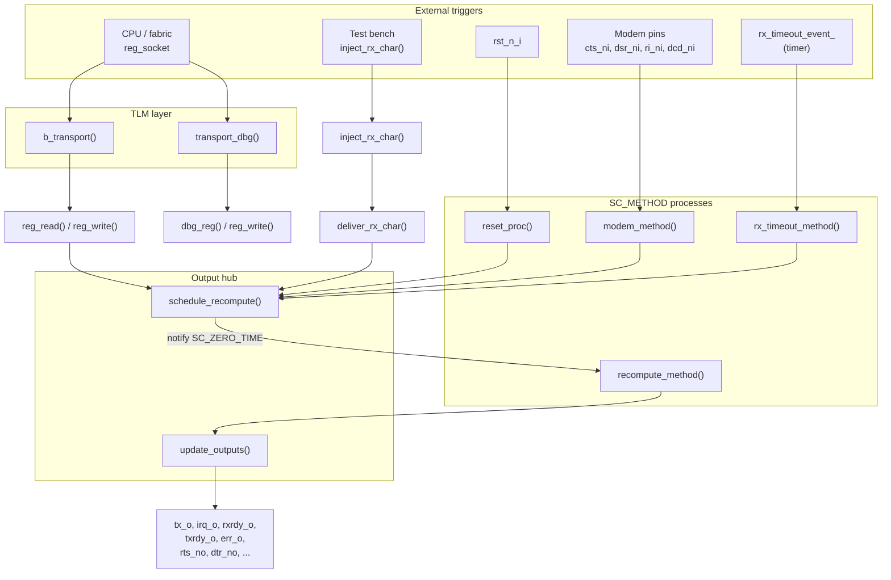
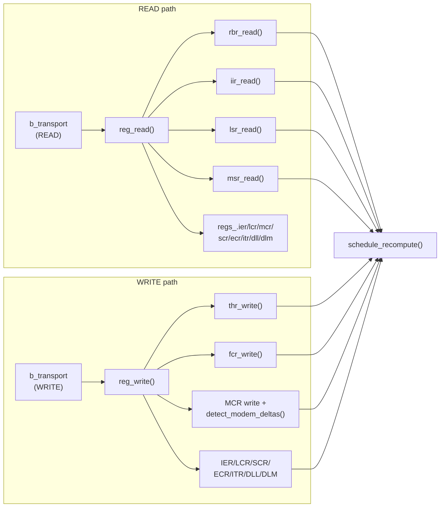
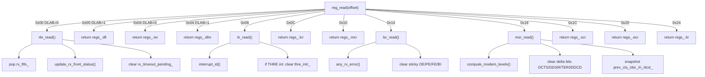
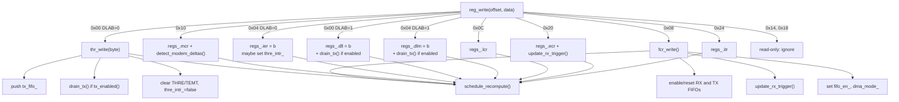
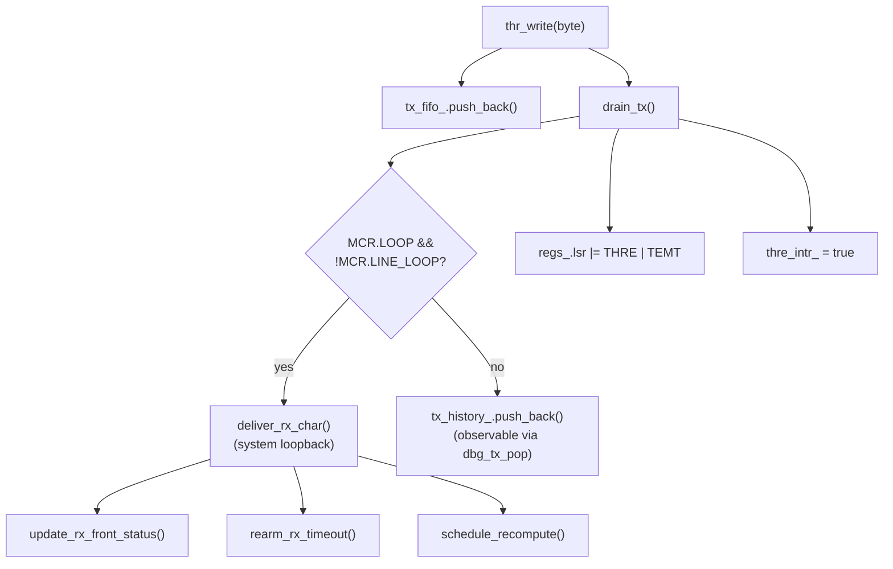
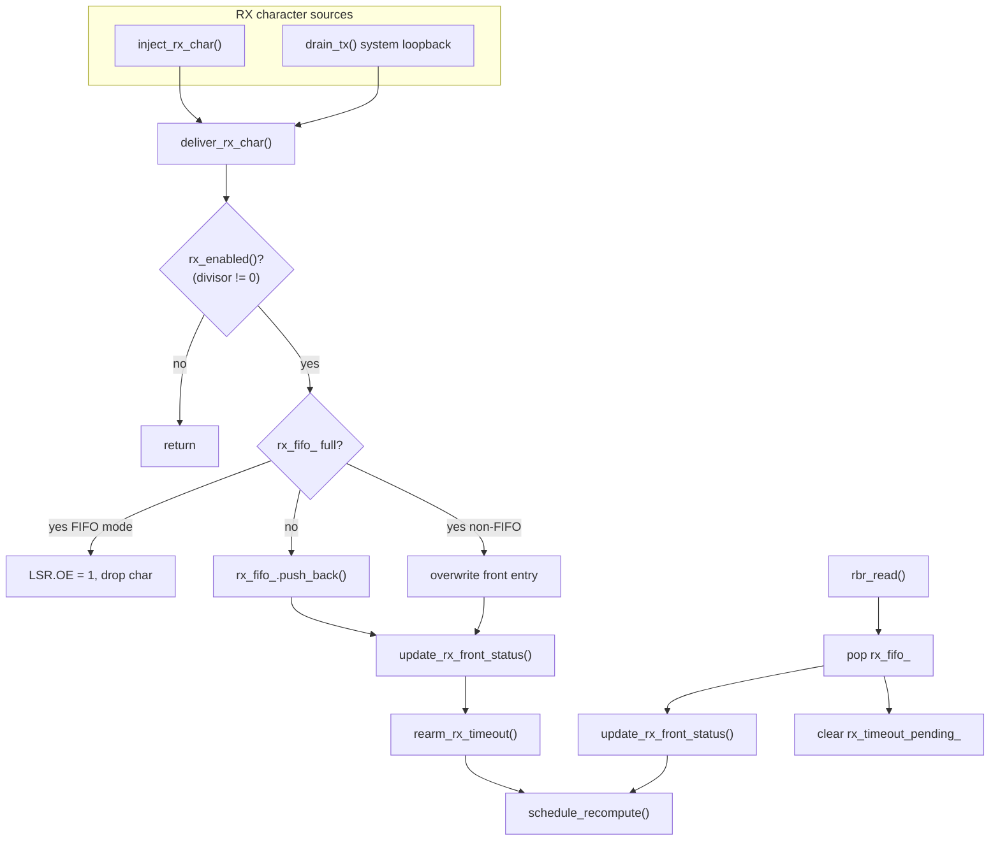
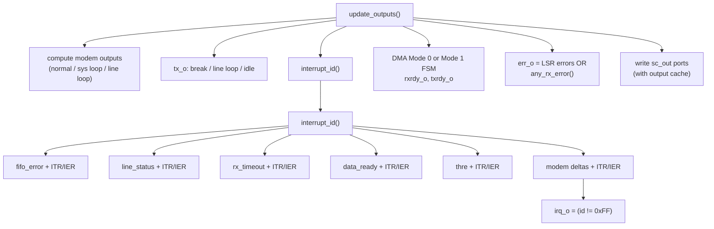
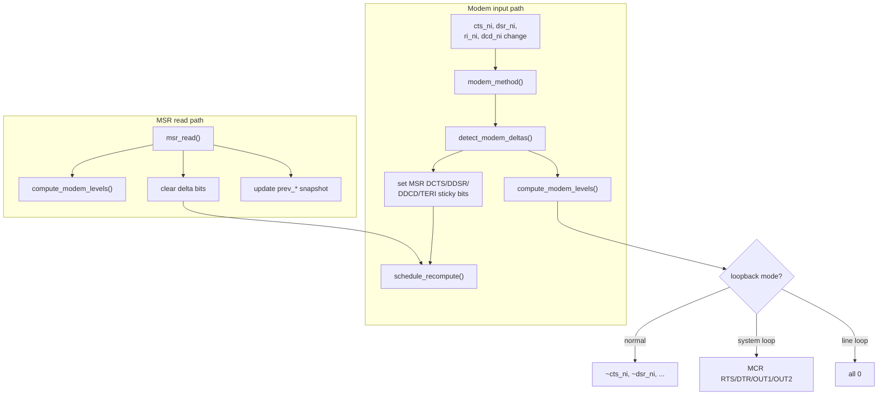
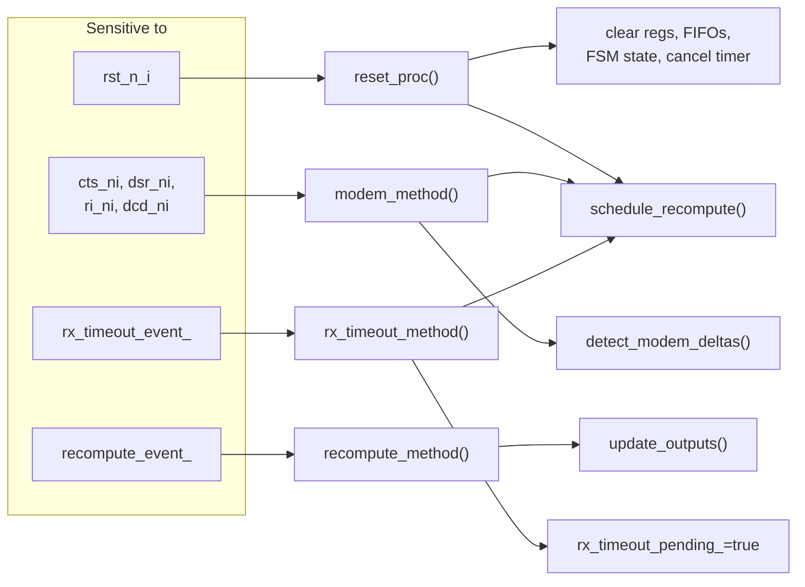
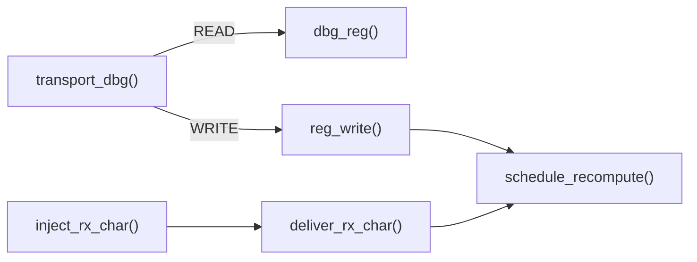

# SMC UART 16550 — Function Flow Reference

**Document**: `04_UART_Function_Flow.md`  
**Module**: `smc::uart` (`include/uart.h`, `src/uart.cpp`)  
**Status**: Reference — call graph and data-flow for the SystemC LT model  
**Companion docs**:
  - `01_UART_Specification.md` — externally-observable behaviour
  - `02_UART_LowLevel_Design.md` — internal implementation design
  - `03_UART_Test_Plan.md` — verification strategy

---

## Contents

1. [Overview](#1-overview)
2. [Big picture — entry points](#2-big-picture--entry-points)
3. [TLM register access path](#3-tlm-register-access-path)
4. [Register read side effects](#4-register-read-side-effects)
5. [Register write side effects](#5-register-write-side-effects)
6. [TX datapath](#6-tx-datapath)
7. [RX datapath](#7-rx-datapath)
8. [Interrupt and output evaluation](#8-interrupt-and-output-evaluation)
9. [Modem flow](#9-modem-flow)
10. [SC_METHOD processes](#10-sc_method-processes)
11. [Debug and test-bench API](#11-debug-and-test-bench-api)
12. [Function inventory](#12-function-inventory)
13. [Key rule — single output driver](#13-key-rule--single-output-driver)

---

## 1. Overview

The UART model follows the SMC **single-driver discipline**:

- Every `sc_out` port is written only by **`update_outputs()`**.
- Every state-changing path calls **`schedule_recompute()`**, which notifies
  **`recompute_event_`** at `SC_ZERO_TIME`.
- **`recompute_method()`** (sensitive to that event) calls **`update_outputs()`**
  in the next delta cycle.

External triggers that can change state:

| Source | Entry function |
|--------|----------------|
| CPU / fabric (`reg_socket`) | `b_transport()`, `transport_dbg()` |
| Test bench | `inject_rx_char()` |
| Reset pin | `reset_proc()` |
| Modem inputs | `modem_method()` |
| RX timeout timer | `rx_timeout_method()` |

---

## 2. Big picture — entry points



---

## 3. TLM register access path



**Validation in `b_transport()`** (before dispatch):

| Check | Response |
|-------|----------|
| Command not READ/WRITE | `TLM_COMMAND_ERROR_RESPONSE` |
| `data_length != 4` | `TLM_BURST_ERROR_RESPONSE` |
| Unaligned or `addr >= WINDOW_SIZE` | `TLM_ADDRESS_ERROR_RESPONSE` |
| Decode miss inside window | `TLM_ADDRESS_ERROR_RESPONSE` |
| Success | `TLM_OK_RESPONSE` + annotate `access_delay_ns` |

DMI is never granted (RBR/IIR/MSR reads have side effects).

---

## 4. Register read side effects



| Register | Read side effect |
|----------|------------------|
| RBR (0x00, DLAB=0) | Pop RX FIFO; update `LSR.DR`; clear RX timeout |
| IIR (0x08) | Compose IIR; clear THRE interrupt if it was the reported source |
| LSR (0x14) | Return value then clear sticky OE/PE/FE/BI |
| MSR (0x18) | Return value then clear delta bits; latch current modem levels |

---

## 5. Register write side effects



| Register | Write side effect |
|----------|-------------------|
| THR (0x00, DLAB=0) | Push TX FIFO; functionally transmit (LT drain) |
| FCR (0x08) | FIFO enable/reset; DMA mode; RX trigger |
| MCR (0x10) | Modem outputs / loopback; recompute MSR deltas |
| IER (0x04) | Enable interrupts; may raise THRE if THR already empty |
| ECR (0x20) | Update 4-bit RX FIFO trigger decode |

---

## 6. TX datapath



**Notes:**

- TX is disabled when baud divisor `{DLM,DLL} == 0` (`tx_enabled()` returns false).
- In the LT model the entire TX FIFO drains in one `drain_tx()` call.
- `SET_BREAK` in LCR forces `tx_o` low via `update_outputs()`, not via the serialiser.

---

## 7. RX datapath



**RX timeout path:**

```
rearm_rx_timeout()
  -> rx_timeout_event_.notify(rx_timeout_delay_)
rx_timeout_method()  (when event fires, FIFO non-empty)
  -> rx_timeout_pending_ = true
  -> schedule_recompute()
```

---

## 8. Interrupt and output evaluation

`update_outputs()` is called only from `recompute_method()`.



### Interrupt priority (`interrupt_id()`)

Fixed priority — first match wins:

| Priority | IIR ID | Source | Condition |
|----------|--------|--------|-----------|
| 0 (highest) | 0x7 | FIFO Error | `any_rx_error()` in FIFO mode + IER.EFEI or ITR.TFEI |
| 1 | 0x3 | Line Status | LSR OE/PE/FE/BI + IER.ELSI or ITR.TLSI |
| 2 | 0x6 | RX Timeout | `rx_timeout_pending_` + IER.ERBFI or ITR.TRTI |
| 3 | 0x2 | Data Ready | RX count >= trigger (FIFO) or non-empty + IER.ERBFI or ITR.TRBFI |
| 4 | 0x1 | THRE | `thre_intr_` + IER.ETBEI or ITR.TTBEI |
| 5 (lowest) | 0x0 | Modem Status | MSR delta bits + IER.EDSSI or ITR.TDSSI |

ITR test bits **force** the corresponding source (bypass real condition and IER enable).

### DMA handshake inside `update_outputs()`

**Mode 0** (`FCR.DMA_MODE_SELECT = 0`):

```
rxrdy_o = (rx_fifo_ non-empty)
txrdy_o = (tx_fifo_ not full)
```

**Mode 1** (FIFO enabled):

```
RX FSM: IDLE --(watermark or timeout)--> READY
        READY --(FIFO empty)--> IDLE
        rxrdy_o = (state == READY)

TX FSM: IDLE --(FIFO full)--> NOT_READY
        NOT_READY --(FIFO empty)--> IDLE
        txrdy_o = (state == IDLE)
```

---

## 9. Modem flow



### Loopback summary

| Mode | MCR | MSR bits 4–7 | Modem outputs |
|------|-----|--------------|---------------|
| Normal | `LOOP=0`, `LINE_LOOPBACK=0` | From real pins | From MCR (`~DTR`, `~RTS`, …) |
| System loopback | `LOOP=1` | Reflect MCR control bits | Forced deasserted (high) |
| Line loopback | `LINE_LOOPBACK=1` | Forced 0 | Follow modem inputs; `tx_o` follows `rx_i` |

Line loopback takes precedence over system loopback.

---

## 10. SC_METHOD processes

Registered in the constructor with `dont_initialize()`:



| Process | Trigger | Calls |
|---------|---------|-------|
| `reset_proc()` | `rst_n_i` low | Clear all state; `compute_modem_levels()` baseline; `schedule_recompute()` |
| `modem_method()` | Any modem input change | `detect_modem_deltas()`; `schedule_recompute()` |
| `recompute_method()` | `recompute_event_` | `update_outputs()` only |
| `rx_timeout_method()` | `rx_timeout_event_` | Set timeout flag; `schedule_recompute()` |

---

## 11. Debug and test-bench API

| Function | Calls | Side effects |
|----------|-------|--------------|
| `inject_rx_char()` | `deliver_rx_char()` | Full RX path + recompute |
| `dbg_tx_pop()` | reads `tx_history_` | None |
| `dbg_tx_count()` | reads `tx_fifo_.size()` | None |
| `dbg_rx_count()` | reads `rx_fifo_.size()` | None |
| `dbg_reg()` | `interrupt_id()`, `compute_modem_levels()`, `any_rx_error()` | **No pop, no sticky clear** |
| `transport_dbg()` READ | `dbg_reg()` | Same as above |
| `transport_dbg()` WRITE | `reg_write()` | Full write path |
| `dump_state()` | `interrupt_id()`, `tx_enabled()`, `any_interrupt()` | None |



---

## 12. Function inventory

### Constructor

| Function | Role |
|----------|------|
| `uart()` | CCI setup; register TLM callbacks; register SC_METHOD processes |

### TLM interface

| Function | Role |
|----------|------|
| `b_transport()` | Main CPU register access; validate; `reg_read`/`reg_write`; annotate delay |
| `transport_dbg()` | Debug access; read via `dbg_reg()`, write via `reg_write()` |

### SC_METHOD processes

| Function | Role |
|----------|------|
| `reset_proc()` | Clear state on active-low reset |
| `modem_method()` | Detect modem input deltas |
| `recompute_method()` | Sole caller of `update_outputs()` |
| `rx_timeout_method()` | Raise RX timeout interrupt |

### Output hub

| Function | Role |
|----------|------|
| `schedule_recompute()` | `recompute_event_.notify(SC_ZERO_TIME)` |
| `update_outputs()` | Drive all `sc_out` ports (irq, DMA, modem, tx, err) |

### Register decode

| Function | Role |
|----------|------|
| `reg_read()` | DLAB-aware read dispatch |
| `reg_write()` | DLAB-aware write dispatch |
| `rbr_read()` | Pop RX FIFO |
| `iir_read()` | Compose IIR; may clear THRE int |
| `lsr_read()` | Compose LSR; clear sticky errors |
| `msr_read()` | Compose MSR; clear deltas |
| `thr_write()` | Push and transmit byte |
| `fcr_write()` | FIFO control |

### Datapath

| Function | Role |
|----------|------|
| `drain_tx()` | LT transmit entire TX FIFO |
| `deliver_rx_char()` | Push RX character (inject or loopback) |
| `update_rx_front_status()` | Update LSR.DR/PE/FE/BI from FIFO front |
| `rearm_rx_timeout()` | Restart RX character-timeout timer |
| `update_rx_trigger()` | Decode {ECR,FCR} trigger level |

### Modem and interrupt

| Function | Role |
|----------|------|
| `compute_modem_levels()` | CTS/DSR/RI/DCD with loopback modes |
| `detect_modem_deltas()` | Set MSR sticky delta bits |
| `interrupt_id()` | Fixed-priority interrupt arbitration |
| `any_interrupt()` | `interrupt_id() != 0xFF` |

### Helpers

| Function | Role |
|----------|------|
| `tx_enabled()` | Divisor != 0 |
| `rx_enabled()` | Same as `tx_enabled()` |
| `any_rx_error()` | Scan RX FIFO for error flags |

### Debug API (public)

| Function | Role |
|----------|------|
| `inject_rx_char()` | Back-door RX stimulus |
| `dbg_tx_pop()` | Pop transmitted character from history |
| `dbg_tx_count()` / `dbg_rx_count()` | FIFO occupancy |
| `dbg_reg()` | Side-effect-free register peek |
| `dump_state()` | Human-readable state dump |

---

## 13. Key rule — single output driver

```
Any state change
    |
    v
schedule_recompute()
    |
    v
recompute_event_.notify(SC_ZERO_TIME)   <-- next delta cycle
    |
    v
recompute_method()
    |
    v
update_outputs()                        <-- ONLY writer of sc_out ports
    |
    +--> tx_o, irq_o, rxrdy_o, txrdy_o, err_o
    +--> rts_no, dtr_no, out1_no, out2_no
```

All other functions update **internal state** (registers, FIFOs, flags) and
defer pin/output updates to this path. This satisfies SystemC's single-driver
rule and keeps output ordering deterministic.

---

## Revision history

| Revision | Date | Notes |
|----------|------|-------|
| 0.1 | 2026-06-25 | Initial function-flow reference for `smc::uart` |
