# SMC Fabric — Function Flow Reference

**Document**: `06_Function_Flow.md`  
**Module**: `smc::smc_fabric` (`include/smc_fabric.h`, `src/smc_fabric.cpp`)  
**Status**: Reference — call graph and transaction-flow for the SystemC LT model  
**Companion docs**:
  - `01_overview_and_architecture.md` — purpose, block diagram, data-path flows
  - `02_tlm_interface.md` — sockets, signals, constructor parameters
  - `03_internal_architecture.md` — sub-block decomposition
  - `04_register_interface.md` — register map and CSR access semantics
  - `05_systemc_implementation.md` — C++ implementation patterns

---

## Contents

1. [Overview](#1-overview)
2. [Big picture — entry points](#2-big-picture--entry-points)
3. [Inbound master paths](#3-inbound-master-paths)
4. [Local routing (`route_local`)](#4-local-routing-route_local)
5. [Outbound routing (`route_outbound`)](#5-outbound-routing-route_outbound)
6. [Address remap](#6-address-remap)
7. [Filter logic](#7-filter-logic)
8. [Local address decode](#8-local-address-decode)
9. [Internal CSR handlers](#9-internal-csr-handlers)
10. [Reset and DMI](#10-reset-and-dmi)
11. [Error / deny path](#11-error--deny-path)
12. [Function inventory](#12-function-inventory)
13. [Key rules](#13-key-rules)

---

## 1. Overview

The SMC fabric is a **Bucket D pure TLM target**: it never calls `wait()` inside
`b_transport`, does not own a quantum keeper, and only **adds** `cfg_.reg_access_ns`
(default 1 ns) to the incoming `delay` on CSR accesses. It receives transactions
on six inbound target sockets and forwards them to downstream initiator sockets
(or handles remap/filter CSRs internally).

There is no `sc_out` single-driver hub like the UART — the fabric is a **pass-through
router**. Each transaction follows one of three inbound paths, then either
`route_local()` or `route_outbound()`.

| Property | Value |
|----------|-------|
| Temporal model | Loosely-timed (LT), pure target |
| Quantum keeper | None (initiator's responsibility) |
| DMI | Never granted (`get_direct_mem_ptr` always returns false) |
| Local/outbound split | Fixed **16 MB** window (`LOCAL_ALIAS_REGION_SIZE`) per aperture |
| Inbound filter default | **Block** (default-deny) |
| Outbound filter default | **Allow** (default-permit) |

---

## 2. Big picture — entry points

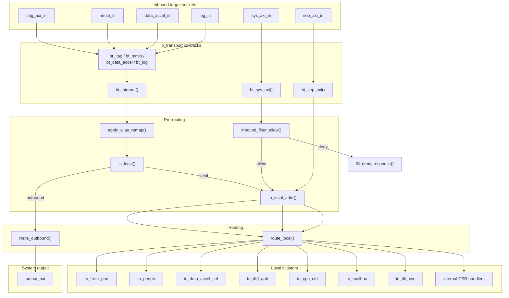

---

## 3. Inbound master paths

Three distinct paths enter the fabric. All six sockets register
`get_direct_mem_ptr` → always denied.

### 3.1 Internal masters (JTAG, MMIO, DMA, Log)

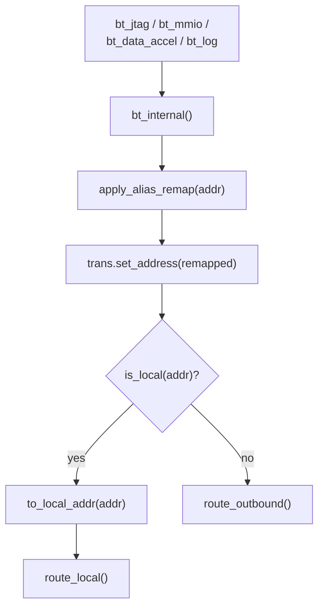

**Steps:**

1. `apply_alias_remap()` — scan `alias_regions_[0..7]`; on hit:
   `addr_out = addr_in + offset`; update `remap_debug_`.
2. `is_local()` — true if address falls in **either**:
   - `[local_base, local_base + 16 MB)`, or
   - `[global_base, global_base + 16 MB)`.
3. Local path: mask to 32-bit crossbar view via `to_local_addr()`.
4. Outbound path: forward to `route_outbound()` with full 64-bit address.

### 3.2 System AXI (`sys_axi_in`)

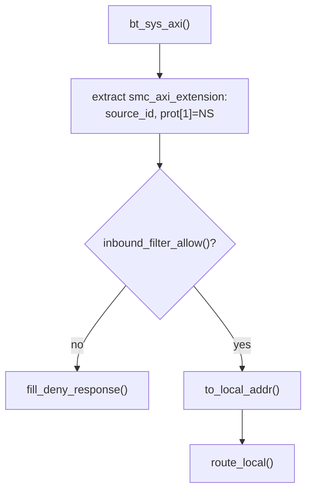

- **Always local** — no alias remap, no outbound path.
- Inbound filter: **default-deny** (`block_by_default = true`).
- Filter checks: address range, source ID, NS bit, read/write enable.

### 3.3 SEP AXI (`sep_axi_in`)

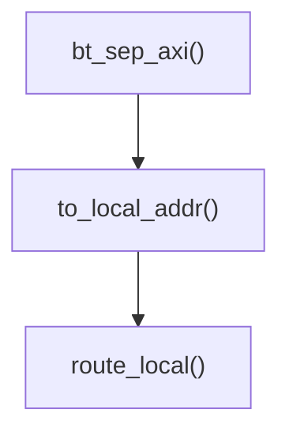

- **Bypasses** alias remap and inbound filter entirely.
- Can reach any decoded local target (including PLIC/CLINT above 16 MB).

---

## 4. Local routing (`route_local`)

Central decode function: maps a **32-bit masked local address** to either an
internal CSR handler or a downstream initiator socket.

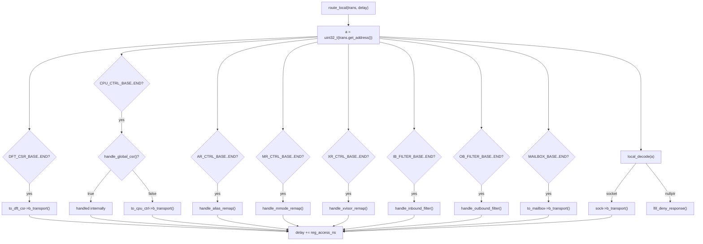

### Local address map (absolute, base `0xC000_0000`)

| Range | Handler / socket |
|-------|------------------|
| `0xC000_0000` – `0xC000_1000` | `to_front_port` (WDT/debug) |
| `0xC000_2000` – `0xC000_B800` | `to_periph` (main) |
| `0xC000_C000` – `0xC000_D000` | `to_periph` (VP-only AOU park) |
| `0xC003_8000` – `0xC004_0000` | `to_data_accel_ctrl` |
| `0xC004_0000` – `0xC016_0000` | `to_front_port` (SPM) |
| `0xC016_0000` – `0xC026_0000` | `to_dfd_apb` |
| `0xC040_0000` – `0xC080_0000` | `to_periph` (ext) |
| `0xC400_0000` – `0xC800_0000` | `to_front_port` (PLIC) |
| `0xC800_0000` – `0xC802_0000` | `to_front_port` (CLINT/BEU) |
| `0xC000_B800` – `0xC000_C000` | `to_dft_csr` |
| `0xC001_0000` – `0xC001_2000` | `handle_global_csr` / `to_cpu_ctrl` |
| `0xC001_2000` – `0xC001_3000` | `handle_alias_remap` (internal) |
| `0xC001_3000` – `0xC001_4000` | `handle_mmode_remap` (internal) |
| `0xC001_4000` – `0xC001_5000` | `handle_xvisor_remap` (internal) |
| `0xC001_5000` – `0xC001_6000` | `handle_inbound_filter` (internal) |
| `0xC001_6000` – `0xC001_7000` | `handle_outbound_filter` (internal) |
| `0xC001_8000` – `0xC003_8000` | `to_mailbox` |
| (no match) | `fill_deny_response()` |

---

## 5. Outbound routing (`route_outbound`)

Used when internal masters (`bt_internal`) target an address outside the
16 MB local alias window.

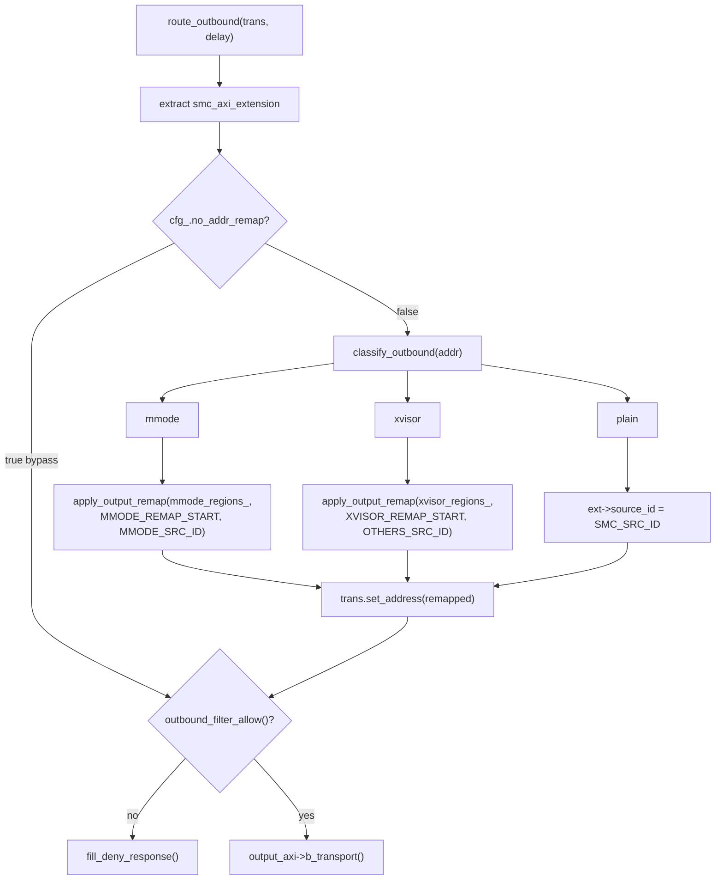

### Outbound path classification (`classify_outbound`)

| Path | Address window (relative to local/global base) | Source ID after remap |
|------|-----------------------------------------------|----------------------|
| **M-mode** | `[0x0100_0000, 0x0180_0000)` (8 MB) | `0xC` (MMODE_SRC_ID) |
| **Xvisor** | `[0x0180_0000, 0x0200_0000)` (8 MB) | `0x0` (OTHERS_SRC_ID) |
| **Plain** | Everything else | `0x3` (SMC_SRC_ID) |

Outbound filter: **default-allow** (`block_by_default = false`).

---

## 6. Address remap

### 6.1 Alias remap (inbound, internal masters only)

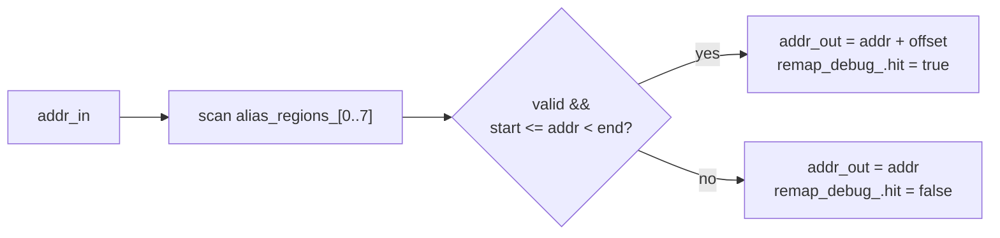

- Programmed via `handle_alias_remap()` → `handle_remap_entry()`.
- Each entry: `start`, `end`, signed `offset`, `valid`, `cacheable`.
- Skipped when `cfg_.no_addr_remap == true` is only for **output** remap;
  alias remap is always applied for internal masters.

### 6.2 Output remap (M-mode / Xvisor outbound)

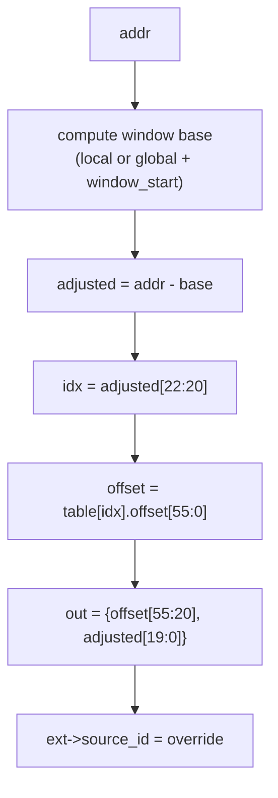

Bit-exact to `output_remap.sv`: 8 regions × 1 MB (`IdxStart=20`).

### 6.3 Local address masking (`to_local_addr`)

```
local_addr[31:25] = cfg_.local_base_addr[31:25]   (forced)
local_addr[24:0]  = addr[24:0]                    (from transaction)
```

Makes local-alias and global-alias transactions decode identically in the
local crossbar.

---

## 7. Filter logic

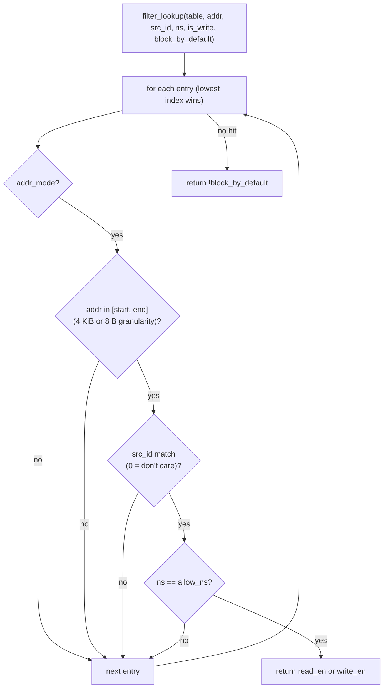

| Wrapper | Table | Default on no hit |
|---------|-------|-------------------|
| `inbound_filter_allow()` | `inbound_filter_[0..15]` | **Deny** (`block_by_default=true`) |
| `outbound_filter_allow()` | `outbound_filter_[0..15]` | **Allow** (`block_by_default=false`) |

Filter CSRs programmed via `handle_inbound_filter()` / `handle_outbound_filter()`
→ `handle_filter_entry_csr()` (shared static helper in `.cpp`).

---

## 8. Local address decode

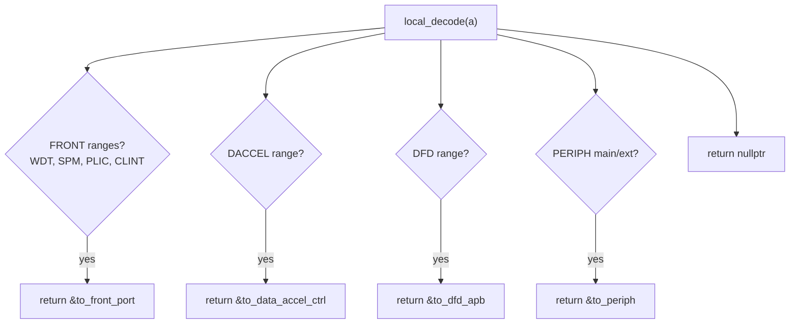

Note: CSR windows (CPU ctrl, remap, filter, mailbox, DFT) are handled **before**
`local_decode()` inside `route_local()`, not by this function.

---

## 9. Internal CSR handlers

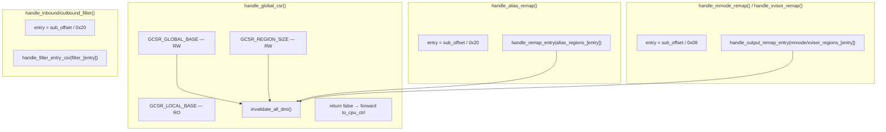

### CSR handler summary

| Handler | Table updated | Entry layout | Invalidate DMI |
|---------|---------------|--------------|----------------|
| `handle_global_csr()` | `cfg_.global_base_addr`, `cfg_.region_size` | 32-bit CSRs in CPU ctrl window | Yes (on write) |
| `handle_alias_remap()` | `alias_regions_[0..7]` | 4 × 64-bit fields / entry (0x20 stride) | Yes |
| `handle_mmode_remap()` | `mmode_regions_[0..7]` | 1 × REGION_ATTRS / entry (0x08 stride) | Yes |
| `handle_xvisor_remap()` | `xvisor_regions_[0..7]` | Same as M-mode | Yes |
| `handle_inbound_filter()` | `inbound_filter_[0..15]` | FILTER_CONFIG + START + END | No |
| `handle_outbound_filter()` | `outbound_filter_[0..15]` | Same layout | No |

Remap/filter CSR sockets (`to_aR_ctrl`, `to_mR_ctrl`, etc.) exist for testbench
observation but traffic is **handled internally** — tables update in-place without
forwarding to those sockets.

---

## 10. Reset and DMI

### Reset (`reset_proc`)

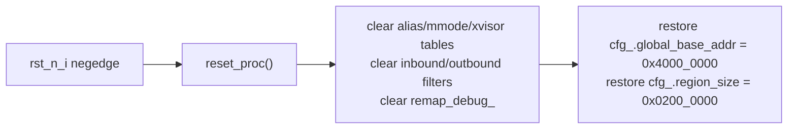

Sensitive to `rst_n_i.neg()` (active-low falling edge).

### DMI

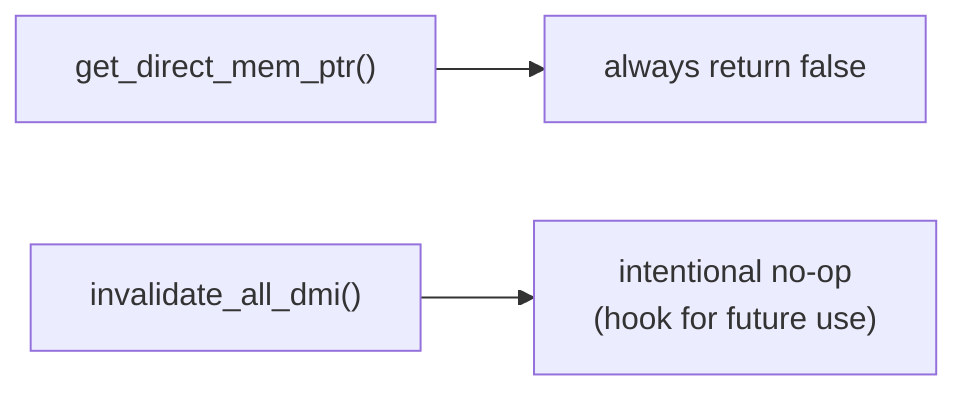

Every CSR write path that could affect routing calls `invalidate_all_dmi()`.
All `b_transport` exits set `trans.set_dmi_allowed(false)` on deny/internal-CSR paths.

---

## 11. Error / deny path

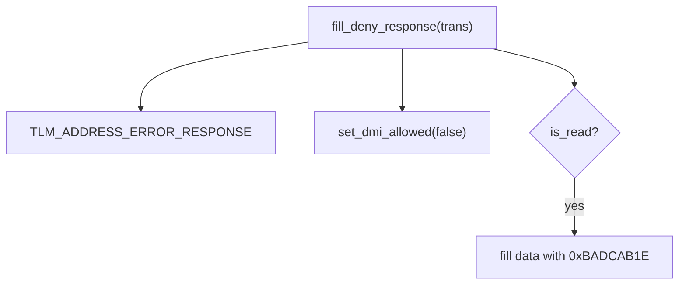

**Callers of `fill_deny_response()`:**

| Caller | Condition |
|--------|-----------|
| `bt_sys_axi()` | Inbound filter denied |
| `route_local()` | `local_decode()` returned nullptr |
| `route_outbound()` | Outbound filter denied |
| CSR handlers | Entry index out of range |

---

## 12. Function inventory

### Construction

| Function | Role |
|----------|------|
| `smc_fabric(name)` | Default-construct with `config{}` |
| `smc_fabric(name, cfg)` | Register 6× `b_transport`, 6× `get_direct_mem_ptr`, `reset_proc` |

### TLM entry points

| Function | Socket | Path |
|----------|--------|------|
| `bt_jtag()` | `jtag_axi_in` | → `bt_internal()` |
| `bt_mmio()` | `mmio_in` | → `bt_internal()` |
| `bt_data_accel()` | `data_accel_in` | → `bt_internal()` |
| `bt_log()` | `log_in` | → `bt_internal()` |
| `bt_sys_axi()` | `sys_axi_in` | filter → `route_local()` |
| `bt_sep_axi()` | `sep_axi_in` | bypass → `route_local()` |
| `get_direct_mem_ptr()` | all targets | Always deny DMI |

### Routing core

| Function | Role |
|----------|------|
| `bt_internal()` | Alias remap → local/outbound split |
| `route_local()` | 32-bit decode → CSR handler or initiator forward |
| `route_outbound()` | Output remap → outbound filter → `output_axi` |
| `local_decode()` | Map address to `to_front_port` / `to_periph` / etc. |

### Address helpers

| Function | Role |
|----------|------|
| `apply_alias_remap()` | Inbound alias table lookup |
| `is_local()` | 16 MB aperture test (local + global base) |
| `to_local_addr()` | Mask to 32-bit crossbar view |
| `classify_outbound()` | M-mode / Xvisor / plain path |
| `apply_output_remap()` | Bit-exact `output_remap.sv` translation |

### Filter

| Function | Role |
|----------|------|
| `filter_lookup()` | Shared lowest-index-hit filter engine |
| `inbound_filter_allow()` | Default-deny wrapper |
| `outbound_filter_allow()` | Default-allow wrapper |

### CSR handlers

| Function | Role |
|----------|------|
| `handle_global_csr()` | LOCAL_BASE / GLOBAL_BASE / REGION_SIZE |
| `handle_remap_entry()` | Alias region field R/W |
| `handle_alias_remap()` | Dispatch to alias table entry |
| `handle_output_remap_entry()` | M-mode/Xvisor REGION_ATTRS R/W |
| `handle_mmode_remap()` | Dispatch to mmode table |
| `handle_xvisor_remap()` | Dispatch to xvisor table |
| `handle_inbound_filter()` | Dispatch to inbound filter entry |
| `handle_outbound_filter()` | Dispatch to outbound filter entry |

### Support

| Function | Role |
|----------|------|
| `fill_deny_response()` | Address error + poison read data |
| `invalidate_all_dmi()` | No-op hook (future DMI revocation) |
| `reset_proc()` | Clear tables; restore power-on CSR defaults |

### Testbench / debug API (public)

| Function | Role |
|----------|------|
| `read_global_base()` / `write_global_base()` | Inspect/mutate global aperture base |
| `read_region_size()` / `write_region_size()` | Inspect/mutate REGION_SIZE CSR image |
| `get_alias_region(n)` | Peek alias remap entry |
| `get_remap_debug()` | Last alias-remap hit info |
| `get_inbound_filter_entry(n)` | Peek inbound filter entry |
| `get_outbound_filter_entry(n)` | Peek outbound filter entry |

### File-local helpers (anonymous namespace in `.cpp`)

| Function | Role |
|----------|------|
| `filter_cfg_pack()` | Encode `filter_entry` → FILTER_CONFIG register |
| `filter_cfg_unpack()` | Decode FILTER_CONFIG write |
| `handle_filter_entry_csr()` | Shared filter CSR field R/W |

---

## 13. Key rules

### Pure target — no blocking waits

```
Initiator calls reg_socket->b_transport(trans, delay)
    |
    v
smc_fabric::bt_*()
    |
    +--> route_local() / route_outbound()
    |         |
    |         v
    |    downstream_sock->b_transport(trans, delay)   // nested LT call
    |
    +--> delay += reg_access_ns   (CSR paths only)
    |
    v
return to initiator (initiator owns quantum keeper sync)
```

The fabric **never** calls `wait()`. Routing latency is zero; only CSR touches
add `reg_access_ns`.

### Three inbound paths at a glance

```
Internal (jtag/mmio/dma/log):
  apply_alias_remap → is_local? → route_local | route_outbound

System (sys_axi_in):
  inbound_filter → to_local_addr → route_local

SEP (sep_axi_in):
  to_local_addr → route_local   (no remap, no filter)
```

### Internal vs forwarded CSRs

```
route_local()
  ├── handle_*() internally  → updates tables in smc_fabric state
  └── to_*->b_transport()    → forwards to bound downstream module
```

---

## Revision history

| Revision | Date | Notes |
|----------|------|-------|
| 0.1 | 2026-06-25 | Initial function-flow reference for `smc::smc_fabric` |
