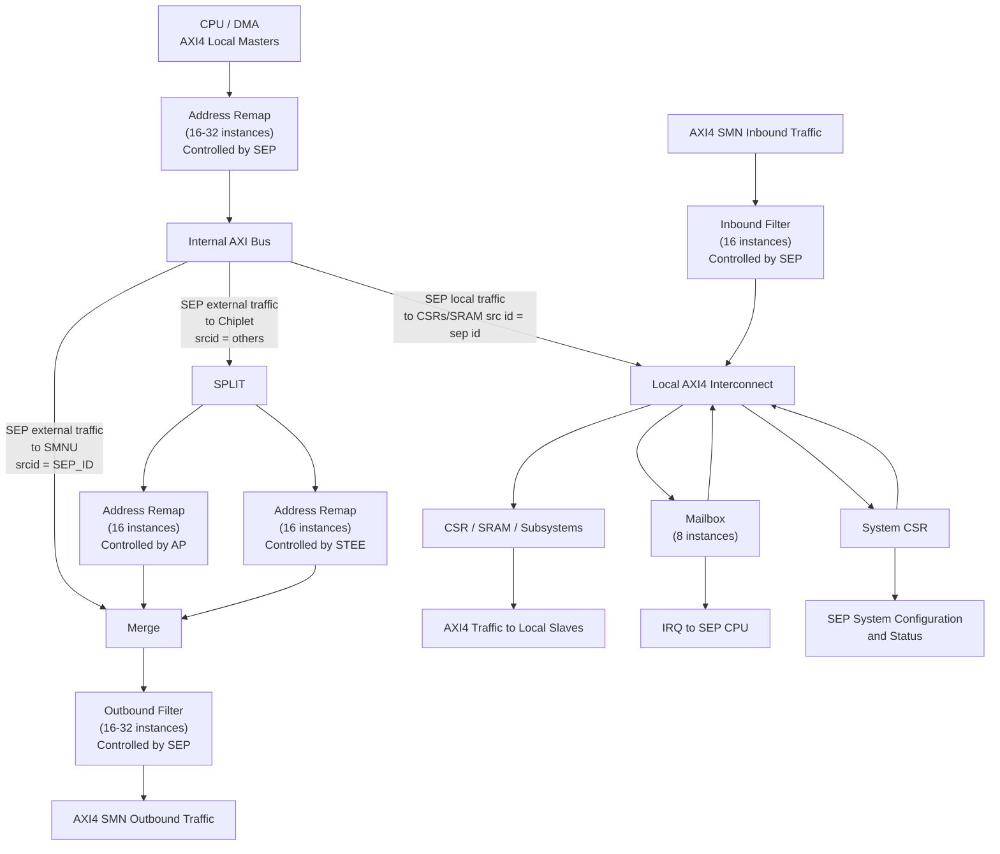

# SEP AXI4 Architecture

```mermaid
flowchart TD

%% ===========================
%% External Masters
%% ===========================
CPU["CPU / DMA<br/>AXI4 Local Masters"]

AR0["Address Remap<br/>(16-32 instances)<br/>Controlled by SEP"]

CPU --> AR0

%% ===========================
%% Internal Bus
%% ===========================
BUS1["Internal AXI Bus"]

AR0 --> BUS1

%% ===========================
%% Left Side Traffic
%% ===========================

BUS1 -->|SEP external traffic<br/>to SMNU<br/>srcid = SEP_ID| MERGE

BUS1 -->|SEP external traffic<br/>to Chiplet<br/>srcid = others| SPLIT

BUS1 -->|SEP local traffic<br/>to CSRs/SRAM src id = sep id| LOCAL_AXI

SPLIT --> AR_AP
SPLIT --> AR_STEE

AR_AP["Address Remap<br/>(16 instances)<br/>Controlled by AP"]

AR_STEE["Address Remap<br/>(16 instances)<br/>Controlled by STEE"]

AR_AP --> MERGE
AR_STEE --> MERGE

MERGE["Merge"]

MERGE --> OF

OF["Outbound Filter<br/>(16-32 instances)<br/>Controlled by SEP"]

OF --> OUT["AXI4 SMN Outbound Traffic"]

%% ===========================
%% Local AXI
%% ===========================

LOCAL_AXI["Local AXI4 Interconnect"]

LOCAL_AXI --> CSRTRAF["CSR / SRAM / Subsystems"]

CSRTRAF --> TOP["AXI4 Traffic to Local Slaves"]

%% ===========================
%% Inbound Traffic
%% ===========================

IN["AXI4 SMN Inbound Traffic"]

IN --> IFILT

IFILT["Inbound Filter<br/>(16 instances)<br/>Controlled by SEP"]

IFILT --> LOCAL_AXI

%% ===========================
%% Mailbox
%% ===========================

MAIL["Mailbox<br/>(8 instances)"]

MAIL --> LOCAL_AXI
LOCAL_AXI --> MAIL

IRQ["IRQ to SEP CPU"]

MAIL --> IRQ

%% ===========================
%% System CSR
%% ===========================

SYSCSR["System CSR"]

LOCAL_AXI --> SYSCSR
SYSCSR --> LOCAL_AXI

STATUS["SEP System Configuration<br/>and Status"]

SYSCSR --> STATUS
```